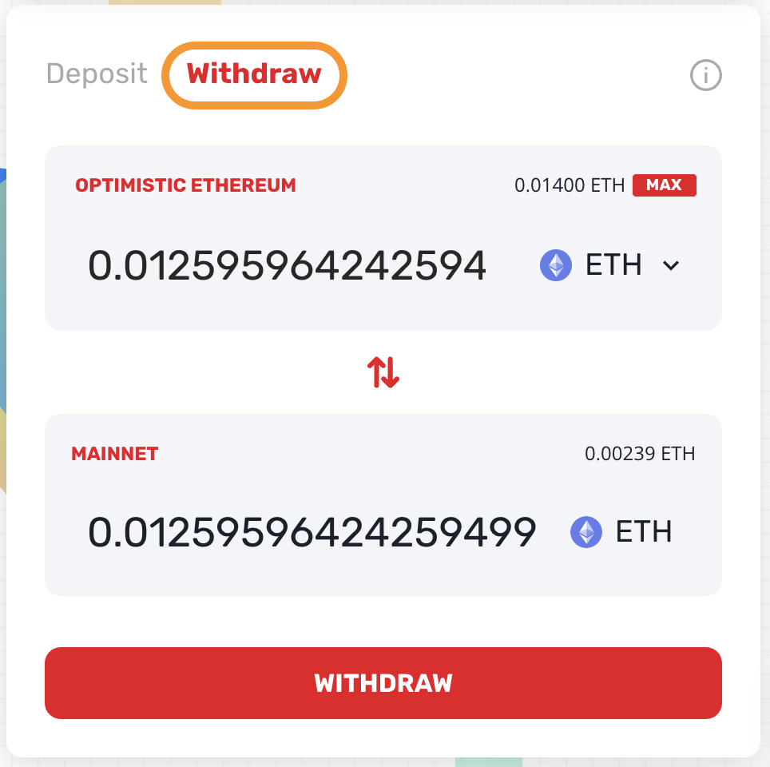
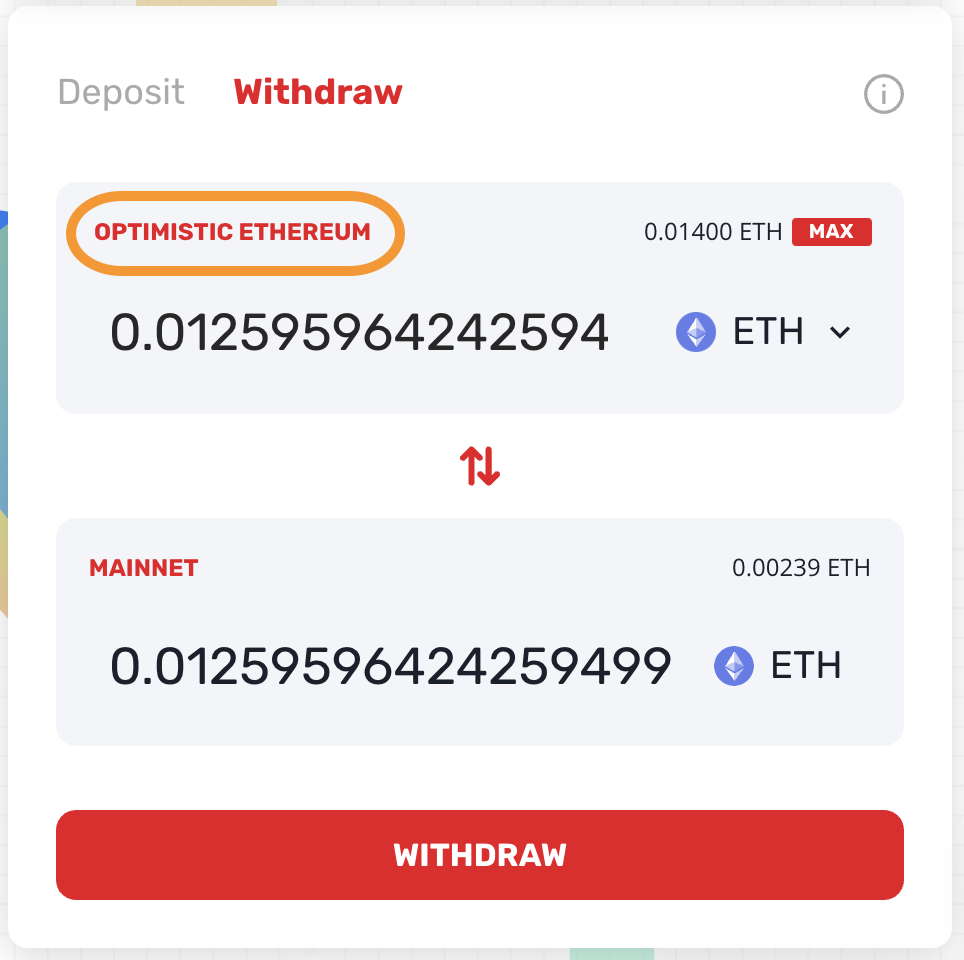
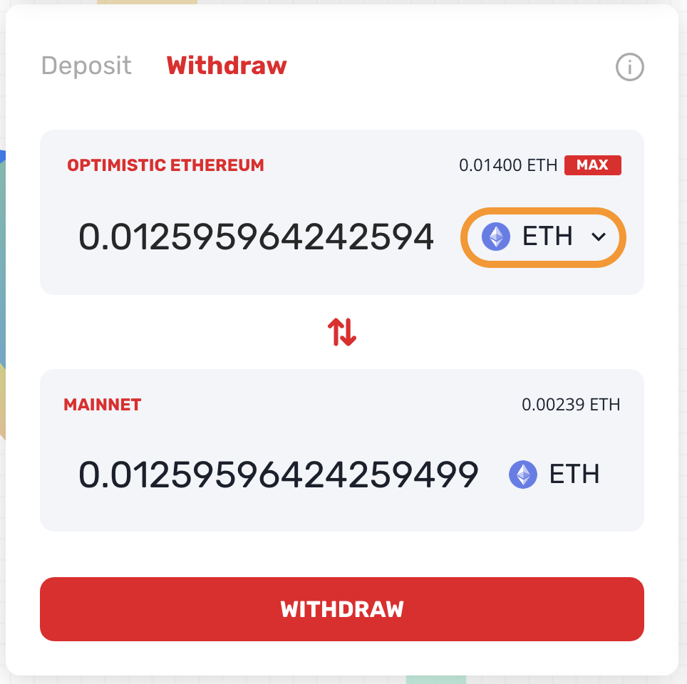
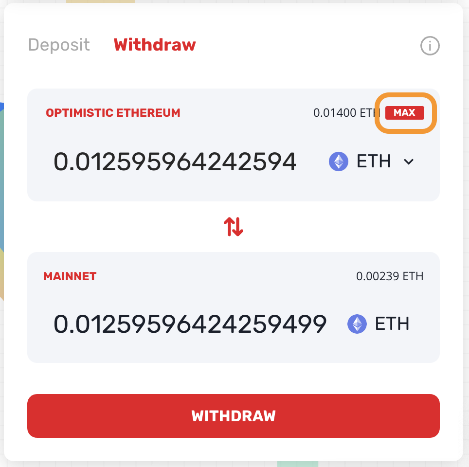
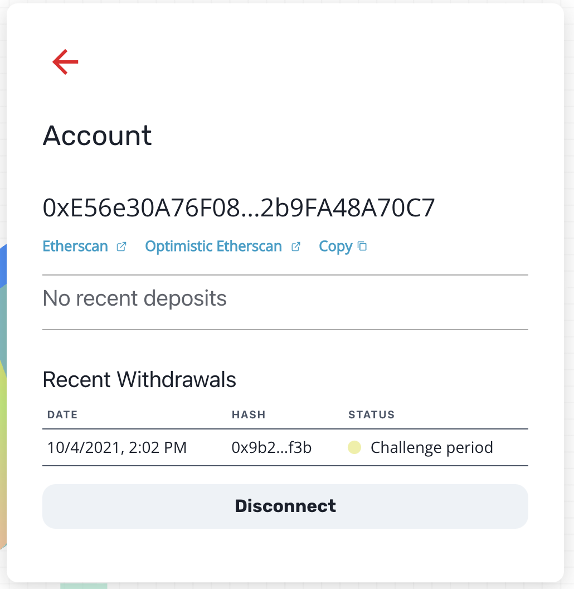
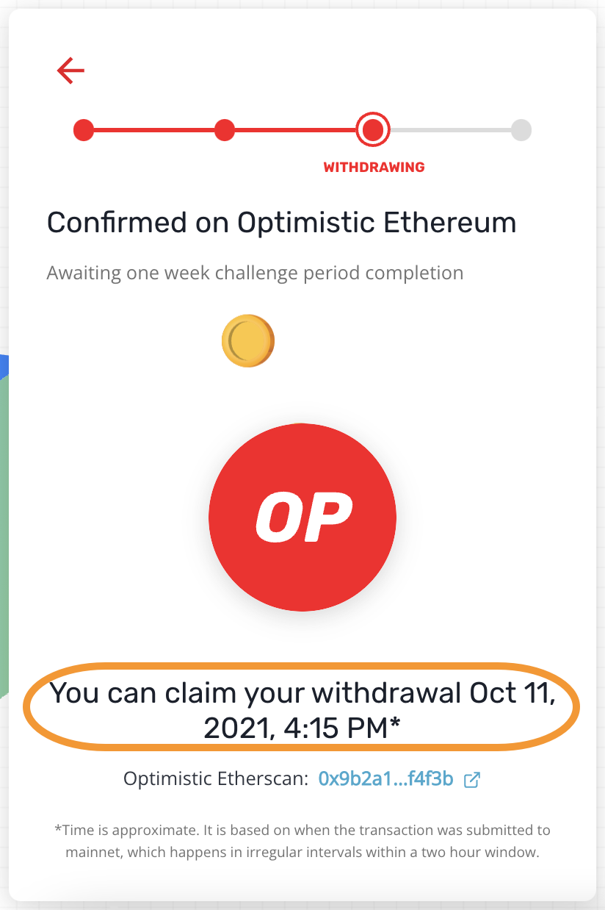
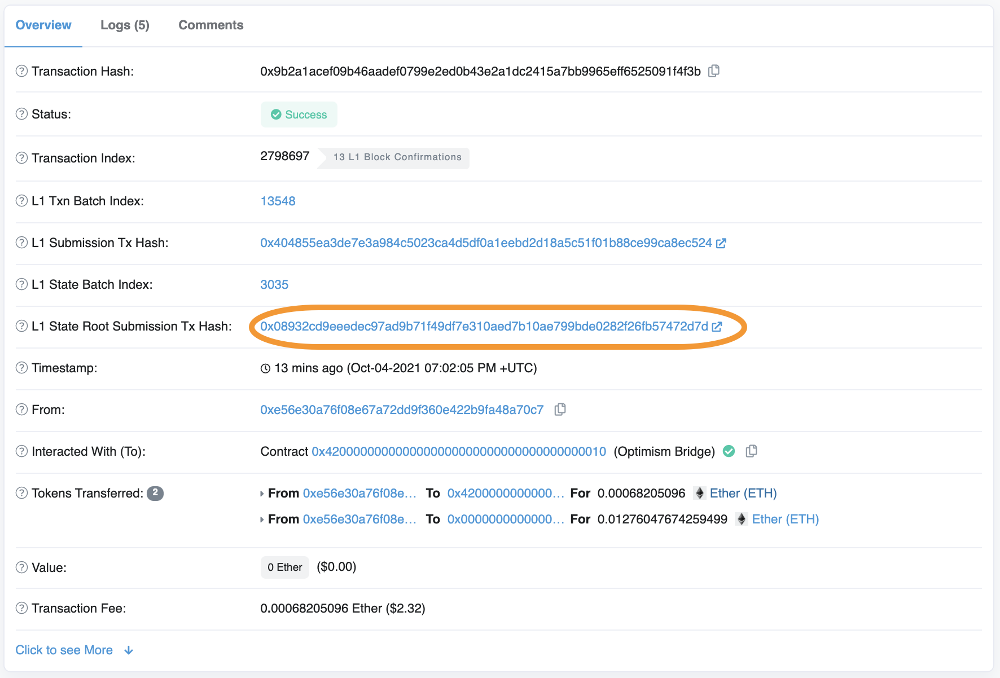
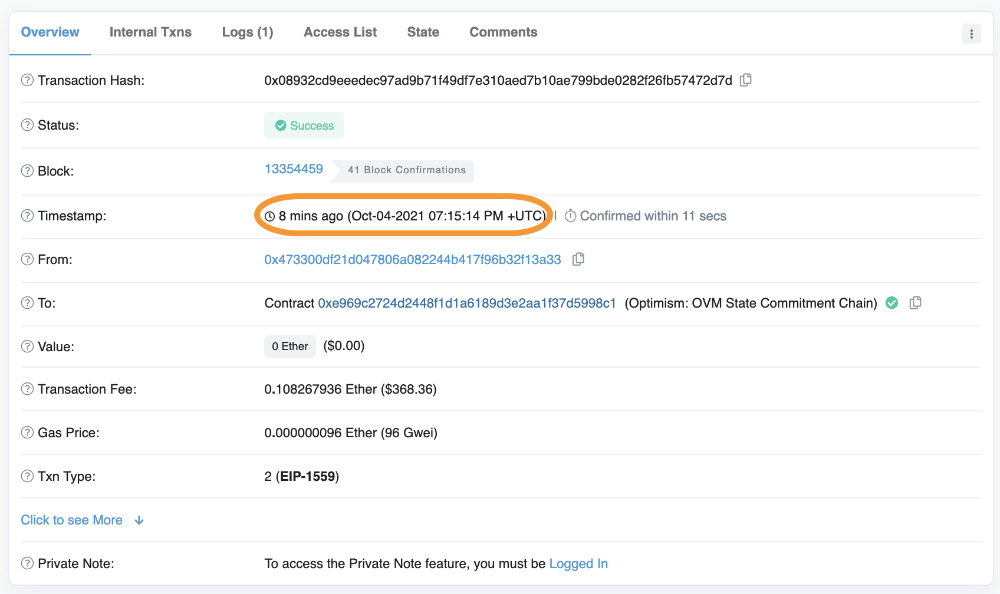
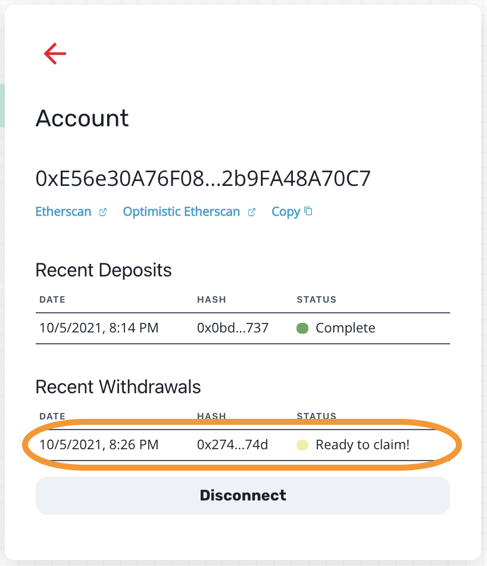
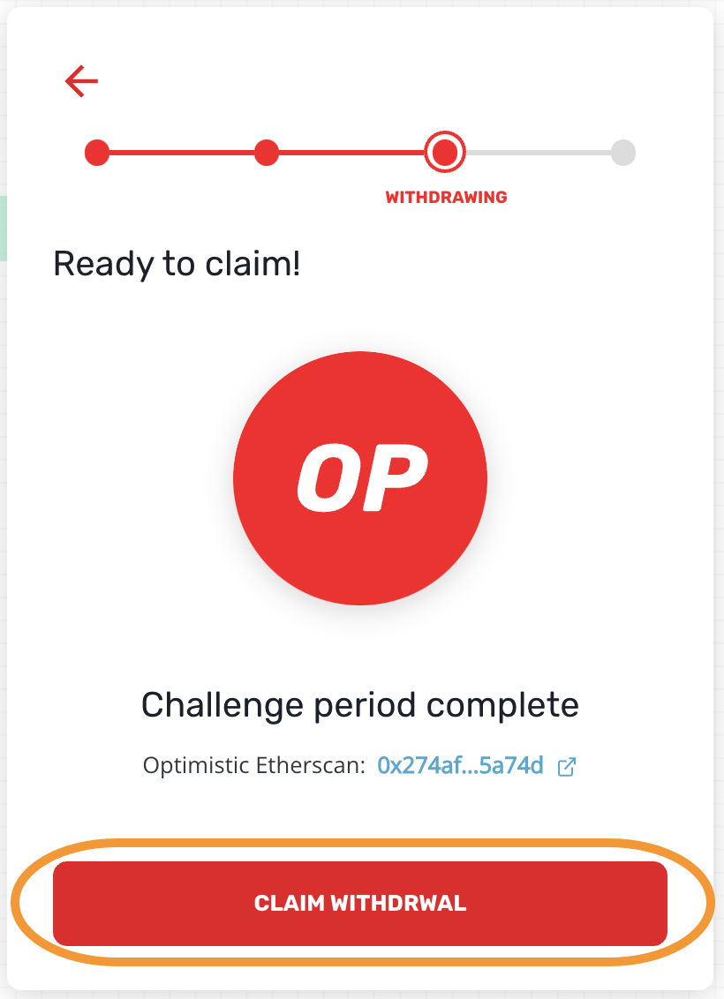

# {{ $frontmatter.title }}

::: tip Where is my money?
If you withdrew using the Optimism gateway and are not sure what is happening 
with your withdrawal, 
[search for the transaction hash here](https://optimistic.etherscan.io/messagerelayer), 
the withdrawal might still be in the validity challenge period. 
Alternatively, you might just need to [claim the withdrawal](#claim-the-withdrawal).
:::

::: warning Centralized Exchanges
When you transfer assets to a centralized exchange you send it to an address
provided by that centralized exchange. By default, this is an L1 address and
the exchange does **not** look at this address in Optimistic Ethereum. As a
result, assets transferred directly to a centralized exchange that doesn't
support Optimistic Ethereum are irrevocably lost. **Don't do it**.

When a centralized exchange supports Optimistic Ethereum we will publish that
fact.
:::

## Which Assets?

### Ether

At writing there are two ways to withdraw ETH:

1. [Hop exchange](https://app.hop.exchange/send?token=ETH&sourceNetwork=optimism&destNetwork=ethereum), which is quick and tells you the cost upfront.

1. [The Optimism Gateway](https://gateway.optimism.io/), which requires you to
   wait the challenge verification period (one week) and then 
   [claim the withdrawal](#claim-the-withdrawal), which costs extra gas.

### ERC-20 Tokens

* [The Optimism Gateway](https://gateway.optimism.io/).
  We have a [list of supported ERC-20 tokens](https://static.optimism.io/optimism.tokenlist.json), but you are not limited to them, [you can select any 
  token that exists on both L1 and L2](https://optimismpbc.medium.com/arbitrary-token-bridging-d552f6bef694).

* [Third-party bridges](https://www.optimism.io/apps/bridges). Those bridges are
  usually cheaper and faster than our main gateway, but have a more limited list
  of supported tokens. The way this works is that the bridge loans you the
  relevant asset on L1 (mainnet).

  When enough of an asset has accumulated, the bridge sends all of those
  tokens to L1 in one gateway transaction. This way:

  * You don't have to wait the normal challenge verification period. The
    bridge takes the risk that the block with the transaction (or a prior one)
    is invalid. Bridges run their own verification so it's not a big risk
    for them.
  * The cost of the merkle proof required for a withdrawal transaction is 
    spread over a larger pool of tokens, so the relative cost of the 
    withdrawal is smaller.

## Withdrawing through the Optimism Gateway

Withdrawals through the Optimism Gateway is a multi-step process:

1. [Initiate the withdrawal](#initiate-the-withdrawal) on Optimistic Ethereum
1. [Wait the verification challenge period](#while-waiting), which 
   is *seven days* from the time the transaction is published on L1. 
   
   Normally transactions are published on L1 quickly, but in the case of an 
   outage it might take longer, in which case it will take longer until you
   can claim your withdrawal.
1. [Claim the withdrawal](#claim-the-withdrawal)

### Initiate the withdrawal

1. [Browse to the gateway](https://gateway.optimism.io/).
1. Click **CONNECT**, select your wallet type, and approve the connection in the 
   wallet itself if asked.
1. Make sure the form is correct:

   * **Withdraw** is selected
    
     

     
     

   * From **OPTIMISTIC ETHEREUM**

     

     
     

   * The asset is the one you with to withdraw.

     

     
     

   * Set an amount that is available in your account. Click **MAX** if 
     you want to withdraw your entire balance.

     

     
     

1. Click **WITHDRAW**.
1. Click **WITHDRAW** again to confirm.
1. Confirm the transaction in the wallet.

### While waiting

There are several ways to see if your withdrawal is ready to be claimed:

*  [Browse to the gateway](https://gateway.optimism.io/) and click your
  account. This shows you the list of recent withdrawals and their status:

  

  
  

  Click a specific withdrawal to see exactly when it will become available.

  

  
  

* Search the transaction hash on 
  [the Etherscan message relayer](https://optimistic.etherscan.io/messagerelayer). 
  If the withdrawal is ready to be claimed, the **Execute** button will be 
  enabled.

*  You can search for the transaction hash on 
  [Optimistic Etherscan](https://optimistic.etherscan.io/). Click the L1
  State Root Submission Tx. 

  

  
  

  The verification challenge period starts when
  that transaction is confirmed:

  

  
  

### Claim the withdrawal

1. Once the challenge period is over, the status in the gateway changes 
   to **Ready to claim!**. Click the transaction.

   

   
   

1. Click **CLAIM WITHDRAWAL**, wait for the transaction to be created, and approve it
   in your wallet.  

   

   
   

