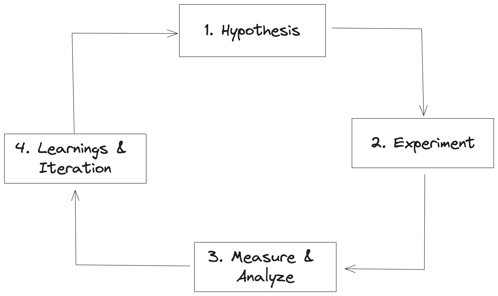

The Citizens’ House relies on the concept of governance by individuals with one vote each. Citizens are meant to represent individual human stakeholders of the Collective: builders, users, and community members who are aligned with the project’s values and are interested in the long-term benefit of the Collective. This is complementary to the token-weighted voting system used in the Token House.

## Bootstrapping Citizenship - an Initial Set of Citizens

In the initial stage of bootstrapping the Citizens' House, participants receive temporary badges to vote in Retro Funding rounds. The early participants were selected via a 'Web of Trust', whereby [known individuals were invited](https://optimism.mirror.xyz/wqk1Yeyn2OhV9paDzbRXvQ0m0JYDu2npbSkMClwk1rY) by The Optimism Foundation, The Token House, [past Retro Funding award winners](https://gov.optimism.io/t/retropgf-3-voting-badge-distribution/6557), and existing Badgeholders.
* Round 1 had 24 badgeholder participants
* Round 2 had 71 badgeholder participants, invited by Round 1 badgeholders
* Round 3 had 146 badgeholder participants

In future stages, the Token House and Citizens’ House together will collaborate on ongoing criteria for participation in the Citizens’ House. This means the criteria for Citizenship will evolve over time. Holding a voting badge does not guarantee voting rights in future rounds of Retro Funding, as eventually membership will be determined by governance and may change.

## How will Citizenship selection work?

The goal of the Citizens' House is to:
- Reduce concentration of power
- Safeguard against capture of Token House
- Allocate resources according to the long-term benefit to the Collective

Citizenship selection will be based on growing knowledge about the type of Citizenry that performs well on these goals. Ahead of making any permanent decisions on Citizenship selection, the Collective must gain insights on the performance of Citizens' House and form hypotheses on the types of Citizens that are likely to contribute to the Citizens' House achieving its goals.

Changes to Citizenship are likely to occur hand-in-hand with changes to Retro Funding, as the nature of the voting system is interdependent with the size and character of the Citizenry. In the current phase, the Collective's primary focus is to learn as much as possible about both Retro Funding design and Citizenship selection design and the interaction between the two. 

## Experimentation with Citizenship 

The main way the Collective is learning about Retro Funding and Citizenship selection design is through experimentation. 

While Badgeholders for Retro Funding Rounds 1-4 were selected via the Web of Trust method, future rounds may see the participation of Guest Voters, selected to participate temporarily via different selection mechanisms.

After each Retro Funding Round, learnings are open-sourced for the benefit of the Optimism Collective and wider community. Growing collective knowledge is an essential element of supporting future decision-making around these topics.

You can read more about experimentation with Citizenship here.

