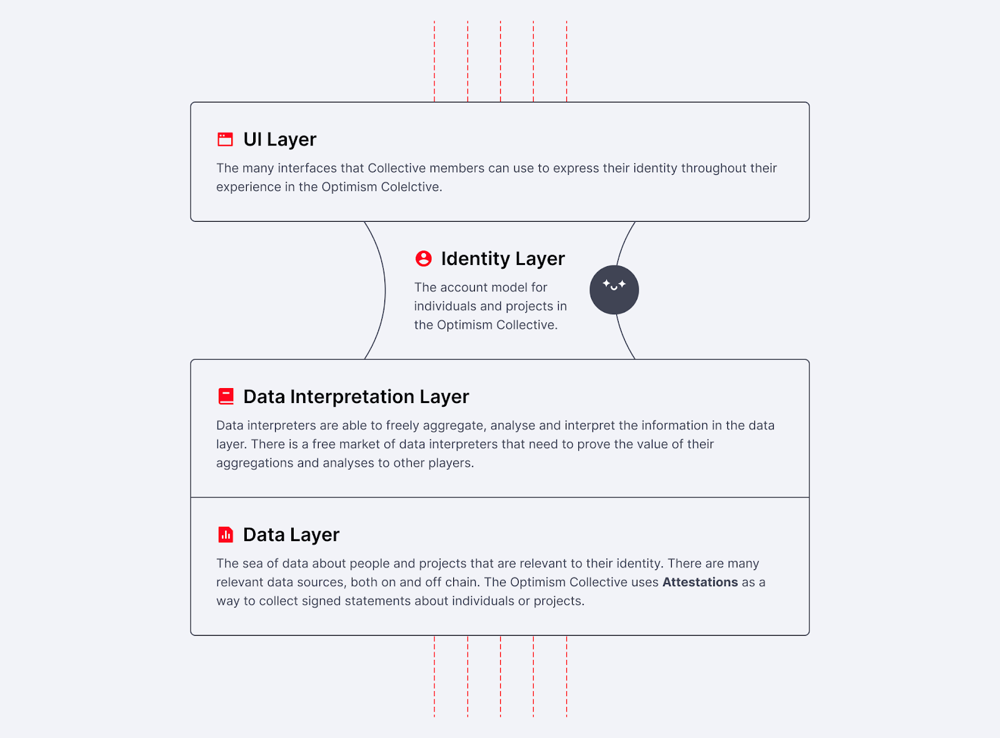

# Citizenship, identity, reputation and attestations

This document intends to open-source the Optimism Foundation’s thinking around identity and reputation within the Collective, as it relates to Citizenship. The hope is to provide some clarity and direction for community members who are curious or eager to build things that create impact for the Collective.

## Problem summary

We need robust user and project identity within the Optimism Collective as a foundation for Citizenship.This will improve the quality of Token House elections, better support developers on their journey of building on the superchain and create a high trust ecosystem.

In our plan for how to get there, we need to avoid following known pitfalls:

- Products that on their own don’t solve a problem, don’t get adopted.
- Attestations aren’t valuable unless they are being consumed in a real use case.
- There may be a cold start or chicken-and-egg problem in bootstrapping an identity/reputation network.
- Defining the criteria for citizenship ‘top down’ and issuing related attestations misses an opportunity for emergent knowledge.
- Attestations issued for their own sake are at risk of being arbitrary - i.e. not representing anything meaningful for the Optimism Collective.

## Principles

- Prioritize the things that will help Citizenship emerge organically over defining Citizenship top-down.
- Issue attestations that will be used for something right away rather than issuing attestations for every little thing that might be useful in the future.
- When aggregating data, avoid arbitrary inputs and ensure there is a way to measure effectiveness.
- Design with the expectation that what is built will attract farmers.

See the ‘Attestations Best Practices’ section below for a practical guide to attestations.

## Framework

The identity stack framework helps us to see how the different elements of identity and reputation fit together.

At the data layer, we have raw blockchain transactions, attestations and other types of data. The data producers can be dApps, organizations or individuals themselves. Anyone can produce any kind of data, but those higher up in the stack (such as data aggregators) need to differentiate signal from noise.

The data interpretation layer includes algorithms, aggregations and other kinds of analytics run across the data in the data layer. Data aggregators can but don’t need to be the same entities that produce or consume the data. In fact, in the future we can imagine a large marketplace of data aggregators that compete to provide the most valuable algorithms to other entities. Anyone can aggregate data, but they must prove their worth and trustworthiness to other players. In the future, metric-based impact evaluation for Retro Funding, smart defaults in the Token House and Citizenship selection are all areas where we imagine that data interpretation will become essential.

At the identity layer we have the way that individual users and projects/teams are represented in the Optimism Collective in order to tie together all the information about them. In the past, Ethereum addresses have been used to represent users and projects, but we are seeing limitations in this approach, as Ethereum addresses often do not stay stable over the lifecycle of a user or a project. The identity layer of the stack is the narrowest point - here having multiple competing offerings could become detrimental if one person’s identity is split across multiple accounts.

Finally, the UI layer includes any interface that integrates elements of the layers below - for example an interface that represents user profiles or a website that surfaces various algorithms that compute a user’s impact in the Optimism Collective. A multitude of interfaces is valuable and provides users different ways to engage with the layers below in the context of the user journey or the problem they are trying to solve.

## Now what?

We ought to take an approach of building out vertical slices of the identity stack, rather than building out sections horizontally. For example, rather than investing into building out all the possible use cases for data interpretation, we should select specific user problems and solve them end-to-end. Each vertical slice will solve a specific problem and integrate the necessary elements of the stack. This is the classic method of building an MVP and ensures that each piece that is built serves a purpose and gets adoption. It also means that attestations will be generated when they serve a specific need as part of a user journey, rather than being arbitrary.

While we are not taking an approach of building all the layers horizontally, the Optimism Foundation will support the establishment of an opinionated identity data structure that others can build around. By forming an opinion on how individuals and projects are represented in the Collective, we will make it easier for others to contribute and interoperate. Stay tuned for more updates on this.

We recommend that others keen to build within the identity and reputation space in the Optimism Collective take an approach of solving a specific and real problem for a clearly-defined user group and consider how this relates to the various layers of the identity stack, while adopting a shared user and project identity structure.

For those seeking specific input and ideas on what the Foundation and Token House consider valuable work, please refer to the [Builder Ideas List](https://contribute.optimism.io/), and current [Delegate Mission Requests](https://gov.optimism.io/c/mission-requests/69) and [Foundation Mission Requests](https://github.com/orgs/ethereum-optimism/projects/31/views/1) - these are the channels where specific work is called for.

If you’re working on something that you think fits within this framework and is not represented in these channels, please email identity@optimism.io and we’ll consider whether a Mission Grant could support this work.

## Attestations best practices

The Optimism Collective uses attestations via the [Ethereum Attestation Service](https://optimism.easscan.org/) as the mechanism for capturing important pieces of data as signed statements made by an issuer. For example, the Optimism Foundation is currently the issuer of attestations about who is a Badgeholder.

### When are attestations useful?

- Any time there is need for public/consumable and trusted data that is not available on-chain, an attestation might be useful.
- Attestations are especially valuable in cases where you need an entity to sign a claim.
- If you are generating some data which is valuable to some other person / organization / entity, by making it an attestation you can make it consumable to them and verify that you are the source of the data.
- Attestations / their content [can be made private](https://docs.attest.sh/docs/core--concepts/privacy), make sure to consider whether this would be appropriate for your use case.

### When are Attestations not useful?

- If the data in an attestation doesn’t need to be shared / consumed by anyone at all then there is probably no reason to turn it into an attestation.
- Data which can just be derived on-chain, like an account’s balance, transaction histories, etc., doesn’t need to be an attestation.

### Knowing when to generate attestations

We need to grow a rich set of attestations to build out identity in the Collective, but they must also be relevant. It is a delicate balancing act that each attestor will need to decide. Blanket issuing attestations that don’t have much value just means that we’ll have to filter out more noise. Ideally, the fact that you’re issuing an attestation is already one sign that this piece of data is signal rather than noise.

- A good moment to issue an attestation is when there is already a use-case - i.e. the attestation you issue will immediately be consumed for a specific purpose and solves a real need / problem. For example, when you want attestation-gated channels in Discord.
- If there is an attestation you think might be useful to some other or future entity, gather input from that entity (if possible). Validate that this data is indeed valuable / necessary. If we’re talking about future entities, use your best judgment. It’s true that starting to issue certain attestations early (before there is a clear use case) can be valuable later, but only if the future use case manifests.
- If you’re not sure, consider the importance of the piece of information you are attesting in the context of the value chain it is part of. For example, in the context of Retro Funding, the fact a project received funding is closer to the source of value than the fact that it applied.

### Deciding on the issuer

- The issuer is perhaps the most essential component of an attestation. Trust in the issuer is what gives an attestation meaning. Someone can go around signing digital statements that people have Doctorate degrees from Harvard University, but they have no meaning unless people believe that person to be the legitimate source of truth on who has Doctorate degrees from Harvard University.
- When deciding the issuer, think about who or what is the source of truth on a piece of information. Sometimes, this might be code, and a piece of software is the optimal issuer. In this case, transparency / legitimacy of the code can be important factors in people’s trust in the attestation.
- In cases where a person or group of people are the source of truth of a piece of information, a single person’s Ethereum account or a group’s multisig might be the more appropriate issuers of the attestation.
- There may be cases where software is the best issuer, but it is impractical to make this happen. In these cases, it’s reasonable to find an individual or organization that is a legitimate authority on the attestations and is trustworthy to others. For example, for the time being an Optimism Foundation multisig is the issuer of attestations on who is a Badgeholder, but in the future it may be a smart contract that issues these attestations.
- Remember that attestations are context-dependent / intersubjective - what matters most is the long-term credibility of the issuer of an attestation - i.e. how the issuer is perceived by others.

### Creating a useful schema

- Schemas exist to make sure that similar attestations are structured in the same way and can be identified as belonging to a set. This is vital for attestation consumers.
- Before creating a new schema, check to see if a [relevant schema already exists](https://optimism.easscan.org/schemas).
- The EAS has [recommendations for schema design](https://docs.attest.sh/docs/core--concepts/schemas). Here are some of their tips:
  - **Keep it Simple:** A schema should be concise. Avoid unnecessary complexity.
  - **Be Descriptive:** Each field should have a clear purpose and name.
  - **Avoid Redundancy:** Ensure each piece of information is captured once.
  - **Plan for the Future:** Design your schema to be extendable without breaking existing attestations.
  - **Gas Efficiency:** Consider the Ethereum gas costs. Using the right data types and thinking modularly will help reduce costs.

### When to make attestations on vs. offchain

Some key points to keep in mind ([see here](https://docs.attest.sh/docs/core--concepts/onchain-vs-offchain) for a full rundown):

- Onchain attestations are easier for smart contracts to read and directly verifiable on the blockchain.
- If you need them to be completely private, offchain attestations give you more options. Sensitive data must be encrypted in onchain attestations.
- Offchain attestations can be deleted, but onchain they are immutable.
- Both kinds can be revoked, but offchain attestations require their own separate revocation management.
- Onchain attestations are associated with gas fees and transaction times, making them less scalable than offchain.

For questions about attestations that aren’t answered here, please consult the [Ethereum Attestation Service documentation](https://docs.attest.sh/).
