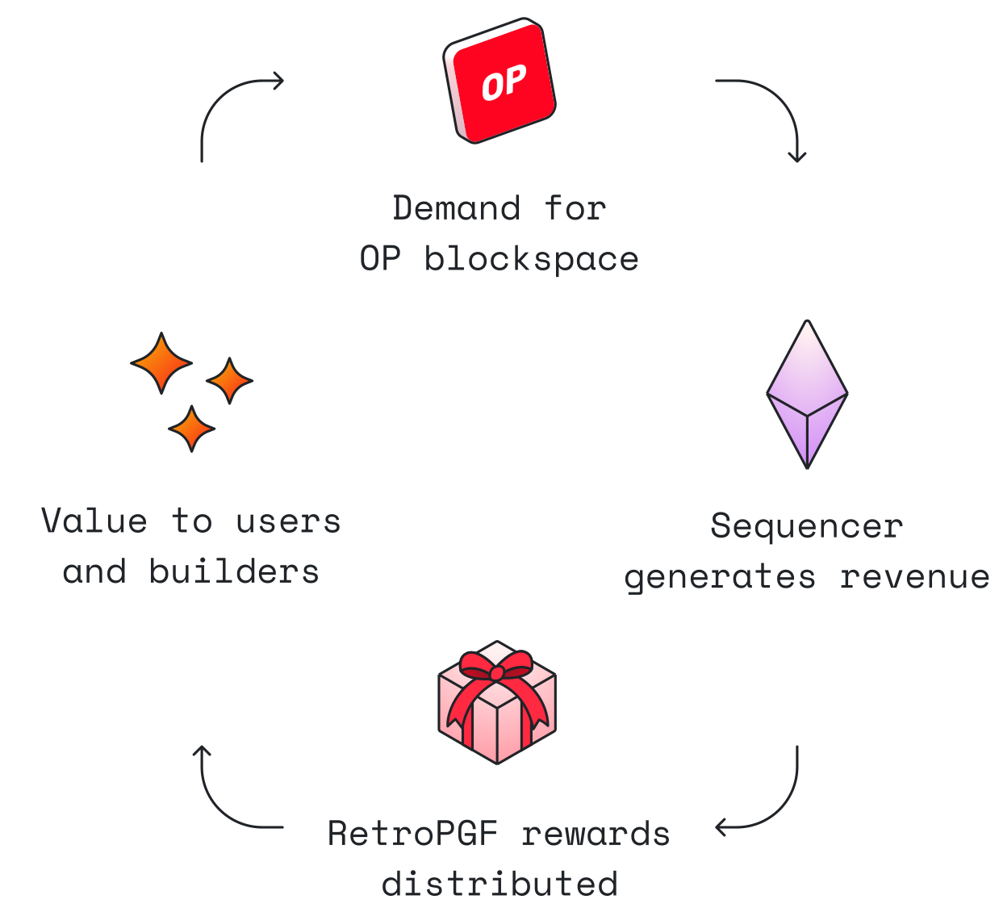

There is a lot going on inside the Optimism Collective. This doc aims to help you understand important terms and phrases. 

If you have specific questions, [join our Office Hours in Discord](https://discord.gg/optimism) (every 2nd week). If you want more support in creating Optimism content, check out our [Ambassador Program](./contribution-path/Ambassador-req.md)! 

For media requests please see [project support options](../biz/README.md#marketing-requests-🦸🦸) or reach out to marketing@optimism.io.

## The Optimistic Vision

An inclusive, open source Superchain that sustainably funds Public Goods, dispelling the myth that building public goods cannot be profitable!

### The RetroPGF Flywheel

The Optimism Collective generates revenue through transaction fees paid on OP Mainnet and other OP Chains. Part of this revenue is directed by the Collective for the benefit of the Collective through RetroPGF. Better public goods means more development, which creates more revenue that can be directed to public goods. Read [more about the flywheel](https://app.optimism.io/retropgf).

### The Optimism Collective

**The Optimism Collective** is a new model of **digital democratic governance** optimized to drive rapid and sustained growth of a decentralized ecosystem. The Collective is a band of communities, companies, and citizens united by a mutually beneficial pact to adhere to the axiom of **impact=profit** — the principle that positive impact to the collective should be rewarded with profit to the individual.

## Brand Kit

We are currently updating our brand kit, but you can find the old [Brand Kit here](https://github.com/ethereum-optimism/brand-kit)!

## Networks & The Superchain

The Optimism ecosystem is a growing space. Here are the basic terms and concepts you need to know to understand the shape of the Superchain. 

### The Superchain

The Superchain is a **vision** for a horizontally scalable network of chains that share security, a communication layer, and the OP Stack as an open source development stack. The Superchain does not yet exist. A number of governance and technical milestones need to be achieved before we have a functioning interoperable network of chains. Because of this, it is best to talk about the Superchain as a “vision” for something we are working towards.

As of Aug 1, 2023, OP Mainnet, Base, Public Goods Network, and ZORA NETWORK have made public commitments to build their L2 network using the OP Stack and join the Superchain when the Superchain launches.

[Read more about the Superchain](https://app.optimism.io/superchain). 

### OP Chains

OP Chains are Layer 2 blockchains that run the governance-approved release of the OP Stack, and therefore will be upgraded based on decisions by Optimism’s governance and contribute sequencer revenue back to the Collective. OP Chains will automatically inherit Superchain features in the future.

The benefit of opting into the Superchain and becoming an OP Chain is that users of OP Chains will have a convenient, homogenous experience bridging between OP Chains, and the OP Chain itself will share security and a governance standard ([Law of Chains](https://gov.optimism.io/t/law-of-chains-v0-1-section-by-section-overview/6515)).

### OP Stack

The [OP Stack](https://stack.optimism.io/) is the modular, open source, MIT-licensed development stack that powers the OP Mainnet, OP Chains, and, in the future, theSuperchain. The OP Stack is maintained by the Optimism Collective.

### OP Stack Fork

An **OP Stack Fork** refers to a Layer 2 blockchain that has been built using the MIT-licensed OP Stack, but is not governed by Optimism’s governance or contributing sequencer revenue back to the Collective (and therefore is not part of the Superchain). This means OP Stack Chains won’t necessarily share security or interoperability with OP Chains in the Superchain.

### OP Mainnet

OP Mainnet is a Layer 2 blockchain powered by Optimism's modular OP Stack. Previously known as just “Optimism,” OP Mainnet is where it all started, and the first chain to commit to the Superchain vision.

## OP Token

The OP token is a governance token and should be discussed as such. Use “OP” instead of “$OP.”  The use of the $ is prohibited in connection with “OP.” Content that refers to OP incorrectly will be removed off of Optimism platforms and will not be eligible for promotion.

- Do not discuss the token price or speculate on the price.
- Avoid referencing the OP token as an investment, including references to price, “pumping” the price, encouraging purchases, how the network can result in returns on investments, or discussing how to buy or sell OP.
- Token grants are made in OP and should not be converted to USD, nor referred to in USD amounts.