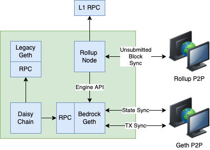

::: warning This guide is for bedrock
This guide is for the *bedrock* upgrade, which is coming in the second half of 2022.
Do not attempt to use this in production prior to that upgrade. Keep an eye on these docs or [our official Twitter](https://twitter.com/OPLabsPBC) for announcements on [the Bedrock testnet](#testnets).
:::

This document provides an overview of how the Bedrock upgrade will impact infrastructure providers. 
To learn more about how Bedrock itself works and its motivations, please see [the specs on GitHub](https://github.com/ethereum-optimism/optimism/tree/develop/specs).

## Deployment Overview

### Key Differences

- There is no more [DTL](../../protocol/2-rollup-protocol.md#block-execution).
  This is one Docker container you no longer need.
- Nodes can sync over a peer-to-peer network just like L1.
  This means you need to allow Bedrock Geth to communicate directly with other Bedrock Geth instances to get the fastest possible state synchronization. 
- Transactions are distributed over a peer-to-peer network just like L1.
  This means you need to allow Rollup Node access both to and from the Internet.
- The sequencer has a mempool now, and produces blocks on a fixed interval just like post-Merge L1.
  As an infrastructure provider, this should not affect you.
- There is no more `getBlockRange` RPC, since this was used primarily by the DTL.
  As an infrastructure provider, this should not affect you, unless you have custom code that uses the `getBlockRange` RPC.
- Historical data (pre-bedrock) is served by a read-only version of our existing Geth node. 
  RPC requests are automatically routed between historical and non-historical Geth using a new component called the Daisy Chain.
  This means there are two more docker containers, Daisy Chain and l2geth.

## Components

### Rollup Node

- The Rollup Node is a Go binary that derives and distributes L2 blocks.
- It uses [the new Engine API](https://github.com/ethereum/execution-apis/blob/main/src/engine/specification.md#core) to append the blocks it derives to the canonical chain.
- It communicates over a peer-to-peer network to download blocks that haven’t been submitted to L1 yet.
- It detects and handles [L1 reorgs](https://cointelegraph.com/explained/what-is-chain-reorganization-in-blockchain-technology).

### Bedrock Geth

- The Bedrock Geth node is a vanilla Geth 1.10.x instance with the minimal Optimism-specific diff applied.
- It syncs unconfirmed transactions over a peer-to-peer network using Geth’s built in transaction pool.
- It syncs state to other Bedrock Geth nodes using Geth’s build in [snap sync mechanism](https://github.com/ethereum/devp2p/blob/master/caps/snap.md).
- It serves the Engine API to the Rollup Node.

### Legacy Geth

- A stripped-down, read-only version of the legacy (i.e., pre-Bedrock) `l2geth` node.
- Serves historical data to the Daisy Chain.
- The Legacy Geth instance will ship with a pre-populated database. 
  It does not need state synchronization, because that database is real only.

### Daisy Chain

- The Daisy Chain is an RPC request router. It sends requests for historical chain data to the Legacy Geth node, and requests for current chain data to the Bedrock Geth node.

## Guidelines

1. The Bedrock Geth node is deployed identically to an L1 Geth node:
    - It needs access to Ethereum’s peer-to-peer network.
    - It needs a large attached disk to store its state.
    - Its RPC ports need to be accessible in order for users to submit transactions and read chain data.
    - The Bedrock Geth node needs to be accessible by the Rollup Node in order for the Engine API to function correctly.
2. The Rollup Node can be deployed as a single container.
    - It needs access to an L1 RPC endpoint.
    - It needs access to the Bedrock Geth node, preferably over a WebSocket connection.
    - It needs access to the Rollup Node’s peer-to-peer network.
    - The Rollup Node is stateless, so it does not need a writable disk.
3. Don’t try to run multiple Bedrock Geth nodes per Rollup Node or vice versa. Always deploy them in pairs.
    - In a Kubernetes deployment, the Rollup Node might be deployed as a sidecar to the Bedrock Geth node.
4. The Legacy Geth node is deployed similarly to an L1 Geth node, except:
    - The node is read-only, so it will not run any transaction pooling or sync logic.
    - Since the state of the Legacy Geth node is immutable, it is safe to run unlimited Legacy Geth nodes behind a load balancer without worrying about consistency problems.
5. The Daisy Chain is deployed similarly to any proxy container:
    - It needs access to the RPC endpoints of a Legacy Geth and Bedrock Geth node.
    - The Geth nodes the Daisy Chain routes to can be behind load balancers, as long as the load balancers only contain Geth nodes of a single type (i.e., do not mix Legacy and Bedrock Geth nodes behind the same LB).

## Upgrade Plan

### Testnets

Prior to upgrading mainnet, we will be running a series of testnets. 
The last testnet will replace our existing Goerli, and run for an entire month to give developers time to fix any integration issues they may encounter.

Dates for the testnet have not been determined yet. 
Please keep an eye on this documentation or our [official Twitter](https://twitter.com/OPLabsPBC) for date announcements.

### Upgrade Process

The high level upgrade process looks like this:

#### Optimism Upgrade Steps

1. At a predefined block height, we disable the sequencer and take a state snapshot.
2. We upgrade our smart contracts.
3. We generate a `genesis.json` file from the state snapshot.
4. We initialize the sequencer with the `genesis.json` file.
5. We redeploy our Legacy Geth instances with the state snapshot.
6. We give infra providers the following artifacts:
    - The `genesis.json` file for the sequencer.
    - The state snapshot for Legacy Geth.
    - The genesis hashes that the Rollup Node needs as part of its configuration.
7. We wait for infrastructure providers to upgrade.
8. We re-enable the sequencer.
9. Now the chain is bedrock enabled!

#### Infra Provider Upgrade Steps

Upon receipt of the `genesis.json`, state snapshot, and genesis hashes:

1. Redeploy Legacy Geth with the provided state snapshot.
2. Initialize Bedrock Geth with the provided `genesis.json` file.
3. Configure the Rollup Node to use the provided genesis hashes.