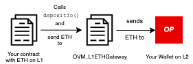
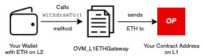

# {{ $frontmatter.title }}

::: tip Work in Progress™
Our documentation is a rapidly improving work in progress. If you have questions or feel like something is missing feel free to ask in our [Discord server](https://discord.gg/5TaAXGn2D8) where we (and our awesome community) are actively responding, or [open an issue](https://github.com/ethereum-optimism/community-hub/issues) in the GitHub repo for this site.
:::

Apps on Optimistic Ethereum can be made to interact with apps on Ethereum via a process called "bridging".
In a nutshell, **contracts on Optimistic Ethereum can send messages to contracts on Ethereum, and vice versa**.
With just a little bit of elbow grease, you too can create contracts that bridge the gap between Layer 1 and Layer 2!

## L1 ⇔ L2 Communication Basics

The following is an abridged version of the section titled "L1 to L2 interoperability" in [_How does Optimism's Rollup really work?_](https://research.paradigm.xyz/optimism) by [Georgios Konstantopoulos](https://twitter.com/gakonst) from Paradigm Research.

---------

Optimistic Ethereum allows asynchronous calls between L1 and L2 users or contracts.
Practically, this means that a contract on L1 can make a call to a contract on L2, and vice versa.
This contract communication is implemented by deploying "messenger" contracts on both Ethereum and Optimistic Ethereum.

The sending chain's contract calls `sendMessage` with the data it wants to pass over, and a relay calls `relayMessage` (from L1 or from L2) on the receiving chain to actually relay the data.

These methods are shown below for reference:

* (L1 or L2 Sender ) [`sendMessage`](https://github.com/ethereum-optimism/optimism/blob/master/packages/contracts/contracts/optimistic-ethereum/OVM/bridge/messaging/Abs_BaseCrossDomainMessenger.sol#L51-L61) of `Abs_BaseCrossDomainMessenger.sol`:

```solidity
/**
 * Sends a cross domain message to the target messenger.
 * @param _target Target contract address.
 * @param _message Message to send to the target.
 * @param _gasLimit Gas limit for the provided message.
 */
function sendMessage(
    address _target,
    bytes memory _message,
    uint32 _gasLimit
)
    override
    public
{
    bytes memory xDomainCalldata = _getXDomainCalldata(
        _target,
        msg.sender,
        _message,
        messageNonce
    );

    messageNonce += 1;
    sentMessages[keccak256(xDomainCalldata)] = true;

    _sendXDomainMessage(xDomainCalldata, _gasLimit);
    emit SentMessage(xDomainCalldata);
}
```

2. (L1 Receiver) [`relayMessage`](https://github.com/ethereum-optimism/optimism/blob/master/packages/contracts/contracts/optimistic-ethereum/OVM/bridge/messaging/OVM_L1CrossDomainMessenger.sol#L79-L89) of  `OVM_L1CrossDomainMessenger.sol`:
```solidity
/**
 * Relays a cross domain message to a contract.
 */
function relayMessage(
    address _target,
    address _sender,
    bytes memory _message,
    uint256 _messageNonce,
    L2MessageInclusionProof memory _proof
)
```

3. (L2 Receiver) [`relayMessage`](https://github.com/ethereum-optimism/optimism/blob/master/packages/contracts/contracts/optimistic-ethereum/OVM/bridge/messaging/OVM_L2CrossDomainMessenger.sol#L45-L54) of `OVM_L2CrossDomainMessenger.sol`:
```solidity
/**
 * Relays a cross domain message to a contract.
 */
function relayMessage(
    address _target,
    address _sender,
    bytes memory _message,
    uint256 _messageNonce
)
```

Conveniently, all transactions from L1 to L2 get automatically relayed _by the sequencer_.
This happens because the L1 ➡️ L2 bridge calls [`enqueue`](https://github.com/ethereum-optimism/optimism/blob/master/packages/contracts/contracts/optimistic-ethereum/OVM/bridge/messaging/OVM_L1CrossDomainMessenger.sol#L287-L291), queuing up a transaction for execution by the sequencer.

From these calls to `enqueue`, we can, in a way, think of the the sequencer is an "always on" relay for L1 to L2 transactions, while L2 to L1 transactions need to be explicitly relayed by users.

Using the default bridge contracts by Optimism requires all L2 to L1 transactions are at least [1 week old](https://community.optimism.io/faqs/#why-is-there-a-delay-when-moving-assets-from-optimistic-ethereum-to-ethereum).
This is to allow enough time for verifiers to submit fraud proofs and prevent invalid withdrawals.

It could be the case that developers deploy their own bridge contracts with semi-trusted mechanisms that allow L2 to L1 transactions with a smaller time restriction.

As a developer integrating with Optimism's messengers is very easy.
Just call `<LAYER>CrossDomainMessenger.sendMessage` with the calldata, gasLimit and target address you want to call on the destination layer.  

This wraps the message in a [`relayMessage`](https://github.com/ethereum-optimism/optimism/blob/master/packages/contracts/contracts/optimistic-ethereum/OVM/bridge/messaging/Abs_BaseCrossDomainMessenger.sol#L83-L96) call, targeting the `L2CrossDomainMessenger`.
That's all! It's the same general process for L2 to L1.
(This is enabled by the `L1MessageSender`, `L1BlockNumber`, and `L1Queue` fields in the message and transaction `meta`.)

## Token Bridges

Just like on L1, gas fees (i.e. transaction fees on Ethereum, usually denominated in [Gwei](https://gwei.io/)) still apply on L2.
That means that you need to deposit some ether (ETH) to L2 to be able to pay for these gas fees.
However, you cannot just directly transfer your ETH from an L1 smart contract or EOA (i.e. wallet) to Optimistic Ethereum's L2.

This is where the ETH (and token) bridges come in!

### The Standard™️ ETH Bridge

Optimistic Ethereum comes with a standard ETH bridge, [`OVM_L1ETHGateway.sol`](https://github.com/ethereum-optimism/optimism/blob/master/packages/contracts/contracts/optimistic-ethereum/OVM/bridge/tokens/OVM_L1ETHGateway.sol). This smart contract acts as a _bridge_ between L1 and L2, letting users deposit ETH into the contract on L1 so that it can be used on L2.

`OVM_L1ETHGateway` has 2 important methods to keep in mind:

1. [`deposit()`](https://github.com/ethereum-optimism/optimism/blob/master/packages/contracts/contracts/optimistic-ethereum/OVM/bridge/tokens/OVM_L1ETHGateway.sol#L81) is external and payable method used to send ETH from an account on L1 to the same address on L2.
2. [`depositTo()`](https://github.com/ethereum-optimism/optimism/blob/master/packages/contracts/contracts/optimistic-ethereum/OVM/bridge/tokens/OVM_L1ETHGateway.sol#L93) is external and payable method used to send ETH to another address on L2.

Here's an example deposit flow from L1 to L2 using the `depositTo()` method:



Similarly, here's an example of the flow in reverse, starting with a deposit of ETH on L2 and the funds being sent to the `msg.sender`'s address on L1. Here we use `withdraw()` or [`withdrawTo()`](https://github.com/ethereum-optimism/optimism/blob/fb362ff748c803dc9099326f0e3096889b5dd5aa/packages/contracts/contracts/optimistic-ethereum/OVM/bridge/tokens/Abs_L2DepositedToken.sol#L163), which `OVM_ETH.sol` inherits to initiate our transfer of ETH from L2 to L1:



### Token Bridges

Similar to the ETH bridge, Optimistic Ethereum comes with bridge contracts that allow for _any_ token transfers between L1 and L2.

These contracts are:
1. [`Abs_L1TokenGateway.sol`](https://github.com/ethereum-optimism/contracts/blob/master/contracts/optimistic-ethereum/OVM/bridge/tokens/Abs_L1TokenGateway.sol)
2. [`Abs_L2DepositedToken`](https://github.com/ethereum-optimism/contracts/blob/master/contracts/optimistic-ethereum/OVM/bridge/tokens/Abs_L2DepositedToken.sol)
3. [`OVM_L1ERC20Gateway.sol`](https://github.com/ethereum-optimism/contracts/blob/master/contracts/optimistic-ethereum/OVM/bridge/tokens/OVM_L1ERC20Gateway.sol)
4. [`OVM_L2DepositedERC20.sol`](https://github.com/ethereum-optimism/contracts/blob/master/contracts/optimistic-ethereum/OVM/bridge/tokens/OVM_L2DepositedERC20.sol)

If you would like to see an example implementation of message passing in an application, we made a simple example deposit-and-withdraw guide for [how to use `Abs_L2DepositedToken.sol`](https://github.com/ethereum-optimism/l1-l2-deposit-withdrawal/blob/9529827a763dee21f28452bcd825ea2ce70f4b22/contracts/L2DepositedERC20.sol#L8-L11) on the [`l1-l2-deposit-withdrawal`](https://github.com/ethereum-optimism/l1-l2-deposit-withdrawal) example repository for you to check out!

## By Example: Synthetix

If you find examples useful, you might be interested in taking a look at the bridge contracts that [Synthetix](https://synthetix.io/) wrote for their [L2 mainnet launch](https://blog.synthetix.io/l2-mainnet-launch/).
These contracts are pretty slick and make heavy use of our L1⇔L2 messaging infrastructure.
Here's a quick play-by-play:

1. Depositing SNX into L2
    - [Initiating a deposit on L1](https://github.com/Synthetixio/synthetix/blob/master/contracts/SynthetixBridgeToOptimism.sol#L190-L205)
    - [Which leads to receiving a balance on L2](https://github.com/Synthetixio/synthetix/blob/master/contracts/SynthetixBridgeToBase.sol#L111-L115)
2. Migrate SNX Escrow entries to L2 (transferring large amounts of state from L1->L2):
    - [Initiating a migration on L1](https://github.com/Synthetixio/synthetix/blob/master/contracts/SynthetixBridgeToOptimism.sol#L207-L236)
    - [Which leads to receiving escrow entries on L2](https://github.com/Synthetixio/synthetix/blob/master/contracts/SynthetixBridgeToBase.sol#L98-L108)
3. Withdrawing SNX to L1:
    - [Burning L2 SNX and initiating the withdrawal on L2](https://github.com/Synthetixio/synthetix/blob/master/contracts/SynthetixBridgeToBase.sol#L76-L94)
    - [Completing the withdrawal and receiving a balance on L1](https://github.com/Synthetixio/synthetix/blob/master/contracts/SynthetixBridgeToOptimism.sol#L126-L136)

