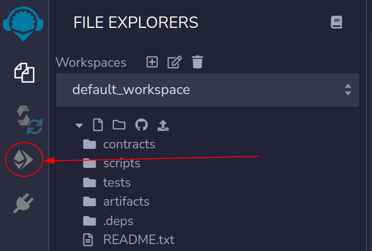
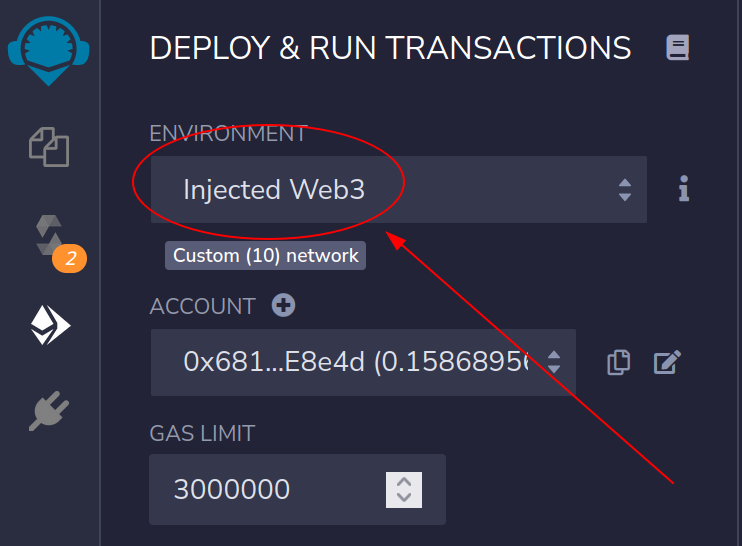
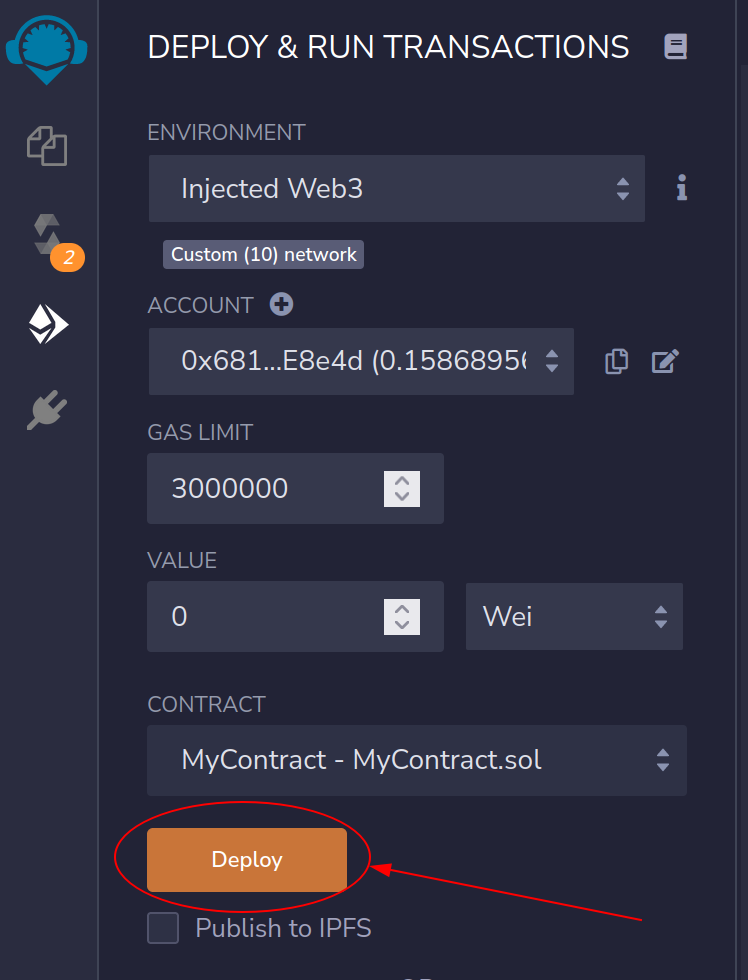
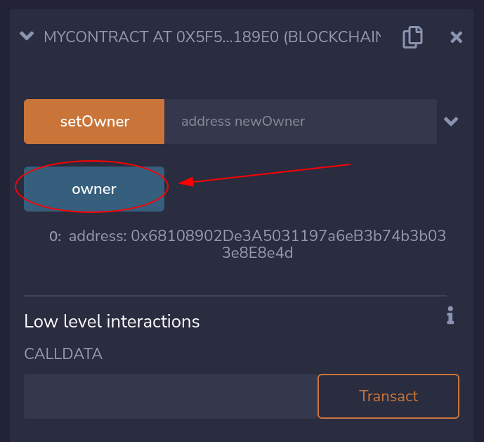
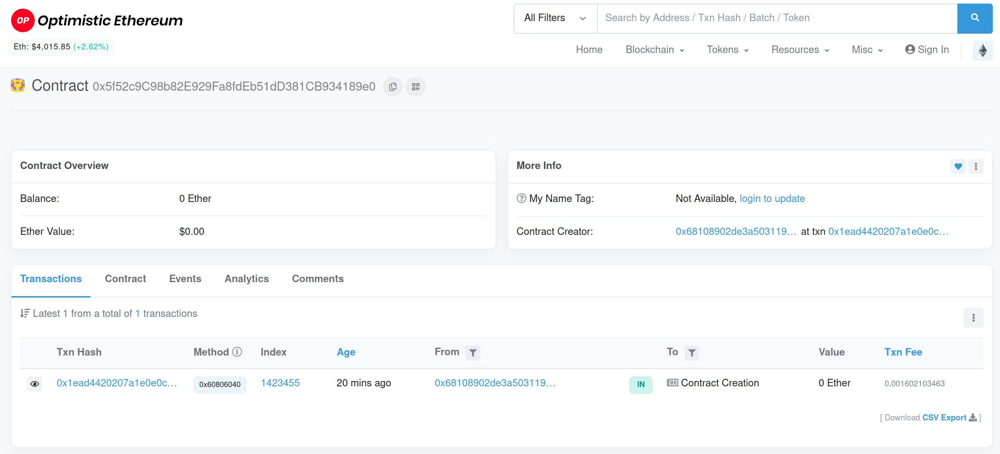
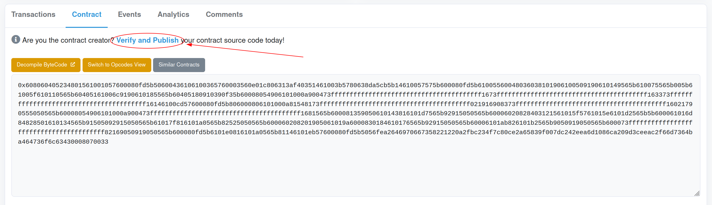

# {{ $frontmatter.title }}

Optimism is the first [EVM equivalent](https://medium.com/ethereum-optimism/introducing-evm-equivalence-5c2021deb306) L2 system, which means that it's almost 100% identical to Ethereum.
The process of deploying a contract to Optimism is exactly the same as deploying a contract to Ethereum.
We'll demonstrate how easy it is to get started by deploying a basic contract to the Optimism Kovan testnet using [Remix](https://remix.ethereum.org/).

## Requirements

Just like with Ethereum, you'll need a wallet to use to interact with Optimism.
Here we'll be using the [MetaMask](https://metamask.io/) Chrome extension to interact with the Optimism Kovan testnet.
You can probably use other wallets and/or extensions, but this guide will include screenshots of MetaMask.
We recommend using MetaMask to simplify the process of following along.

## Connecting to Optimism

MetaMask requires you to manually connect to new Ethereum-based networks before you can interact with them.
You can find more information about the connection process [on the Optimism Help Center](https://help.optimism.io/hc/en-us/articles/4411903123483-Connecting-your-wallet-to-Optimism).

For now, simply [head to this link](https://chainid.link/?network=optimism-kovan) and click "Connect".
Accept the popup that shows up in MetaMask and you'll be connected to the Optimism Kovan testnet.

## Getting some testnet ETH

Like on Ethereum, transaction fees on Optimism are paid in ETH.
You'll need some ETH on the Optimism Kovan testnet to deploy a contract.
The [Paradigm Multifaucet](https://faucet.paradigm.xyz/) is a quick and easy way to get ETH on a whole bunch of testnets, including the Optimism Kovan testnet.
You'll also be sent some other tokens and assets that you can use to play around even more once you're done with this guide.

## Writing a quick contract

Once you've got your testnet ETH, it's time to write a contract.
Head over to [Remix](https://remix.ethereum.org) and create a new file (you can name this whatever you want).
You're free to drop whatever code you want in this file (anything that runs on Ethereum will run on Optimism!) but here's some sample code that you can use:

```solidity
contract MyContract {
    address public owner;

    constructor() {
        owner = msg.sender;
    }

    function setOwner(address newOwner) public {
        require(msg.sender == owner);
        owner = newOwner;
    }
}
```

Save the file (ctrl+s) to automatically compile it.
Now it's time to deploy!

## Deploying your contract

Deploying contracts with Remix is as easy as 1-2-3!

1. Select the Deployment tab:

<div align="center"></div>

2. Select the "Injected Web3" environment:

<div align="center"></div>

3. Click "Deploy"!

<div align="center"></div>

Accept the popup in MetaMask and you're all done!
Your contract deployment should take less than a second (Optimism is *fast*).
If you've used Remix to deploy contracts to Ethereum before, you'll notice that the process of deploying to Optimism has been 100% identical.
That's the power of [EVM equivalence](https://medium.com/ethereum-optimism/introducing-evm-equivalence-5c2021deb306)!

## Interacting with your contract

Now that your contract has been deployed you'll be able to interact with it just like you'd interact with a contract on Ethereum.
You can try messing around with the contract directly in Remix by expanding the newly created contract and triggering one of the contract functions.
Try querying the current owner:

<div align="center"></div>

## Viewing your contract on Etherscan

You might want to see more information about your contract by visiting [Optimistic Etherscan](https://kovan-optimistic.etherscan.io).
Drop in the address of your contract and you'll get all the information that you'd get from the standard Etherscan explorer:

<div align="center"></div>

You can also verify the source code of your contract by going through the standard source code verification flow:

<div align="center"></div>

## Diving deeper

That's really all there is to deploying a contract on Optimism.
It's exactly like deploying a contract on Ethereum.
We hope you didn't learn anything new!

If you're itching to start building a more complex contract, check out our next section on [using your favorite tools](./using-tools.md) with Optimism!
