---
title: The Standard™ ETH Gateway
lang: en-US
---     

# {{ $frontmatter.title }}

Just like on Ethereum, you'll need some ETH to pay for transaction fees on Layer 2.
The easiest way to move ETH from Layer 1 to Layer 2 is via [our ETH Gateway](https://gateway.optimism.io).
You can make use of this gateway on [any of our networks](./networks).

## Usage Guide

Here's a quick guide to using this gateway to deposit some Kovan ETH into Layer 2!
Before you continue, make sure you've successfully [connected your wallet to Optimistic Ethereum](./metamask).
If you're using a wallet other than MetaMask, you should refer to our [Networks and Connection Details](./networks) page.
On that note, let's begin!

1. We'll be using the Kovan testnet during this guide. Make sure you've selected the Kovan Test Network before you continue:

2. You'll also need some Kovan ETH (KETH). If you don't already have Kovan ETH, try using this [Kovan ETH faucet](https://faucet.kovan.network/).

3. Once you're connected to Kovan and you have some KETH, head over to [https://gateway.optimism.io](https://gateway.optimism.io). You'll be greeted with a disclaimer that contains some important information. **Please read this disclaimer carefully.** Whenever you're ready, click `connect`.

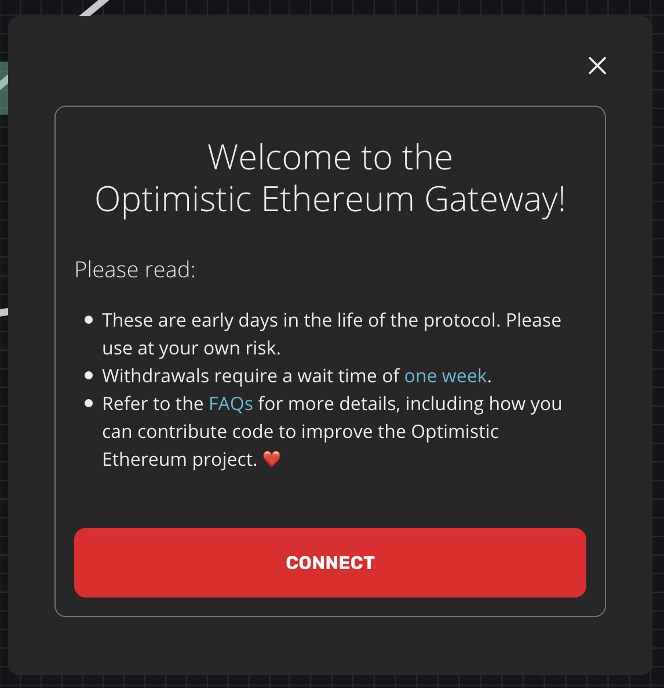

4. You'll now be presented with the option to either `deposit` ETH from Layer 1 into Layer 2 or to `withdraw` ETH from Layer 2 back to Layer 1. Select `deposit`:

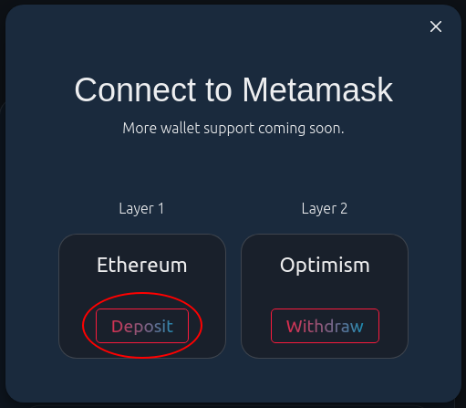

5. You should now see a popup asking you to connect your wallet to the website. Accept this popup to continue.

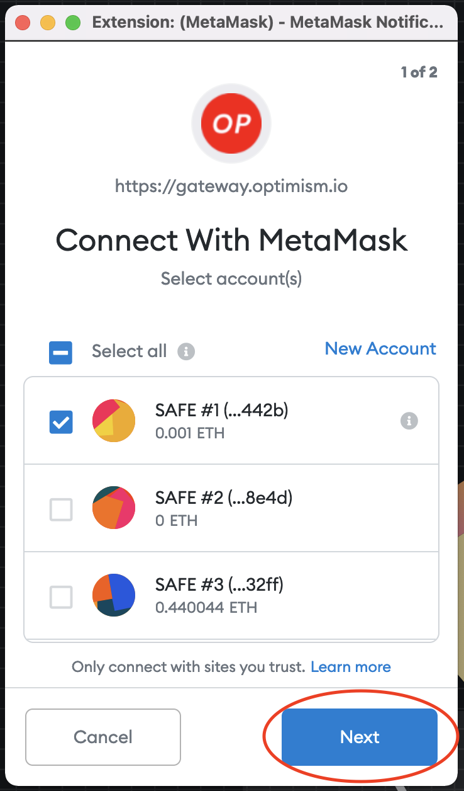

6. Now you'll see a "deposit" page where you can input some amount of ETH to transfer from Layer 1 to Layer 2. Input a small amount of KETH and click `deposit`.

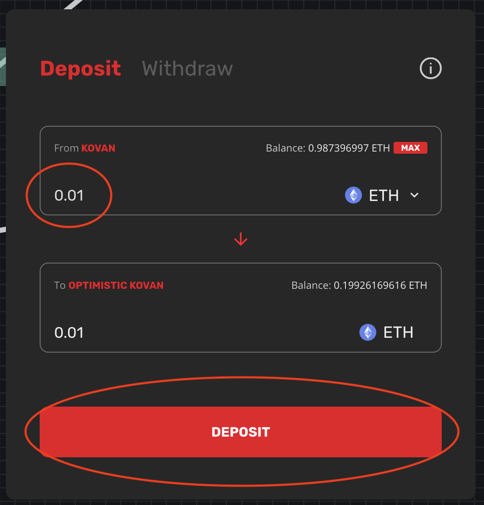

7. You'll see yet another disclaimer. Read this disclaimer carefully and continue. You'll be presented with a transaction to sign. Go ahead and sign it.

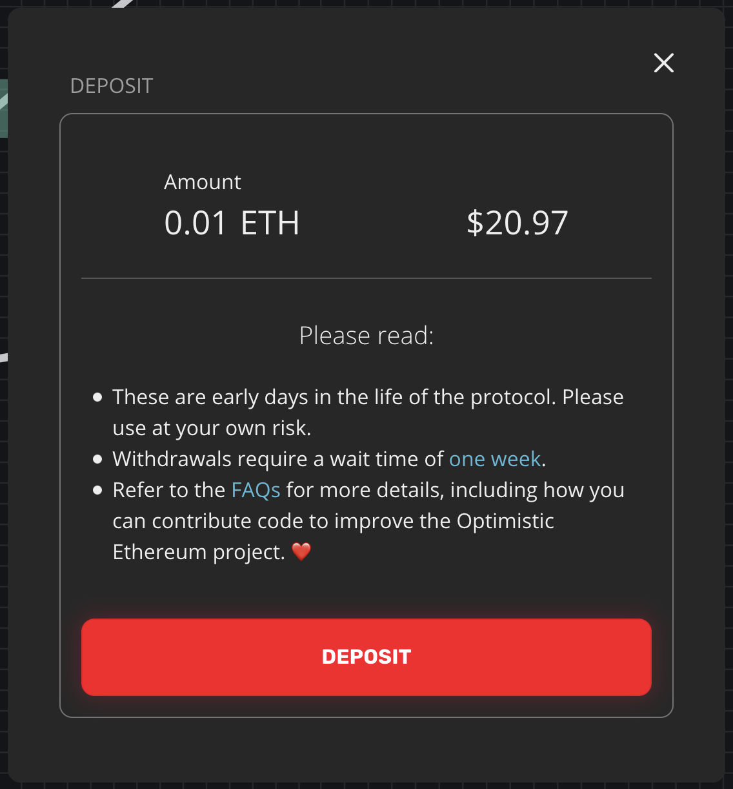

8. Now you just need to wait a minute for your transaction to be processed! After that, you should have a balance on Layer 2:

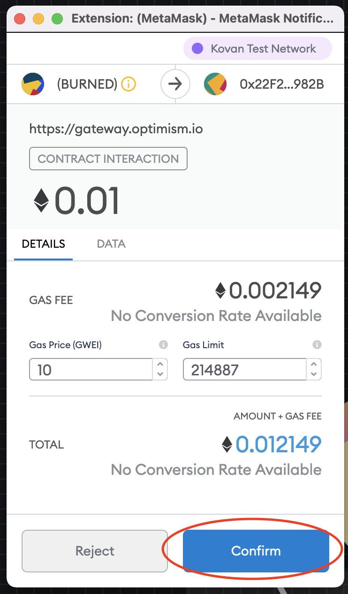

9. You can also confirm that everything went as expected by [switching to the Optimistic Kovan network](./metamask) and checking your balance:

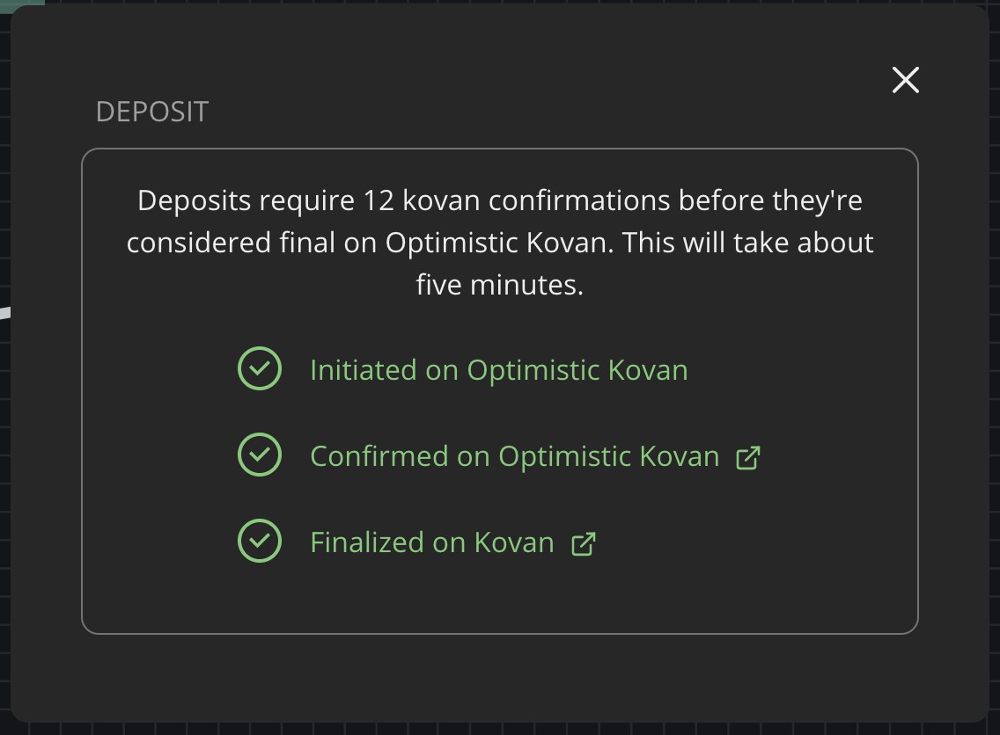

Congrats!
You just made your first deposit.
The process of withdrawing your ETH back from Layer 2 to Layer 1 is basically just the same thing but in reverse.
Go ahead and give it a shot! ☺️

::: tip On withdrawal times
Communication from Layer 1 to Layer 2 only takes on the order of a minute or so.
**Communication from Layer 2 to Layer 1 takes about a week.**
This is a security measure that leaves enough time for invalid transaction results to be caught and reverted before they become "finalized".
Please refer to our [guide to Bridging L1 and L2](./bridging) for more information about this withdrawal delay.
:::

## Under the Hood

Interested in how the ETH gateway works under the hood?
We've got you.

In a nutshell, the ETH gateway is pretty much just like any other application that [bridges L1 and L2](./bridging).
It's made up of two primary contracts, the [`OVM_L1ETHGateway`](https://github.com/ethereum-optimism/optimism/blob/develop/packages/contracts/contracts/optimistic-ethereum/OVM/bridge/tokens/OVM_L1ETHGateway.sol) contract on Layer 1, and the [`OVM_ETH`](https://github.com/ethereum-optimism/optimism/blob/develop/packages/contracts/contracts/optimistic-ethereum/OVM/predeploys/OVM_ETH.sol) contract on Layer 2.

So how do these contracts work together to move ETH between the two layers?
Great question!
Let's first take a look at how we send ETH from Layer 1 to Layer 2.

Deposits from Layer 1 into Layer 2 start when you **send some ETH to the `OVM_L1ETHGateway` contract**.
This ETH is then *locked* inside the contract.

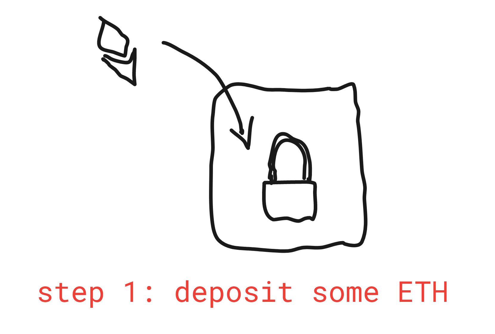

The `OVM_L1ETHGateway` contract then proceeds to **send a message** to the `OVM_ETH` contract on Layer 2.
If you want to know more about how this message actually gets sent, you should check out our page describing the [basics of L1 ⇔ L2 communication](./bridging.html#l1-⇔-l2-communication-basics).

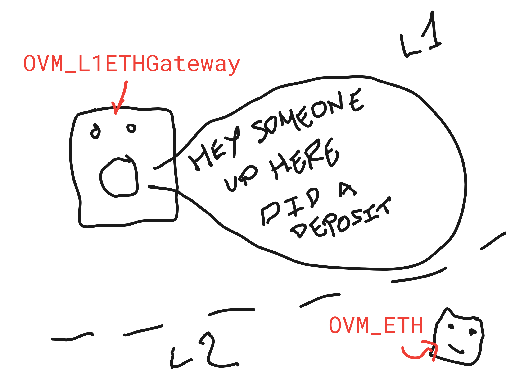

Now we just have to wait a few minutes for the `OVM_ETH` contract on Layer 2 to actually see this message.

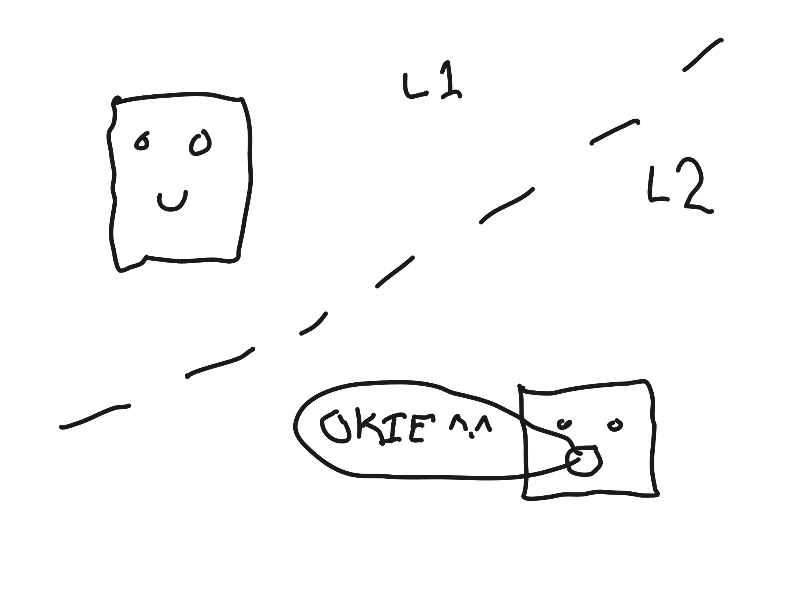

Once the `OVM_ETH` contract gets the message, it *mints* some ETH (out of thin air) equal to the amount of ETH that was originally deposited on Layer 1.

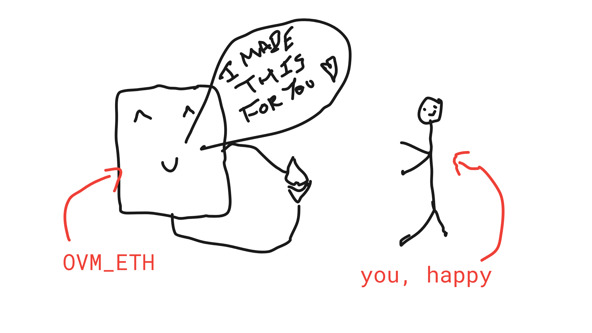

Badaboom, it's easy as that.
The process of moving ETH back from Layer 2 to Layer 1 is basically the same thing but in reverse.
I'm too lazy to draw the whole thing (sorry), but I'll give you the basic steps:

1. You send a "withdrawal" transaction to the `OVM_ETH` contract on Layer 2.
2. The `OVM_ETH` contract *burns* the ETH that you want to withdraw.
3. The `OVM_ETH` contract sends a message to the `OVM_L1ETHGateway` saying that it should unlock some ETH on your behalf.
4. You wait out the [one week fraud proof window](bridging.html#understanding-the-fraud-proof-window).
5. You send send a second, final "withdrawal" transaction to the `OVM_L1ETHGateway` on Layer 2 and get your funds back!
6. You are happy.
7. We are happy.
8. Ethereum gets way cooler.

::: tip On leaving feedback
I hope this was sufficiently informative.
Sometimes I struggle with trying to strike a balance between "useful" and "entertaining".
If you have opinions on this and would like to leave some feedback, I recommend [creating an issue on GitHub](https://github.com/ethereum-optimism/community-hub/issues).
Otherwise, thank you for reading this page!
:::