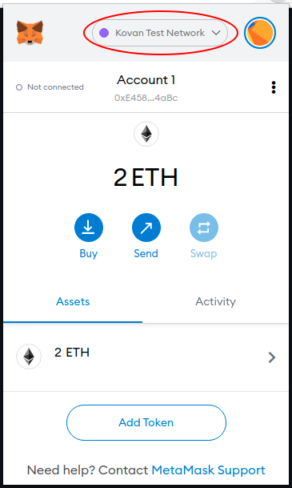
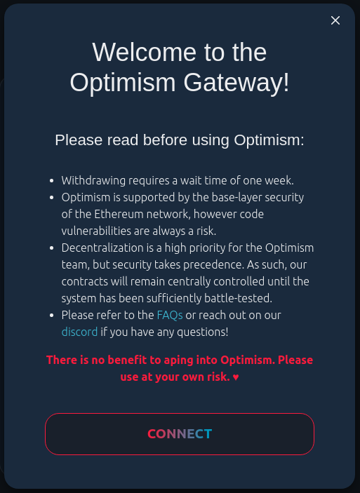
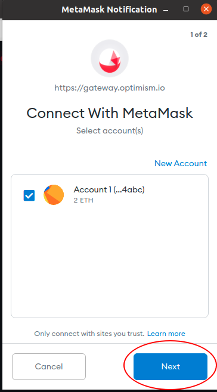
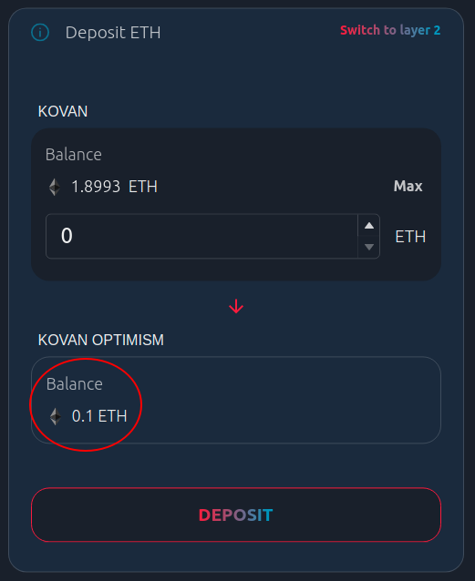

---
title: The Standard™ ETH Gateway
lang: en-US
---     

# {{ $frontmatter.title }}

Just like on Ethereum, you'll need some ETH to pay for transaction fees on Layer 2.
The easiest way to move ETH from Layer 1 to Layer 2 is via [our ETH Gateway](https://gateway.optimism.io).
You can make use of this gateway on [any of our networks](./networks).

## Usage Guide

Here's a quick guide to using this gateway to deposit some Kovan ETH into Layer 2!
Before you continue, make sure you've successfully [connected your wallet to Optimistic Ethereum](./metamask).
If you're using a wallet other than MetaMask, you should refer to our [Networks and Connection Details](./networks) page.
On that note, let's begin!

1. We'll be using the Kovan testnet during this guide. Make sure you've selected the Kovan Test Network before you continue:

2. You'll also need some Kovan ETH (KETH). If you don't already have Kovan ETH, try using this [Kovan ETH faucet](https://faucet.kovan.network/).

3. Once you're connected to Kovan and you have some KETH, head over to [https://gateway.optimism.io](https://gateway.optimism.io). You'll be greeted with a disclaimer that contains some important information. **Please read this disclaimer carefully.** Whenever you're ready, click `connect`.

4. You'll now be presented with the option to either `deposit` ETH from Layer 1 into Layer 2 or to `withdraw` ETH from Layer 2 back to Layer 1. Select `deposit`:

5. You should now see a popup asking you to connect your wallet to the website. Accept this popup to continue.

6. Now you'll see a "deposit" page where you can input some amount of ETH to transfer from Layer 1 to Layer 2. Input a small amount of KETH and click `deposit`.

7. You'll see yet another disclaimer. Read this disclaimer carefully and continue. You'll be presented with a transaction to sign. Go ahead and sign it.

8. Now you just need to wait a minute for your transaction to be processed! After that, you should have a balance on Layer 2:

9. You can also confirm that everything went as expected by [switching to the Optimistic Kovan network](./metamask) and checking your balance:

Congrats!
You just made your first deposit.
The process of withdrawing your ETH back from Layer 2 to Layer 1 is basically just the same thing but in reverse.
Go ahead and give it a shot! ☺️

::: tip On withdrawal times
Communication from Layer 1 to Layer 2 only takes on the order of a minute or so.
**Communication from Layer 2 to Layer 1 takes about a week.**
This is a security measure that leaves enough time for invalid transaction results to be caught and reverted before they become "finalized".
Please refer to our [guide to Bridging L1 and L2](./bridging) for more information about this withdrawal delay.
:::

<!-- TODO: add "how it works" section -->
