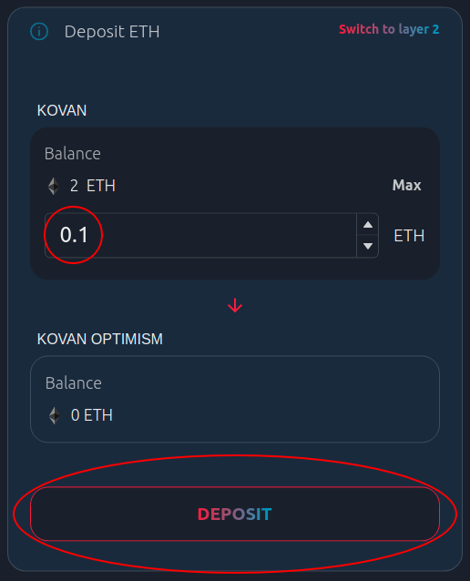
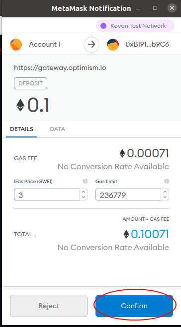
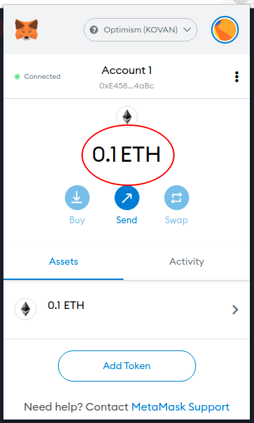

# {{ $frontmatter.title }}

The easiest way to move assets between Layer 1 and Layer 2 is to use the [Optimism Gateway](https://gateway.optimism.io).
You can make use of this gateway on [any of our networks](./networks).

## Tutorial: Depositing into L2

First we'll go over the basics of transferring tokens for L1 into L2.
We'll be depositing ETH in this tutorial, but you can also deposit any token supported on the Gateway frontend.
**This tutorial uses [MetaMask](https://metamask.io).**
Your experience may vary if using a different wallet provider.

1. We'll be using the Kovan testnet during this tutorial. Make sure you're connected to the Kovan testnet before you continue:

2. You'll also need some Kovan ETH (KETH). If you don't already have Kovan ETH, try using this [Kovan ETH faucet](https://faucet.kovan.network/).

3. Once you're connected to Kovan and you have some KETH, head over to [https://gateway.optimism.io](https://gateway.optimism.io). You'll be greeted with a disclaimer that contains some important information. **Please read this disclaimer carefully.** Whenever you're ready, click `connect`.

4. You'll now be asked to connect your wallet to the Gateway app. The app currently supports [MetaMask](https://metamask.io/) and any wallet that utilizes [WalletConnect](https://walletconnect.org/). Select the MetaMask option:

5. You should now see a popup asking you to connect your wallet to the website. Select the account you'd like to use and click `Next` continue.

6. Now you'll see a "deposit" page where you can input some amount of Kovan ETH to transfer from Layer 1 to Layer 2. You can also click on the `ETH` dropdown to deposit other supported tokens, but for this tutorial we'll stick with ETH. Input a small amount of Kovan ETH and click `deposit`.

7. You'll see yet another disclaimer. Read this disclaimer carefully and click `deposit` again.

8. You'll be presented with a transaction to sign. Go ahead and sign it by clicking `Confirm`.

9. Now you just need to wait a minute for your transaction to be processed! When moving assets from Layer 1 to Layer 2, you'll first have to wait for the transaction to be confirmed on Layer 1. This can take up to five minutes.

10. Once the UI says that your deposit is `Finalized on Kovan` you should have a balance on Layer 2. Click the `X` in the top right corner of the screen from the previous step to return to the Deposit page and check your balance:

10. You can also confirm that everything went as expected by [manually switching to the Optimistic Kovan network](./metamask) and checking your balance:

Congrats!
You just made your first deposit.
Next we'll look at the process for withdrawing tokens from Layer 2 back to Layer 1.

## Tutorial: Withdrawing back to L1

After you've deposited some tokens into L2, you might want to try withdrawing those tokens back to L1.
This tutorial will show you how to perform the full withdrawal process.
Please make sure you've already completed [the previous tutorial about depositing into L2](#tutorial-depositing-into-l2) before you continue.
**As in the previous tutorial, we'll be using MetaMask connected to the Kovan testnet.**

1. First, head over to the [Optimism Gateway app](https://gateway.optimism.io).
2. Click on the `Withdraw` button on the main page in order to switch into withdrawal mode:

3. You'll be greeted with a popup asking you to switch over to the Optimistic Kovan test network. Accept this popup by clicking on the `Switch network` button:

4. Next, input some amount of ETH to withdraw back to L1 and click the `withdraw` button:

5. You'll now be presented with another disclaimer. **Please ready this disclaimer carefully**. It includes information about **the cost to finalize your withdrawal on L1** and **the required waiting period before you can claim your withdrawal on L1**. Note that the Optimistic Kovan testnet has a waiting period of only 60 seconds to speed up the testing process. Once you're ready, click the `withdraw` button to trigger your withdrawal:

::: tip On withdrawal times
While communication from Layer 1 to Layer 2 only takes a few minutes, **communication from Layer 2 to Layer 1 on the Optimistic Ethereum mainnet takes about a week.**
This is a security measure that leaves enough time for invalid transaction results to be caught and reverted before they become "finalized."
This means that **you must wait one week before you can claim a withdrawal on the Optimistic Ethereum mainnet**.
Please refer to our [guide to Bridging L1 and L2](./bridging) for more information about this withdrawal delay.
:::

6. Accept the transaction in MetaMask:

7. And then simply wait for the withdrawal challenge period to elapse! On the Optimistic Kovan testnet this withdrawal period is only 60 seconds. Feel free grab a drink or go to the bathroom or something while you wait. After 60 seconds you should see the following screen:

8. The next step is to claim your withdrawal on L1. Etherscan provides a nice little UI for performing this claiming process. Click on the Etherscan link to continue:

9. You'll be shown a page that looks something like the following image:

10. Since you'll be claiming this withdrawal on L1 (Kovan) you'll need switch back to the Kovan test network in MetaMask before you can continue:

11. Finally, click the `Execute` button on the Etherscan page and accept the confirmation popup that follows:

12. After a few seconds you'll be asked to sign a final transaction in MetaMask:

13. Wait for the transaction to be confirmed on Kovan, then refresh the page. If you see that the message is now `Relayed`, then your withdrawal was successful:

Congrats!
You've now completed a deposit *and* a withdrawal.
You're an Optimistic Ethereum pro.

::: tip Still confused?
We hope this tutorial was helpful <3.
If you're still confused by something, we'd love to hear how we can make this tutorial better.
Please always feel free to leave feedback by [creating an issue on GitHub](https://github.com/ethereum-optimism/community-hub/issues).
We read through our issues almost every day and try to fix issues within a week.
:::

## Under the Hood

Interested in how the ETH gateway works under the hood?
We've got you.

In a nutshell, the ETH gateway is pretty much just like any other application that [bridges L1 and L2](./bridging).
It's made up of two primary contracts, the [`OVM_L1ETHGateway`](https://github.com/ethereum-optimism/optimism/blob/develop/packages/contracts/contracts/optimistic-ethereum/OVM/bridge/tokens/OVM_L1ETHGateway.sol) contract on Layer 1, and the [`OVM_ETH`](https://github.com/ethereum-optimism/optimism/blob/develop/packages/contracts/contracts/optimistic-ethereum/OVM/predeploys/OVM_ETH.sol) contract on Layer 2.

So how do these contracts work together to move ETH between the two layers?
Great question!
Let's first take a look at how we send ETH from Layer 1 to Layer 2.

Deposits from Layer 1 into Layer 2 start when you **send some ETH to the `OVM_L1ETHGateway` contract**.
This ETH is then _locked_ inside the contract.

The `OVM_L1ETHGateway` contract then proceeds to **send a message** to the `OVM_ETH` contract on Layer 2.
If you want to know more about how this message actually gets sent, you should check out our page describing the [basics of L1 ⇔ L2 communication](./bridging.html#l1-⇔-l2-communication-basics).

Now we just have to wait a few minutes for the `OVM_ETH` contract on Layer 2 to actually see this message.

Once the `OVM_ETH` contract gets the message, it _mints_ some ETH (out of thin air) equal to the amount of ETH that was originally deposited on Layer 1.

Badaboom, it's easy as that.
The process of moving ETH back from Layer 2 to Layer 1 is basically the same thing but in reverse.
I'm too lazy to draw the whole thing (sorry), but I'll give you the basic steps:

1. You send a "withdrawal" transaction to the `OVM_ETH` contract on Layer 2.
2. The `OVM_ETH` contract _burns_ the ETH that you want to withdraw.
3. The `OVM_ETH` contract sends a message to the `OVM_L1ETHGateway` saying that it should unlock some ETH on your behalf.
4. You wait out the [one week fraud proof window](bridging.html#understanding-the-fraud-proof-window).
5. You send send a second, final "withdrawal" transaction to the `OVM_L1ETHGateway` on Layer 2 and get your funds back!
6. You are happy.
7. We are happy.
8. Ethereum gets way cooler.

::: tip On leaving feedback
I hope this was sufficiently informative.
Sometimes I struggle with trying to strike a balance between "useful" and "entertaining".
If you have opinions on this and would like to leave some feedback, I recommend [creating an issue on GitHub](https://github.com/ethereum-optimism/community-hub/issues).
Otherwise, thank you for reading this page!
:::
