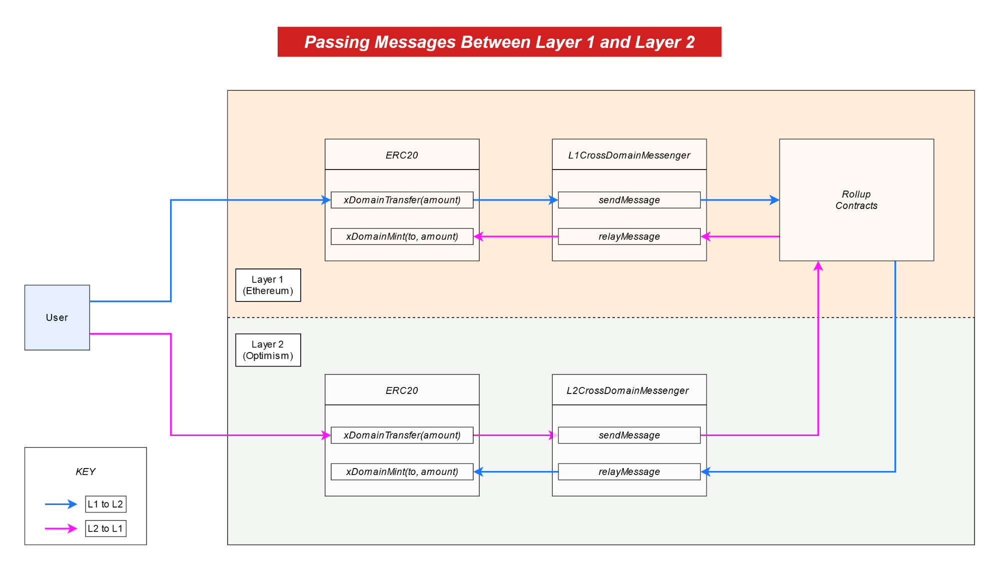

# {{ $frontmatter.title }}

::: tip Work in Progress™
_Our documentation is a rapidly improving work in progress. If you have questions or feel like something is missing feel free to ask in our [Discord server](https://discord.gg/5TaAXGn2D8) where we (and our awesome community) are actively responding, or [open an issue](https://github.com/ethereum-optimism/community-hub/issues) in the GitHub repo for this site._
:::

## Introduction

Hello and welcome!  If you're looking to find out what it takes to get your dApp up and running on layer 2, then you've come to the right place!  This document will serve as a reference to take you through the stages of integrating.

*Note: if at any time in this process you get stuck or have questions, please reach out on [discord](https://discord.gg/5TaAXGn2D8)!  We just ask that you do this in the public `#tech-support` channel so that others may learn alongside us.* :)

## Buidling Overview

There are two main steps to get a dapp running on Optimistic Ethereum:

1. **Compile and test your contracts:** get your existing contract tests running on a local version of Optimistic Ethereum via [truffle](https://www.trufflesuite.com/), [hardhat](https://hardhat.org), or your preferred Ethereum testing framework.
2. **Deploy your contracts to Optimistic Ethereum:** run those cheap a$$ transactons for real!

You might also want to take the following two steps depending on your specific needs:

1. **(Optional) Deploy and test against L2 Geth:** get those contracts running on a local instance of the full L2 system with our modified version of [go-ethereum](https://github.com/ethereum-optimism/go-ethereum).
2. **(Optional) Create bridges between L1 and L2:** get L1 and L2 communicating where necessary, such as adding deposits/withdrawals.

## Compiling and Testing Contracts

### Setup and Resources

::: tip Required Tooling
* [`@eth-optimism/plugins`](https://www.npmjs.com/package/@eth-optimism/plugins)
* [`hardhat`](https://hardhat.org/getting-started/)

Since your OVM-compatible contracts require Optimism's custom `solc` compiler, you'll be using Optimism's `@eth-optimism/plugins` package, which gives you access to both the custom compiler and a custom OVM-compatible version of `ethers`. 

Currently, We're focusing most of our internal development efforts on our [`hardhat`](https://hardhat.org/) tooling. However, we are still attempting to provide continued support for other development frameworks like [`truffle`](https://www.trufflesuite.com/). If any of our plugins are giving you issues, please ping us in our [#tech-support channel](https://discord.gg/NypkmfSkkw) in our discord server and we can help out!
:::

The first part of getting started with Optimistic Ethereum is to get your contracts up and running on a local L2 node.
This process involves two primary sub-steps:

1. Compile your contracts with the OVM Solidity compiler.
2. Deploy and test your contracts onto the local L2 node.

If you're using [hardhat](https://hardhat.org), our preferred development environment, this can all be done with the use of some handy plugins we've built.
For the rest of this documentation, we'll expect you to have your Solidity contracts ready to go.
Please note that Vyper support is currently not enabled but is planned for a future release.

If you want to try out an example contract instead of deploying your own, you can follow our [tutorial](https://github.com/ethereum-optimism/optimism-tutorial) (which should be pretty seamless).
If you're using another testing suite like [truffle](https://www.trufflesuite.com/), that tutorial won't apply. But these `npm` packages have got you covered:

- [`@eth-optimism/solc`](https://www.npmjs.com/package/@eth-optimism/solc): exports the Optimistic Ethereum compiler for `solidity@0.5/0.6/0.7`
- [`@eth-optimism/plugins`](https://www.npmjs.com/package/@eth-optimism/plugins): exports "OVM-ified" `waffle.mockProvider` and `ganache` packages which will work with contracts output by the compiler.

An example of usage with [waffle](https://getwaffle.io) can be found in [this great tutorial](https://github.com/ScopeLift/ovm-uniswap-v2-core#porting-solidity-contracts-to-optimism-a-guide-using-uniswap-v2) by [Scopelift](https://www.scopelift.co/) which walks through getting Uniswap V2 ported over.
If you are using [truffle](https://www.trufflesuite.com/), [here is an example config file](https://github.com/ethereum-optimism/optimism-monorepo/blob/6b535ab759aa2d4bf9325d40ea68aa5f7fc466a6/packages/ovm-toolchain/test/config/truffle-config.js) which shows how to incorporate the compiler and `ganache` for the OVM.

We recommend preserving EVM functionality when doing your port.
For example, you might want to add separate `test:evm` and `test:ovm` scripts that use different `truffle-config.js` and `truffle-config-ovm.js` configuration files.
**It's very important to make sure that all of your contract tests work in the EVM first before debugging the OVM.**
Sometimes it looks like the OVM has a bug, when really it's just an error in your contracts.


### Troubleshooting

There are some small differences between the EVM and the OVM which could require some debugging at this stage.
For help with these, you can check out the following resources:

1. [High level overview](https://hackmd.io/elr0znYORiOMSTtfPJVAaA) of differences.
2. [Complete EVM/OVM comparison](/docs/protocol/evm-comparison) of all discrepancies.
3. [Scopelift Uniswap tutorial](https://github.com/ScopeLift/ovm-uniswap-v2-core#porting-solidity-contracts-to-optimism-a-guide-using-uniswap-v2), which has some great "OVM vs. EVM" sections.

## Deploying on Optimistic Ethereum
Assuming you've been able to succesfully follow one of the above tutorials, you should now have an easy way to test your Optimistic Ethereum contracts.
Hopefully you have a bunch of green checkmarks coming out of a fancy L2 VM!
Next we're going to get your contracts deployed to a real Optimistic Ethereum node (running on our [fork of go-ethereum](https://github.com/ethereum-optimism/go-ethereum)).

### Local Deployment (Optional)
This step is technically optional, but we'd recommend going through it anyway.
Before deploying to a "real" network (testnet or mainnet), you may want to deploy to a local version of our `go-ethereum` fork.
If your contracts are relatively simple you may not need to do this.
However, if you plan to write contracts that communicate between L1 and L2, then we highly recommend reading this section.

#### Using the `optimism-integration` Repo
The [`optimism-integration`](https://github.com/ethereum-optimism/optimism-integration) repo gives you a single command to spin up a complete L1/L2 development environment.
We use [docker](https://www.docker.com/) to standardize our development experience, so please make sure you've [installed docker](https://www.docker.com/products/docker-desktop) and that the docker service is running before you continue.
You can check out the [tool's full usage page](https://github.com/ethereum-optimism/optimism-integration#usage) for a complete "getting started" guide.

First, run the following commands to get set up:

```shell
git clone git@github.com:ethereum-optimism/optimism-integration.git --recurse-submodules
cd optimism-integration
docker-compose pull
```

Then, run the famous `up.sh` script to spin everything up:

```shell
./up.sh
```

And that's it!
You now have an L2 chain (sequencer) at `localhost:9545` connected to an L1 chain at `localhost:8545`.

### Common Gotchas
::: tip Need help?
We're doing our best to keep this section updated as common issues come and go.
If none of the tips here work for you, please report an issue on [discord](https://discord.gg/5TaAXGn2D8).
:::

People tend to run into a few common issues when first interacting with Optimistic Ethereum.
Here's a checklist to run through if you're having any problems.

#### Gotcha: Invalid chain ID
The default chain ID of the `up.sh` script is `420`.
If you're getting an error when sending transactions, please make sure they you're using the right chain ID.

#### Gotcha: Local node does not charge fees
At the moment, the node created by `up.sh` does not charge the user for any fees.
You can send successfully transactions with `gasPrice = 0`.

#### Gotcha: Constantly exceeding gas limit
Because of some technical details about rollups, the maximum gas limit of each transaction is always a bit less than on mainnet.
You can bypass this during testing by updating [this environment variable](https://github.com/ethereum-optimism/optimism-integration/blob/dccd1b95b890c53679d32b36e14b50165900fb6d/docker-compose.env#L17).
However, you will still need to decrease your gas usage before deploying to a "live" network.

#### Gotcha: Still seeing the same bug after a patch or new release
We frequently update our software and corresponding docker images.
Make sure to periodically download the latest code by running the `pull.sh` script inside the `optimism-integration` repository.

#### Gotcha: Gas used appears to be exceeding gas limit
All L2 transactions are technically metatransactions sent by the sequencer.
This means that `receipt.gasUsed` may be higher than the `tx.gasLimit`, and is currently an underestimate by about 20%.
This will be fixed in an upcoming release. 

#### Gotcha: Contract deployment appears to fail for no reason
Make sure you're compiling with the Optimistic Ethereum version of the Solidity compiler.
Contract deployments will usually fail if you compile using the standard Solidity compiler.

#### Gotcha: Revert reasons are not returned on `eth_sendRawTransaction` calls
When `geth` was forked for Optimistic Ethereum, the `geth` had not yet started returning revert reasons for `eth_sendRawTransaction`s. 
Thus, if you want to retrieve a revert reason for a failing L2 transaction on `eth_sendRawTransaction` calls, you will need to make an `eth_call` (e.g. similar to [this](https://github.com/Synthetixio/synthetix-cli/blob/165fb39ea9c4298d7193c1b7f169dfd95cc89a80/src/utils/runTx.js#L61-L72)) at the block height for that transaction. 

### Testnet Deployment
You probably want to deploy to testnet before heading over to mainnet (good idea, tbh).
Our primary L2 testnet is currently deployed on top of Ethereum's [Kovan](https://kovan.etherscan.io) network.
We sometimes run other testnets too. 
Here's a current list of our testnet endpoints (will be updated when things change):

| L1 Network                          | L2 Network | HTTP Endpoint                                          | Websocket Endpoint                                               |
| ----------------------------------- | ---------- | ------------------------------------------------------ | ---------------------------------------------------------------- |
| [Kovan](https://kovan.etherscan.io) | OE Kovan 1 | [https://kovan.optimism.io](https://kovan.optimism.io) | [https://kovan.optimism.io:8546](https://kovan.optimism.io:8546) |


## Bridging L1 and L2
::: tip Work in Progress™
This section is still a work in progress.
Cross-chain communication is one of the most complex (but also coolest) parts of our system.
Thank you for your patience while we get all of this documentation out. ❤️
:::

Apps on Optimistic Ethereum are extra cool because they can, if necessary, interact with smart contracts sitting on Ethereum.
We provide a standard message-passing interface for sending data between L1 and L2 to make this as easy as possible.
If you don't think you'll be sending information between layers, you probably don't need to read through this section.

Documentation for arbitrary message passing is a Work In Progress™, but all features do already work.
In the meantime, you may be interested in taking a look at the Synthetix Bridge contracts.
These contracts are pretty cool and make heavy use of our L1⇔L2 messaging infrastructure:

1. Depositing SNX into L2
    - [Initiating a deposit on L1](https://github.com/Synthetixio/synthetix/blob/49427867e6d50886e0c8725e15c8b87e25aa6f8c/contracts/SynthetixBridgeToOptimism.sol#L190-L205)
    - [Which leads to receiving a balance on L2](https://github.com/Synthetixio/synthetix/blob/49427867e6d50886e0c8725e15c8b87e25aa6f8c/contracts/SynthetixBridgeToBase.sol#L111-L115)
2. Migrate SNX Escrow entries to L2 (transferring large amounts of state from L1->L2):
    - [Initiating a migration on L1](https://github.com/Synthetixio/synthetix/blob/49427867e6d50886e0c8725e15c8b87e25aa6f8c/contracts/SynthetixBridgeToOptimism.sol#L207-L236)
    - [Which leads to receiving escrow entries on L2](https://github.com/Synthetixio/synthetix/blob/49427867e6d50886e0c8725e15c8b87e25aa6f8c/contracts/SynthetixBridgeToBase.sol#L98-L108)
3. Withdrawing SNX to L1:
    - [Burning L2 SNX and initiating the withdrawal on L2](https://github.com/Synthetixio/synthetix/blob/49427867e6d50886e0c8725e15c8b87e25aa6f8c/contracts/SynthetixBridgeToBase.sol#L76-L94)
    - [Completing the withdrawal and receiving a balance on L1](https://github.com/Synthetixio/synthetix/blob/49427867e6d50886e0c8725e15c8b87e25aa6f8c/contracts/SynthetixBridgeToOptimism.sol#L126-L136)

### ☎️ L1 <> L2 Communication
::: tip Work in Progress™
This section is also an WIP, but we are quickly working to improve it! If you think that something is unclear, we recommend looking through the OVM's `messaging` contracts for a granular view of this L1 <> L2 communication. As always, feel free to reach out to us on discord with questions 🤗:

📎 OVM's `messaging` contracts:
* 📜 [`Abs_BaseCrossDomainMessenger.sol`](https://github.com/ethereum-optimism/contracts/blob/master/contracts/optimistic-ethereum/OVM/bridge/messaging/Abs_BaseCrossDomainMessenger.sol)
* 📜 [`OVM_L1CrossDomainMessenger.sol`](https://github.com/ethereum-optimism/contracts/blob/master/contracts/optimistic-ethereum/OVM/bridge/messaging/OVM_L1CrossDomainMessenger.sol)
* 📜 [`OVM_L1MultiMessageRelayer.sol`](https://github.com/ethereum-optimism/contracts/blob/master/contracts/optimistic-ethereum/OVM/bridge/messaging/OVM_L1MultiMessageRelayer.sol)
* 📜 [`OVM_L2CrossDomainMessenger`](https://github.com/ethereum-optimism/contracts/blob/master/contracts/optimistic-ethereum/OVM/bridge/messaging/OVM_L2CrossDomainMessenger.sol)
:::

The following is an abridged version of the section titled "L1 to L2 interoperability" in [_How does Optimism's Rollup really work?_](https://research.paradigm.xyz/optimism) by [Georgios Konstantopoulos](https://twitter.com/gakonst) from Paradigm Research.

---------

Optimistic Ethereum allows asynchronous calls between L1 and L2 users or contracts. Practically, this means that a contract on L1 can make a call to a contract on L2, and vice versa. This contract communication is implemented by deploying "messenger" contracts on both Ethereum and Optimistic Ethereum.

The sending chain's contract calls `sendMessage` with the data it wants to pass over, and a relay calls `relayMessage` (from L1 or from L2) on the receiving chain to actually relay the data.

These methods are shown below for reference:

* (L1 or L2 Sender ) [`sendMessage`](https://github.com/ethereum-optimism/contracts/blob/master/contracts/optimistic-ethereum/OVM/bridge/messaging/Abs_BaseCrossDomainMessenger.sol#L38-L48) of `Abs_BaseCrossDomainMessenger.sol`:

```solidity
/**
 * Sends a cross domain message to the target messenger.
 * @param _target Target contract address.
 * @param _message Message to send to the target.
 * @param _gasLimit Gas limit for the provided message.
 */
function sendMessage(
    address _target,
    bytes memory _message,
    uint32 _gasLimit
)
    override
    public
{
    bytes memory xDomainCalldata = _getXDomainCalldata(
        _target,
        msg.sender,
        _message,
        messageNonce
    );

    messageNonce += 1;
    sentMessages[keccak256(xDomainCalldata)] = true;

    _sendXDomainMessage(xDomainCalldata, _gasLimit);
    emit SentMessage(xDomainCalldata);
}
```

2. (L1 Receiver) [`relayMessage`](https://github.com/ethereum-optimism/contracts/blob/master/contracts/optimistic-ethereum/OVM/bridge/messaging/OVM_L1CrossDomainMessenger.sol#L79-L89) of  `OVM_L1CrossDomainMessenger.sol`:
```solidity
/**
 * Relays a cross domain message to a contract.
 */
function relayMessage(
    address _target,
    address _sender,
    bytes memory _message,
    uint256 _messageNonce,
    L2MessageInclusionProof memory _proof
)
```

3. (L2 Receiver) [`relayMessage`](https://github.com/ethereum-optimism/contracts/blob/master/contracts/optimistic-ethereum/OVM/bridge/messaging/OVM_L2CrossDomainMessenger.sol#L46-L55) of `OVM_L2CrossDomainMessenger.sol`:
```solidity
/**
 * Relays a cross domain message to a contract.
 */
function relayMessage(
    address _target,
    address _sender,
    bytes memory _message,
    uint256 _messageNonce
)
```

Conveniently, all transactions from L1 to L2 get automatically relayed _by the sequencer_. This happens because the L1 ➡️ L2 bridge calls [`enqueue`](https://github.com/ethereum-optimism/contracts/blob/21c38bb51a2d47029b40bdac709eec342d16a761/contracts/optimistic-ethereum/OVM/bridge/messaging/OVM_L1CrossDomainMessenger.sol#L287-L291), queuing up a transaction for execution by the sequencer.

From these calls to `enqueue`, we can, in a way, think of the the sequencer is an "always on" relay for L1 to L2 transactions, while L2 to L1 transactions need to be explicitly relayed by users.

Using the default bridge contracts by Optimism requires all L2 to L1 transactions are at least [1 week old](https://community.optimism.io/faqs/#why-is-there-a-delay-when-moving-assets-from-optimistic-ethereum-to-ethereum). This is to allow enough time for verifiers to submit fraud proofs and prevent invalid withdrawals.

It could be the case that developers deploy their own bridge contracts with semi-trusted mechanisms that allow L2 to L1 transactions with a smaller time restriction. The simplest example of this mechanism would be [depositing an ERC20 on an L1 bridge contract](https://github.com/ethereum-optimism/optimism-tutorial/blob/dev-xdomain/contracts/L1_ERC20Adapter.sol) and [minting the equivalent token amount on L2](https://github.com/ethereum-optimism/optimism-tutorial/blob/dev-xdomain/contracts/L2_ERC20.sol).



As a developer integrating with Optimism's messengers is very easy. Just call `<LAYER>CrossDomainMessenger.sendMessage` with the calldata, gasLimit and target address you want to call on the destination layer.  

This wraps the message in a [`relayMessage`](https://github.com/ethereum-optimism/contracts/blob/21c38bb51a2d47029b40bdac709eec342d16a761/contracts/optimistic-ethereum/OVM/bridge/messaging/Abs_BaseCrossDomainMessenger.sol#L70-L97) call, targeting the `L2CrossDomainMessenger`. That's all! It's the same general process for L2 to L1. (This is enabled by the `L1MessageSender`, `L1BlockNumber`, and `L1Queue` fields in the message and transaction `meta`.)

---------

<!-- platocrat's TODO: 

1. Clarify how to interact with these messenger contracts on the page, instead of referring to many external links.

2. Does this section L1 <> L2 comms section provide you enough info to buidl? If not, improve it so it does.

3. Perhaps demo some of the code from the `dev-xdomain` repo in this L1 <> L2 comms section.
--->