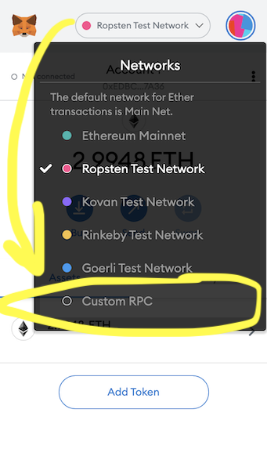
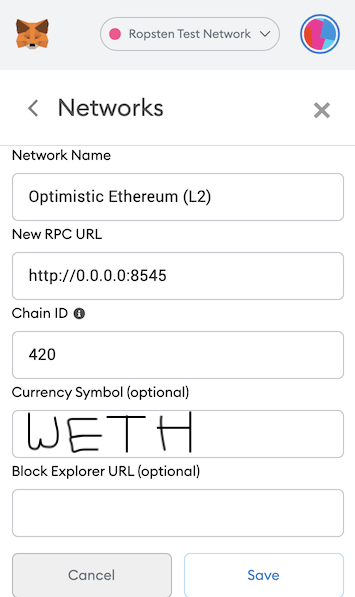
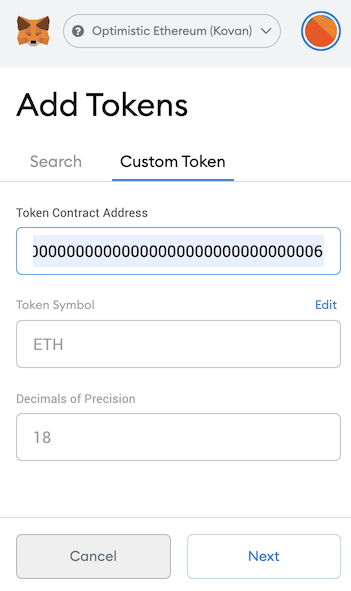
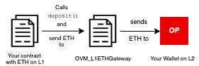
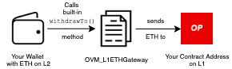

# {{ $frontmatter.title }}

::: tip Work in Progress™
_Our documentation is a rapidly improving work in progress. If you have questions or feel like something is missing feel free to ask in our [Discord server](https://discord.gg/5TaAXGn2D8) where we (and our awesome community) are actively responding, or [open an issue](https://github.com/ethereum-optimism/community-hub/issues) in the GitHub repo for this site._
:::

## Introduction

Hello and welcome!  
If you're looking to find out what it takes to get your dApp up and running on layer 2, then you've come to the right place!  
This document will serve as a reference to take you through the stages of integrating.

*Note: if at any time in this process you get stuck or have questions, please reach out on [discord](https://discord.gg/5TaAXGn2D8)!  We just ask that you do this in the public `#tech-support` channel so that others may learn alongside us.* :)

## Building Overview

There are two main steps to get a dapp running on Optimistic Ethereum:

1. **Compile and test your contracts:** get your existing contract tests running on a local version of Optimistic Ethereum via [truffle](https://www.trufflesuite.com/), [hardhat](https://hardhat.org), or your preferred Ethereum testing framework.
2. **Deploy your contracts to Optimistic Ethereum:** run those cheap a$$ transactions for real!

You might also want to take the following two steps depending on your specific needs:

1. **(Optional) Deploy and test against L2 Geth:** get those contracts running on a local instance of the full L2 system with our modified version of [go-ethereum](https://github.com/ethereum-optimism/go-ethereum).
2. **(Optional) Create bridges between L1 and L2:** get L1 and L2 communicating where necessary, such as adding deposits/withdrawals.

## Compiling and Testing Contracts

### Setup and Resources

::: tip Required Tooling
* [`@eth-optimism/hardhat-ovn`](https://www.npmjs.com/package/@eth-optimism/) 
* [`hardhat`](https://hardhat.org/getting-started/)

Since your OVM-compatible contracts require Optimism's custom Solidity compiler, you'll be using Optimism's `@eth-optimism/hardhat-ovm` package.
This package makes it easy to compile contracts and deploy them to an Optimistic Ethereum network.

Currently, We're focusing most of our internal development efforts on our [`hardhat`](https://hardhat.org/) tooling.
However, we are still attempting to provide continued support for other development frameworks like [`truffle`](https://www.trufflesuite.com/).
If any of our plugins are giving you issues, please ping us in our [#tech-support channel](https://discord.gg/NypkmfSkkw) in our discord server and we can help out!
:::

The first part of getting started with Optimistic Ethereum is to get your contracts up and running on a local L2 node.
This process involves three steps:

1. Compile your contracts with the OVM Solidity compiler.
2. Deploy your contracts against a local instance of Optimistic Etheereum and our Kovan testnet.
3. Test your contracts against the local instance and Kovan testnet.

If you're using [hardhat](https://hardhat.org), our preferred development environment, this can be done with the use of a handy plugin we've built.
For the rest of this documentation, we'll expect you to have your Solidity contracts ready to go.
Please note that Vyper support is currently not enabled but is planned for a future release.

::: tip The Official Tutorial that you can fork!
If you want to try out an example contract instead of deploying your own, you can follow our [optimism-tutorial](https://github.com/ethereum-optimism/optimism-tutorial) which serves as a quick and easy example to bootstrap your project with.
:::

If you're using another framework like [Truffle](https://www.trufflesuite.com/) or [Waffle](https://getwaffle.io), that tutorial won't apply. But these `npm` packages have got you covered:

- [`@eth-optimism/solc`](https://www.npmjs.com/package/@eth-optimism/solc): exports the Optimistic Ethereum compiler for `solidity@0.5/0.6/0.7`
- [`@eth-optimism/hardhat-ovm`](https://www.npmjs.com/package/@eth-optimism/hardhat-ovm): exports `artifacts-ovm` folder of contract artifacts which will work with contracts output by the compiler.

An example of using Waffle on Optimistic Ethereum can be found in our [`Waffle-ERC20-Example`](https://github.com/ethereum-optimism/Waffle-ERC20-Example) repository which serves as a simple guide for how to get started using Waffle for Optimistic Ethereum.
If you are using Truffle, [here is an example repository](https://github.com/ethereum-optimism/Truffle-ERC20-Example) which walks through how to start using Optimistic Ethereum with Truffle and a simple ERC-20.

We recommend preserving EVM functionality when doing your port.
For example, you might want to add separate `test:evm` and `test:ovm` scripts to your `package.json` that use different `truffle-config.js` and `truffle-config-ovm.js` configuration files.
**It's very important to make sure that all of your contract tests work in the EVM first before debugging the OVM.**
Sometimes it looks like the OVM has a bug, when really it's just an error in your contracts.

### Troubleshooting

There are some small differences between the EVM and the OVM which could require some debugging at this stage.
For help with these, you can check out the following resources:

1. [High level overview](https://hackmd.io/elr0znYORiOMSTtfPJVAaA) of differences.
2. [Complete EVM/OVM comparison](/docs/protocol/evm-comparison) of all discrepancies.

### Adding and installing dependencies

In this step, we will assume that you have a pre-existing Ethereum project build with Node.js, that you would like convert to an Optimistic Ethereum project.
Make sure to have the prerequisite software installed before continuing.
Additionally, make sure that you have the following `scripts` and `devDependencies` added to your `package.json`:

```json
{
  // ...
  "scripts": {
    "clean": "rimraf ./cache-ovm ./cache ./artifacts-ovm ./artifacts ./deployments"
  },
  "devDependencies": {
    "@nomiclabs/hardhat-ethers": "^2.0.1",
    "@nomiclabs/hardhat-waffle": "^2.0.1",
    "chai": "4.3.4",
    "chai-as-promised": "^7.1.1",
    "ethereum-waffle": "^3.2.1",
    "ethers": "^5.0.24",
    "hardhat": "^2.0.7",
    "hardhat-deploy": "^0.7.0-beta.49",
    "mocha": "^8.2.1"
  }
  // ...
}
```

With this added, let's install the dependencies by running:

```sh
yarn install
```

### Adding a Hardhat configuration file

Hardhat uses their own configuration file that will control global settings for your project.
For your Optimistic Ethereum project, we have some customizations so that the Solidity compiler is compatible with the OVM compiler and to use the proper network when testing and deploying your contracts.

Let's create a file called `hardhat.config.js` and add the following to it:

```js
require('@nomiclabs/hardhat-ethers')
require('@nomiclabs/hardhat-waffle')
require('hardhat-deploy')

module.exports = {
  networks: {
    hardhat: {
      accounts: {
        mnemonic: 'test test test test test test test test test test test junk'
      }
    },
    optimism: {
      url: 'http://127.0.0.1:8545', // This is the URL of the local L2 instance we will be creating.
      accounts: {
        mnemonic: 'test test test test test test test test test test test junk'
      },
      gasPrice: 0,
      ovm: true
    }
  },
  solidity: '0.7.6', // Must match solc version of the OVM compiler
  ovm: {
    solcVersion: '0.7.6' // Currently, we only support 0.5.16, 0.6.12, and 0.7.6 of the Solidity compiler
  },
  namedAccounts: {
    deployer: 0
  },
}
```

The network changes that we added here let us use Hardhat's `network` flag to control which network we wish to compile, test, and deploy our contracts for.
Pretty neat!

Now we're ready to move on to compiling your contracts.

## Step 1. Compiling contracts

We're going to use our `@eth-optimism/hardhat-ovm` package (described in the previous section above).
If this package is not already in your project, let's install this package now:

```sh
yarn add @eth-optimism/hardhat-ovm
```

This package now let's us compile our contracts for the OVM.
But first, let compile your contracts for L1.
Run the following command to do so:

```sh
yarn hardhat compile
```

To ensure that your contracts have been compiled correctly, check your project directory for the outputted folders `artifacts` and `cache`.

To compile your contacts for L2, we simply add the `network` flag to our command and specify the network we wish to compile for:

```sh
yarn hardhat compile --network optimism
```

Likewise for L1, we can check for the folders `artifacts-ovm` and `cache-ovm` in our project directory to check whether our contacts were properly compiled by the OVM compiler.

## Step 2. Testing contracts

Before deploying to a "real" network, like a testnet or mainnet, you may want to deploy to a local version of our `go-ethereum` fork.

### Using the `optimism` Repo

The [`optimism`](https://github.com/ethereum-optimism/optimism) monorepo provides you with the docker containers needed to spin up your own local Optimistic Ethereum network.
We use [docker](https://www.docker.com/) to standardize our development experience, so please make sure you've [installed docker](https://www.docker.com/products/docker-desktop) and that the docker service is running before you continue.
You can check out the [tool's full usage page](https://github.com/ethereum-optimism/optimism#quickstart) for a "Quickstart" guide.

Run the following commands to get set up:

```shell
git clone git@github.com:ethereum-optimism/optimism.git
cd optimism
yarn install
yarn build
cd ops
docker-compose build
docker-compose up
```

And that's it!
You now have an L2 chain at `http://0.0.0.0:8545` connected to an L1 chain at `http://0.0.0.0:9545`.

### Setting up a custom network in MetaMask (Optional)

With the L2 node and L1 nodes running locally, you can use their respective RPC URLs for testing!
If you use MetaMask, what you could do next is create a custom RPC network so that you can easily deploy and interact with your contracts using MetaMask!

Here's a step-by-step process on how to do that while in your browser:

1. Open MetaMask the browser extension and click on your currently connected network at the top pane, next to your jazzicon.
2. You'll see a modal open up with list of networks. Click on the "Custom RPC" button at the very bottom. (See example image below.)



3. Next, you'll enter in the network parameters:
- network name: `Optimistic Ethereum (Local L2)` 
- RPC URL: `http://0.0.0.0:8545`
- chain ID: `420`

Then click save.



4. Next, we need to add the ETH address that is used on L2.

To do this, we need to add the WETH address address to our account.



The WETH address to add is `0x4200000000000000000000000000000000000006`.
You should see that the "Token Symbol" is `ETH` if you entered the address correctly.
Despite this field reading `ETH`, it's important to understand that **this is actually an ERC20 version of ETH that we call WETH.**

::: warning L2 WETH address  
It's very important to note here that the default ETH address that is provided by MetaMask is **NOT** the same as the default WETH address that is used on L2.
We will be use WETH to make transfers between one L2 address and another.
Thus, here we add this specific address to make WETH transfers on L2.
For more info, see [this section in the docs](../protocol/evm-comparison.html#native-weth).
:::

**L1 Custom Network (Optional)**

In addition to adding the L2 chain as a custom network, we can also add our local instance of the L1 chain from `optimism`.
To do this, you would go through the same steps as above, but instead enter in the following for the network parameters:
|     Param                    |                Value               |
| ---------------------------- | :--------------------------------: |
| Network Name                 |  `Optimistic Ethereum (Local L1)`  |
| New RPC URL                  |      `http://0.0.0.0:9545`         |
| Chain ID                     |        `31337`                     |

However, you'll likely mostly be using the L2 chain for most of your contract and deployment tests.
So, we'd advise just adding the L2 custom network, unless you think you really need the local custom L1 chain network.

Later, when you decide to move on to testing on Optimism's Kovan testnet, the simple change you'd make is just replacing the RPC URL with the RPC URL for Optimism's Kovan testnet.

## Step 3. Deploying contracts

First, we will show you how to test your contracts locally and then using the Optimistic Ethereum Kovan testnet.

To test your contract locally, you will need to have the `optimism` monorepo containers running that we showed in the ["Using the `optimism` Repo"](http://community.optimism.io/docs/developers/integration.html#using-the-optimism-repo) step above.
Once those containers are running, we can run the following command to run our contract tests against the local instance of the Optimistic Ethereum instance:

```sh
yarn hardhat --network optimism test
```

Now, to run your tests against the Kovan testnet, we need to change the `optimism` network url in our `hardhat.config.js` file to `https://kovan.optimism.io`, like so:

```js
// ...
module.exports = {
    networks: {
        //...
        optimism: {
            url: 'https://kovan.optimism.io', // This is the URL of the Kovan testnet
        },
    },
    // ...
}
```

Then, we can run the same command in the previous step to run our contract tests against the Optimistic Ethereum Kovan testnet!

```sh
yarn hardhat --network optimism test
```

### Deploying contracts

We make use of the [`hardhat-deploy`](https://github.com/wighawag/hardhat-deploy) package to make contract deployments straightforward.

First, let's create a directory called `deploy` in the top level of your project directory and add the following content to it:

```js
// Just a standard hardhat-deploy deployment definition file!
const func = async (hre) => {
  const { deployments, getNamedAccounts } = hre
  const { deploy } = deployments
  const { deployer } = await getNamedAccounts()

  // Replace these two variables with your own contract arguments
  const initialSupply = 1000000
  const name = 'My Optimistic Token'

  await deploy('ERC20', { // Replace `ERC20` with your contract's file name
    from: deployer,
    args: [initialSupply, name],
    gasPrice: hre.ethers.BigNumber.from('0'),
    gasLimit: 8999999,
    log: true
  })
}

func.tags = ['ERC20'] // Replace `ERC20` with your contract's file name
module.exports = func
```

This script was made from one of `hardhat-deploy`'s [code examples](https://github.com/wighawag/tutorial-hardhat-deploy/blob/main/deploy/001_deploy_token.ts).
You can learn more about how the `hardhat-deploy` package works and how it's used [here](https://github.com/wighawag/hardhat-deploy#hardhat-deploy-in-a-nutshell).

#### Deploying

This step is actually pretty easy because the commands to run are almost the same as the commands to run your tests!

Assuming your `hardhat.config.js` has your local L2 network's URL set to `'http://127.0.0.1:8545'`, you can run the following command to deploy to your local L2 instance by running:

```sh
yarn hardhat deploy --network optimism
```

And, if you're L2 network is set to `'https://kovan.optimism.io'`, you can deploy to the L2 Kovan testnet by running the same command:

```sh
yarn hardhat deploy --network optimism
```

## Common Gotchas

::: tip Need help?
We're doing our best to keep this section updated as common issues come and go.
If none of the tips here work for you, please report an issue on [discord](https://discord.gg/5TaAXGn2D8).
:::

People tend to run into a few common issues when first interacting with Optimistic Ethereum.
Here's a checklist to run through if you're having any problems.

### Gotcha: Invalid chain ID

The default chain ID of the local L2 chain is `420`.
If you're getting an error when sending transactions, please make sure that you are using the right chain ID.

### Gotcha: Local node does not charge fees

At the moment, the node created by starting the docker containers under `optimism/ops` does not charge the user for any fees.
You can send successfully transactions by setting `gasPrice` to `0` in your configs and in contract calls.

### Gotcha: Constantly exceeding gas limit

Because of some technical details about rollups, the maximum gas limit of each transaction is always a bit less than on mainnet.

### Gotcha: Still seeing the same bug after a patch or new release

We frequently update our software and corresponding docker images.
Make sure to periodically download the latest code by running the following in your project.

```sh
git clone git@github.com:ethereum-optimism/optimism.git
cd optimism
yarn
yarn build
cd ops
docker-compose build
```

### Gotcha: Gas used appears to be exceeding gas limit

All L2 transactions are technically meta transactions sent by the sequencer.
This means that `receipt.gasUsed` may be higher than the `tx.gasLimit`, and is currently an underestimate by about 20%.
This will be fixed in an upcoming release.

### Gotcha: Contract deployment appears to fail for no reason

Make sure you're compiling with the Optimistic Ethereum version of the Solidity compiler.
Contract deployments will usually fail if you compile using the standard Solidity compiler.

### Gotcha: Revert reasons are not returned on `eth_sendRawTransaction` calls

When `geth` was forked for Optimistic Ethereum, the `geth` had not yet started returning revert reasons for `eth_sendRawTransaction`s.
Thus, if you want to retrieve a revert reason for a failing L2 transaction on `eth_sendRawTransaction` calls, you will need to make an `eth_call`.
For example, [here](https://github.com/Synthetixio/synthetix/blob/develop/test/optimism/utils/revertOptimism.js) is how Synthetix retrieves the revert reason for contract calls in the OVM.

## Testnet Deployment

You probably want to deploy to testnet before heading over to mainnet (good idea, tbh).
Our primary L2 testnet is currently deployed on top of Ethereum's [Kovan](https://kovan.etherscan.io) network.
We sometimes run other testnets too.
Here's a current list of our testnet endpoints (will be updated when things change):

| L1 Network                          | L2 Network | HTTP Endpoint                                          | Websocket Endpoint                                               |
| ----------------------------------- | ---------- | ------------------------------------------------------ | ---------------------------------------------------------------- |
| [Kovan](https://kovan.etherscan.io) | OE Kovan 1 | [https://kovan.optimism.io](https://kovan.optimism.io) | [https://kovan.optimism.io:8546](https://kovan.optimism.io:8546) |

## Bridging L1 and L2

::: tip Work in Progress™
This section is still a work in progress.
Cross-chain communication is one of the most complex (but also coolest) parts of our system.
Thank you for your patience while we get all of this documentation out. ❤️
:::

Apps on Optimistic Ethereum are extra cool because they can, if necessary, interact with smart contracts sitting on Ethereum.
We provide a standard message-passing interface for sending data between L1 and L2 to make this as easy as possible.
If you don't think you'll be sending information between layers, you probably don't need to read through this section.

Documentation for arbitrary message passing is a Work In Progress™, but all features do already work.

::: tip Bridges and messaging passing contracts are pre-deployed on Kovan testnet and Mainnet
For the following bridge and message passing contracts described in the following sections, these contracts are pre-deployed on L2 Kovan testnet or L2 Mainnet.

_That means that, unlike in your local instance of L2, you do **NOT** need to deploy your own bridge and message passing contracts to leverage either the bridge or the L1 <>  L2 communication functionality._
:::

In the meantime, you may be interested in taking a look at the Synthetix Bridge contracts.
These contracts are pretty cool and make heavy use of our L1⇔L2 messaging infrastructure:

1. Depositing SNX into L2
    - [Initiating a deposit on L1](https://github.com/Synthetixio/synthetix/blob/master/contracts/SynthetixBridgeToOptimism.sol#L190-L205)
    - [Which leads to receiving a balance on L2](https://github.com/Synthetixio/synthetix/blob/master/contracts/SynthetixBridgeToBase.sol#L111-L115)
2. Migrate SNX Escrow entries to L2 (transferring large amounts of state from L1->L2):
    - [Initiating a migration on L1](https://github.com/Synthetixio/synthetix/blob/master/contracts/SynthetixBridgeToOptimism.sol#L207-L236)
    - [Which leads to receiving escrow entries on L2](https://github.com/Synthetixio/synthetix/blob/master/contracts/SynthetixBridgeToBase.sol#L98-L108)
3. Withdrawing SNX to L1:
    - [Burning L2 SNX and initiating the withdrawal on L2](https://github.com/Synthetixio/synthetix/blob/master/contracts/SynthetixBridgeToBase.sol#L76-L94)
    - [Completing the withdrawal and receiving a balance on L1](https://github.com/Synthetixio/synthetix/blob/master/contracts/SynthetixBridgeToOptimism.sol#L126-L136)

### ☎️ L1 <> L2 Communication

::: tip Work in Progress™
This section is also an WIP, but we are quickly working to improve it! If you think that something is unclear, we recommend looking through the OVM's `messaging` contracts for a granular view of this L1 <> L2 communication.
As always, feel free to reach out to us on discord with questions 🤗:

📎 OVM's `messaging` contracts:`
* 📜 [`Abs_BaseCrossDomainMessenger.sol`](https://github.com/ethereum-optimism/optimism/blob/master/packages/contracts/contracts/optimistic-ethereum/OVM/bridge/messaging/Abs_BaseCrossDomainMessenger.sol)
* 📜 [`OVM_L1CrossDomainMessenger.sol`](https://github.com/ethereum-optimism/optimism/blob/master/packages/contracts/contracts/optimistic-ethereum/OVM/bridge/messaging/OVM_L1CrossDomainMessenger.sol)
* 📜 [`OVM_L1MultiMessageRelayer.sol`](https://github.com/ethereum-optimism/optimism/blob/master/packages/contracts/contracts/optimistic-ethereum/OVM/bridge/messaging/OVM_L1MultiMessageRelayer.sol)
* 📜 [`OVM_L2CrossDomainMessenger`](https://github.com/ethereum-optimism/optimism/blob/master/packages/contracts/contracts/optimistic-ethereum/OVM/bridge/messaging/OVM_L2CrossDomainMessenger.sol)
:::

The following is an abridged version of the section titled "L1 to L2 interoperability" in [_How does Optimism's Rollup really work?_](https://research.paradigm.xyz/optimism) by [Georgios Konstantopoulos](https://twitter.com/gakonst) from Paradigm Research.

---------

Optimistic Ethereum allows asynchronous calls between L1 and L2 users or contracts.
Practically, this means that a contract on L1 can make a call to a contract on L2, and vice versa.
This contract communication is implemented by deploying "messenger" contracts on both Ethereum and Optimistic Ethereum.

The sending chain's contract calls `sendMessage` with the data it wants to pass over, and a relay calls `relayMessage` (from L1 or from L2) on the receiving chain to actually relay the data.

These methods are shown below for reference:

* (L1 or L2 Sender ) [`sendMessage`](https://github.com/ethereum-optimism/optimism/blob/master/packages/contracts/contracts/optimistic-ethereum/OVM/bridge/messaging/Abs_BaseCrossDomainMessenger.sol#L51-L61) of `Abs_BaseCrossDomainMessenger.sol`:

```solidity
/**
 * Sends a cross domain message to the target messenger.
 * @param _target Target contract address.
 * @param _message Message to send to the target.
 * @param _gasLimit Gas limit for the provided message.
 */
function sendMessage(
    address _target,
    bytes memory _message,
    uint32 _gasLimit
)
    override
    public
{
    bytes memory xDomainCalldata = _getXDomainCalldata(
        _target,
        msg.sender,
        _message,
        messageNonce
    );

    messageNonce += 1;
    sentMessages[keccak256(xDomainCalldata)] = true;

    _sendXDomainMessage(xDomainCalldata, _gasLimit);
    emit SentMessage(xDomainCalldata);
}
```

2. (L1 Receiver) [`relayMessage`](https://github.com/ethereum-optimism/optimism/blob/master/packages/contracts/contracts/optimistic-ethereum/OVM/bridge/messaging/OVM_L1CrossDomainMessenger.sol#L79-L89) of  `OVM_L1CrossDomainMessenger.sol`:
```solidity
/**
 * Relays a cross domain message to a contract.
 */
function relayMessage(
    address _target,
    address _sender,
    bytes memory _message,
    uint256 _messageNonce,
    L2MessageInclusionProof memory _proof
)
```

3. (L2 Receiver) [`relayMessage`](https://github.com/ethereum-optimism/optimism/blob/master/packages/contracts/contracts/optimistic-ethereum/OVM/bridge/messaging/OVM_L2CrossDomainMessenger.sol#L45-L54) of `OVM_L2CrossDomainMessenger.sol`:
```solidity
/**
 * Relays a cross domain message to a contract.
 */
function relayMessage(
    address _target,
    address _sender,
    bytes memory _message,
    uint256 _messageNonce
)
```

Conveniently, all transactions from L1 to L2 get automatically relayed _by the sequencer_.
This happens because the L1 ➡️ L2 bridge calls [`enqueue`](https://github.com/ethereum-optimism/optimism/blob/master/packages/contracts/contracts/optimistic-ethereum/OVM/bridge/messaging/OVM_L1CrossDomainMessenger.sol#L287-L291), queuing up a transaction for execution by the sequencer.

From these calls to `enqueue`, we can, in a way, think of the the sequencer is an "always on" relay for L1 to L2 transactions, while L2 to L1 transactions need to be explicitly relayed by users.

Using the default bridge contracts by Optimism requires all L2 to L1 transactions are at least [1 week old](https://community.optimism.io/faqs/#why-is-there-a-delay-when-moving-assets-from-optimistic-ethereum-to-ethereum).
This is to allow enough time for verifiers to submit fraud proofs and prevent invalid withdrawals.

It could be the case that developers deploy their own bridge contracts with semi-trusted mechanisms that allow L2 to L1 transactions with a smaller time restriction.

As a developer integrating with Optimism's messengers is very easy.
Just call `<LAYER>CrossDomainMessenger.sendMessage` with the calldata, gasLimit and target address you want to call on the destination layer.  

This wraps the message in a [`relayMessage`](https://github.com/ethereum-optimism/optimism/blob/master/packages/contracts/contracts/optimistic-ethereum/OVM/bridge/messaging/Abs_BaseCrossDomainMessenger.sol#L83-L96) call, targeting the `L2CrossDomainMessenger`.
That's all! It's the same general process for L2 to L1.
(This is enabled by the `L1MessageSender`, `L1BlockNumber`, and `L1Queue` fields in the message and transaction `meta`.)

---------

### 🌉 ETH and Token Bridges

Just like on L1, gas fees (i.e. transaction fees on Ethereum, usually denominated in [Gwei](https://gwei.io/)) still apply on L2.
That means that you need to deposit some ether (ETH) to L2 to be able to pay for these gas fees.
However, you cannot just directly transfer your ETH from an L1 smart contract or EOA (i.e. wallet) to Optimistic Ethereum's L2.

This is where the ETH (and token) bridges come in!

#### The Standard™️ ETH Bridge

Optimistic Ethereum comes with a standard ETH bridge, [`OVM_L1ETHGateway.sol`](https://github.com/ethereum-optimism/optimism/blob/master/packages/contracts/contracts/optimistic-ethereum/OVM/bridge/tokens/OVM_L1ETHGateway.sol). This smart contract acts as a _bridge_ between L1 and L2, letting users deposit ETH into the contract on L1 so that it can be used on L2.

`OVM_L1ETHGateway` has 2 important methods to keep in mind:

1. [`deposit()`](https://github.com/ethereum-optimism/optimism/blob/master/packages/contracts/contracts/optimistic-ethereum/OVM/bridge/tokens/OVM_L1ETHGateway.sol#L81) is external and payable method used to send ETH from an account on L1 to the same address on L2.
2. [`depositTo()`](https://github.com/ethereum-optimism/optimism/blob/master/packages/contracts/contracts/optimistic-ethereum/OVM/bridge/tokens/OVM_L1ETHGateway.sol#L93) is external and payable method used to send ETH to another address on L2.

Here's an example deposit flow from L1 to L2 using the `depositTo()` method:



Similarly, here's an example of the flow in reverse, starting with a deposit of ETH on L2 and the funds being sent to the `msg.sender`'s address on L1. Here we use `withdraw()` or [`withdrawTo()`](https://github.com/ethereum-optimism/optimism/blob/fb362ff748c803dc9099326f0e3096889b5dd5aa/packages/contracts/contracts/optimistic-ethereum/OVM/bridge/tokens/Abs_L2DepositedToken.sol#L163), which `OVM_ETH.sol` inherits to initiate our transfer of ETH from L2 to L1:



#### Token Bridges

Similar to the ETH bridge, Optimistic Ethereum comes with bridge contracts that allow for _any_ token transfers between L1 and L2.

These contracts are:
1. [`Abs_L1TokenGateway.sol`](https://github.com/ethereum-optimism/contracts/blob/master/contracts/optimistic-ethereum/OVM/bridge/tokens/Abs_L1TokenGateway.sol)
2. [`Abs_L2DepositedToken`](https://github.com/ethereum-optimism/contracts/blob/master/contracts/optimistic-ethereum/OVM/bridge/tokens/Abs_L2DepositedToken.sol)
3. [`OVM_L1ERC20Gateway.sol`](https://github.com/ethereum-optimism/contracts/blob/master/contracts/optimistic-ethereum/OVM/bridge/tokens/OVM_L1ERC20Gateway.sol)
4. [`OVM_L2DepositedERC20.sol`](https://github.com/ethereum-optimism/contracts/blob/master/contracts/optimistic-ethereum/OVM/bridge/tokens/OVM_L2DepositedERC20.sol)

If you would like to see an example implementation of message passing in an application, we made a simple example deposit-and-withdraw guide for [how to use `Abs_L2DepositedToken.sol`](https://github.com/ethereum-optimism/l1-l2-deposit-withdrawal/blob/9529827a763dee21f28452bcd825ea2ce70f4b22/contracts/L2DepositedERC20.sol#L8-L11) on the [`l1-l2-deposit-withdrawal`](https://github.com/ethereum-optimism/l1-l2-deposit-withdrawal) example repository for you to check out!
