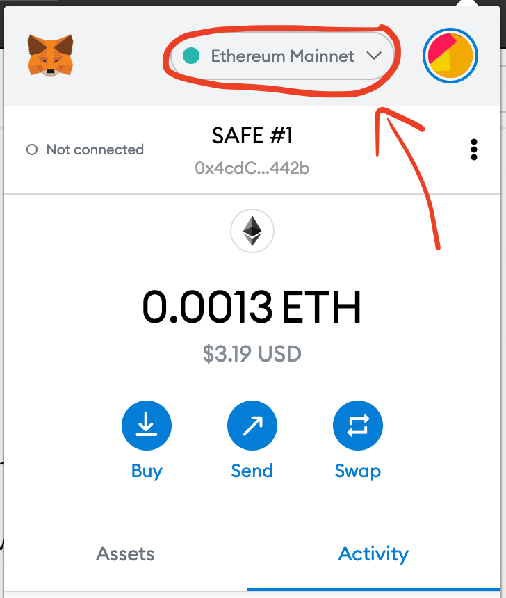
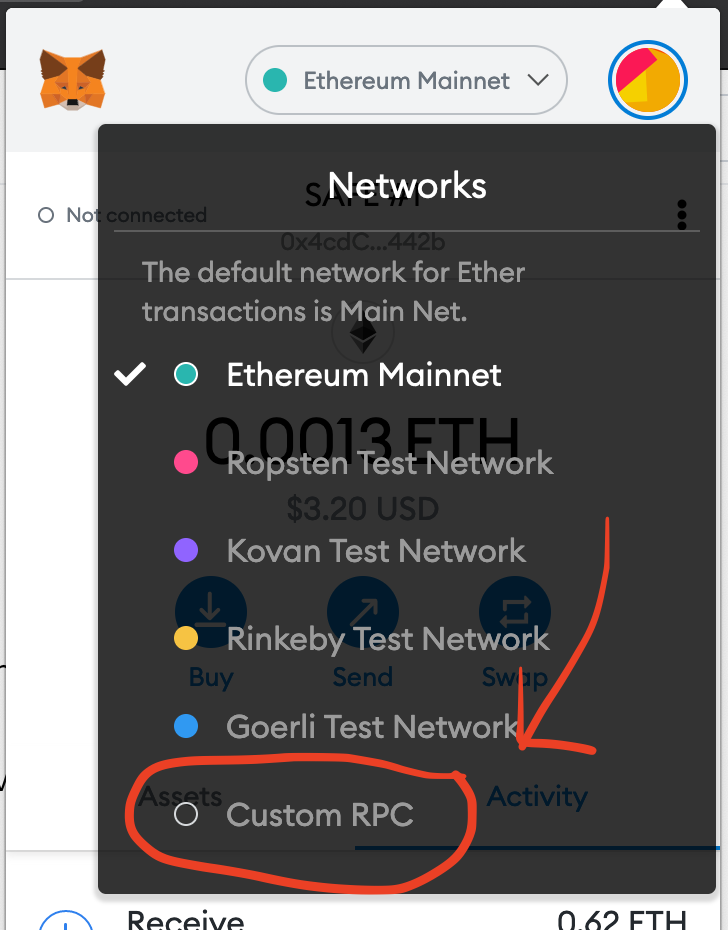
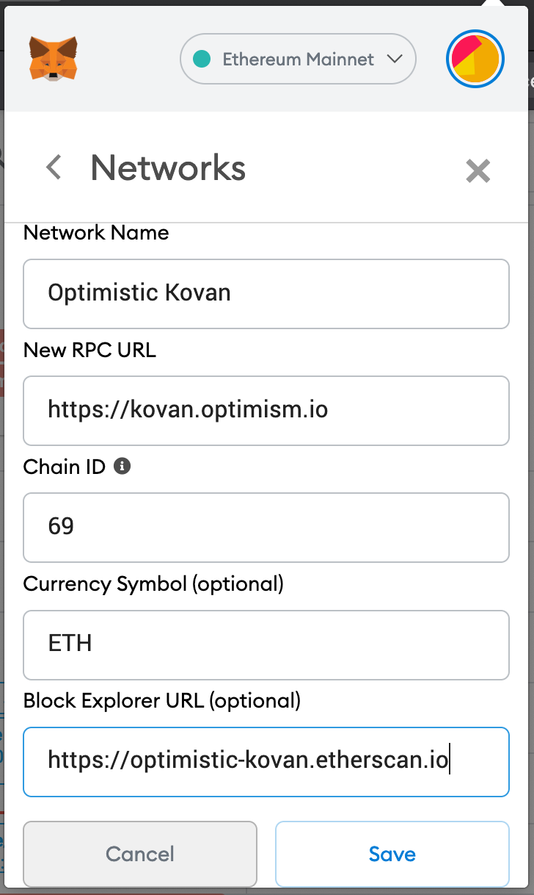
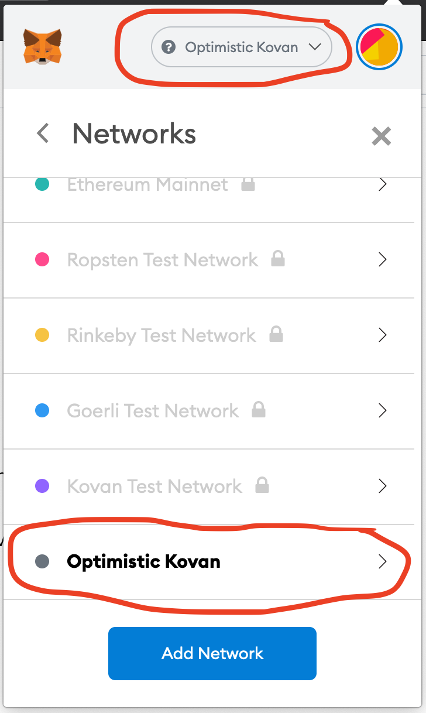

# {{ $frontmatter.title }}

## Connecting with chainid.link

There are a few easy to ways connect to Optimistic Ethereum via MetaMask.
The easiest way is to use `chainid.link`:

* [click here to connect to `optimistic-kovan`](https://chainid.link?network=optimism-kovan)
* [click here to connect to `optimistic-ethereum`](https://chainid.link?network=optimism)

## Connecting manually

Alternatively, you follow these easy steps to manually add a network to MetaMask:

1. Open the MetaMask browser extension and click on the network name at the top of the pane:

2. Next, click the `Custom RPC` button at the bottom of the network list:

3. Now you'll be prompted to input your connection details:

4. Once you hit `save`, you'll be automatically connected to the network:

