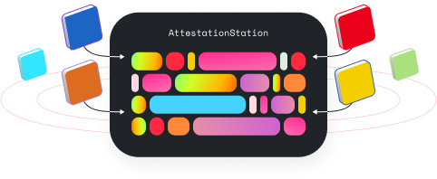

The AttestationStation is an **attestation smart contract** deployed on Optimism.  

The goal of the AttestationStation is to provide a permissionless and accessible data source for builders creating reputation-based applications. By enabling anyone to make arbitrary attestations about other addresses, we can create a rich library of qualitative and quantitative data that can be used across the ecosystem.


<!-- TODO: Add source code link when we have an authoritative source -->

## General FAQ

#### What are attestations?

Attestations are statements by a creator (who attested this) about a subject (who is being attested about). Attestations could present any qualitative or quantitative statement. To paint a picture — actors might submit attestations that are contextual to their brand, ecosystem, and governance structure.


#### What can attestations be used for?

We imagine the first use case for attestations is to create sybil resistant identity that can power [non-plutocratic governance](https://vitalik.ca/general/2021/08/16/voting3.html).

Longer term, this open-source primitive can be used for a variety of sybil-resistant applications including onchain credit scoring / under collateralized loans.

#### How can you go from attestations to sybil-resistant identity?

Attestations in the AttestationStation are onchain and can be used by other smart contracts in a variety of applications. Instead of having a single entity owning user data and identity, the AttestationStation is a graph of peer-to-peer (p2p) attestations. 

The first step to get from attestations to sybil-resistant identity is to grow the number of attestations in the AttestationStation. To do that, we are taking a two pronged approach by growing the number of:

* **Trusted attestations**: These attestations are made by organizations like Gitcoin, DegenScore, Otterspace, etc. attest about individual community members.
* **Social attestations**: These are attestations from one address about another. Eg zain.eth says kathy.eth is a colleague, kathy.eth says will.eth is a friend, etc.


Anyone can then take the graph of p2p attestations from the AttestationStation and run computations like EigenTrust over the set of data to derive identity sets on top of a purely subjective web of trust.


To build a robust, trustworthy identity network, these computations will be run iteratively. We can start with a purely subjective web of trust, and use that starting point to derive a larger web of trust, and so on — we can begin to establish a credibly neutral reputation that is entirely peer-to-peer. 

#### How is the AttestationStation different from other attestation products?

The AttestationStation is deliberately dead simple and serves as an invite to ecosystem contributors to come build an open-source and permissionless attestation graph together.

Creating this system in a decentralized and open-source manner is important because it allows for greater inclusion and representation of different perspectives. This can help to ensure that the system is fair and accessible to all, and that it accurately reflects the diversity of the communities it serves.

#### How do I use the AttestationStation?

See [the tutorial](https://github.com/ethereum-optimism/optimism-tutorial/tree/main/ecosystem/attestation-station). A SDK and CLI for the AttestationStation can be found at [@eth-optimism/atst](https://www.npmjs.com/package/@eth-optimism/atst). Ready to build your app? Checkout this [starter project](https://github.com/ethereum-optimism/optimism-starter) which has everything you need to get started! 

#### What are the contract addresses for the AttestationStation?

| Network | Address |
| - | - |
| Optimism Goerli | [`0xEE36eaaD94d1Cc1d0eccaDb55C38bFfB6Be06C77`](https://goerli-explorer.optimism.io/address/0xEE36eaaD94d1Cc1d0eccaDb55C38bFfB6Be06C77)  |
| Optimism Mainnet | [`0xEE36eaaD94d1Cc1d0eccaDb55C38bFfB6Be06C77`](https://explorer.optimism.io/address/0xEE36eaaD94d1Cc1d0eccaDb55C38bFfB6Be06C77) |

#### What products are built on the AttestationStation? 
If your product is using the AttestationStation, make a PR including how you're using attestations to be added to the list 😊
* [AttestationStation Interface by sbvegan](https://attestationstation.xyz/)
* [Optimist Score by Flipside](https://science.flipsidecrypto.xyz/optimist/)
* [Optimism Attestor by Clique](https://provenance.clique.social/attestor/opattestor)
* [ZK Discord Attestations by Clique](https://clique.social/attestor/opattestor_discordroles)
* [Credit Risk Score by RociFi](https://v2.roci.fi/app/analytics?address=0x00227dd82fae1220bdac630297753bb2cb4e8ddd)


#### What indexing is available for the AttestationStation? 
* [API endpoints by nxyz](https://docs.n.xyz/reference/attestation-station)
* [ShroomSDK by Flipside](https://github.com/MSilb7/op_attestationstation_data)


#### I am building on the AttestationStation but have some questions, where can I discuss these?

The best place to ask any dev related questions is the [Telegram Colloborators channel](https://t.me/+zwpJ8Ohqgl8yNjNh). If you need additional support check out this [Help Article](https://help.optimism.io/hc/en-us/articles/9762044018843-How-do-I-get-project-support-marketing-integrations-etc-).

#### I want to apply for a grant to build on the AttestationStation, how can I do this?

You can learn more about the variety of grants program available at Optimism [here](allocations/#ecosystem-fund). As a reminder, your work should be published to a public GitHub repo.

#### What are some things I should build with the AttestationStation?

It will take a huge community effort to realize the potential that reputation has to transform web3. That’s why we started small with the AttestationStation and an open invite to come experiment with us. Head over to the project ideas list for a bunch of [fun projects](https://github.com/ethereum-optimism/optimism-project-ideas#ideas) to build today. 

## Technical specifications

The following is the breakdown of Optimism's AttestationStation smart contract.

### State

#### attestations

The following is the nested mapping that stores all the attestations made.

```
mapping(address => mapping(address => mapping(bytes32 => bytes))) public attestations;
```

The following is a struct that represents a properly formatted attestation.

#### AttestationData

```
struct AttestationData {
    address about;
    bytes32 key;
    bytes val;
}
```

### Events

#### AttestationCreated

This event is emitted when an attestation is successfully made.

```
event AttestationCreated(
    address indexed creator,
    address indexed about,
    bytes32 indexed key,
    bytes val
);
```

### Functions

#### attest

Records attestations to the AttestationStation's state and emits an `AttestationCreated` event with the address of the message sender, address the attestation is about, the bytes32 key, and bytes value.

```
function attest(address _about, bytes32 _key, bytes memory _val) public
```

Allows anyone to create an attestation. 

| Name   | Type    | Description                                           |
|--------|---------|-------------------------------------------------------|
| _about | address | Address that the attestation is about.                |
| _key   | bytes32 | A key used to namespace the attestation.              |
| _val   | bytes   | An arbitrary value stored as part of the attestation. |

```
function attest(AttestationData[] memory _attestations) public
```

Allows anyone to create attestations. 

Parameters:

| Name           | Type              | Description                   |
| -------------- | ----------------- | ----------------------------- |
| \_attestations | AttestationData[] | An array of attestation data. |

