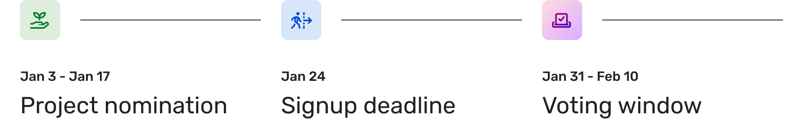

The Optimism Collective’s second round of Retroactive Public Goods Funding (RetroPGF) takes place in January 2023. 
RetroPGF 2 will allocate 10m OP tokens to **fund public goods that support development and usage of the OP Stack.** 

Optimism’s vision is to build a global system where positive impact to the collective is rewarded by profit to the individual. 
RetroPGF is an experimental mechanism to fund positive impact. 

By funding public goods sustainably, the Collective can create a rich ecosystem and a better economy.

## Timeline

**Nomination window**: Jan 3 - Jan 17

**Signup deadline**: Jan 24

**Voting window**: Jan 31 - Feb 10

## Scope of RetroPGF 2

**RetroPGF Round #2 will fund public goods that support development and usage of the OP Stack. This falls in three main categories:**

- **Infrastructure + Dependencies**: Software used to build or deploy the OP Stack; contributions to protocols or standards the OP Stack depends on run; experiments that support future development of the core OP Stack protocol

- **Tooling + Utilities**: Work that helps builders create applications on Optimism mainnet, build on the OP Stack, interact with governance of the Collective, or use applications built on Optimism

- **Education**: Work to spread awareness and knowledge of how Optimism works, whether technically or socially

Today, the **OP Stack** refers to the Optimism monorepo and its dependencies.

RetroPGF 2 focuses on a narrow, Optimism-specific scope of impact to drive the core engine for ecosystem growth. In future rounds, this scope will expand.

## Nominations

Nominations will be open from Jan 3 to Jan 17. During this window, anyone can nominate a **project or person** for funding.

Nominations will take place on the [Optimism Governance Forum](https://optimism.gov.io). Any community member can nominate a person or project by supplying: 

- the project or person’s name
- a description of how they’ve provided public good to the Collective
- a link to their GitHub, Twitter, Discord, or Optimism address
- (optional) contact info for the project or person

A full nomination template will be posted on the Forum before the nomination period begins.

## Funding Eligibility

Any project or person that has been nominated for RetroPGF 2 must complete a project profile in the **Gitcoin Grants Hub** in order to be eligible for voting. 

Grants Hub will ask for information about your project, including authentication with Twitter or GitHub to prevent impersonations. 

Grants Hub will also ask for information about team size, funding amount, impact provided to the Collective. 
This information will help voters make choices about how to allocate funding. 

After project nominations close, the Optimism Foundation will review completed profile submissions for spam and fraud. 

Any project without a correctly verified GitHub or Twitter account, any project impersonating another team, or any project without a complete profile may be hidden from the voting round at the Foundation’s discretion.

## Voting Badge distribution

✨ Voting Badges for RetroPGF 2 will be distributed to a set of **90 community members.**

1. **One badge distributed to each voter from RetroPGF Round 1**, excluding full time employees of OP Labs or the Optimism Foundation. (14 badges, [list](https://docs.google.com/spreadsheets/d/1g4ilAByMNQsmlBC8cskQip7Ojd_qK6IhozJCyoVfU9k/edit#gid=0)) 
2. **One badge given to an individual selected by each of the previous voters in RetroPGF Round 1** (14 badges) 
3. **One badge given to 10 Token House delegates, selected by a Token House vote.** (10 badges)
4. **One badge given to an individual selected by each of the badge-holding Token House delegates in (3) above** (10 badges)
5. **Twenty-one badges distributed to unaffiliated community contributors chosen by the Optimism Foundation**. (21 badges)
6. **Twenty-one badges distributed to individuals selected by each badge-holding community contributor in (5) above** (21 badges)

**Notes**

- Holding a voting badge for one round does not guarantee voting rights in subsequent rounds; Citizenship criteria are subject to change going forward
- Voting Badges in RetroPGF 2 are recorded as a simple attestation in the AttestationStation, not as a soulbound token. This approach preserves flexibility for future iterations
- Badgeholders are expected to adhere to the Optimism Delegate Code of Conduct
- An individual does not have to accept the voting badge. If an eligible person declines, the badge will not be distributed to someone else
- Anyone holding a Voting Badge will be able to mint an Optimist NFT – the inception of identity on Optimism
- Badgeholders with any participation or ownership stake in a project up for vote in RetroPGF 2 will be expected to not vote in favor of that project. Rules around conflicts of interest will be itemized in a forthcoming Badgeholder Manual
- Citizens’ House adheres to “one person one vote.” If an individual falls into more than one category above or is nominated more than once, they will still receive only one voting badge

Badgeholders will be added to a public channel on Discord for announcements and discussion. 

## Voting

Each badgeholder will be asked to vote during a ten-day window from Jan 31 - Feb 10.

Voters will be able to filter, sort, and search projects. 
Projects will be displayed with their answers to the application questions included in the project profile created via Gitcoin Grants Hub.

Votes will be aggregated as a simple weighted average, not as a quadratic vote. 
Votes are encrypted on the frontend and stored on-chain, which means an individual Citizen’s vote will not be public by default. 
Once a vote is cast, the Citizen cannot update their vote.

