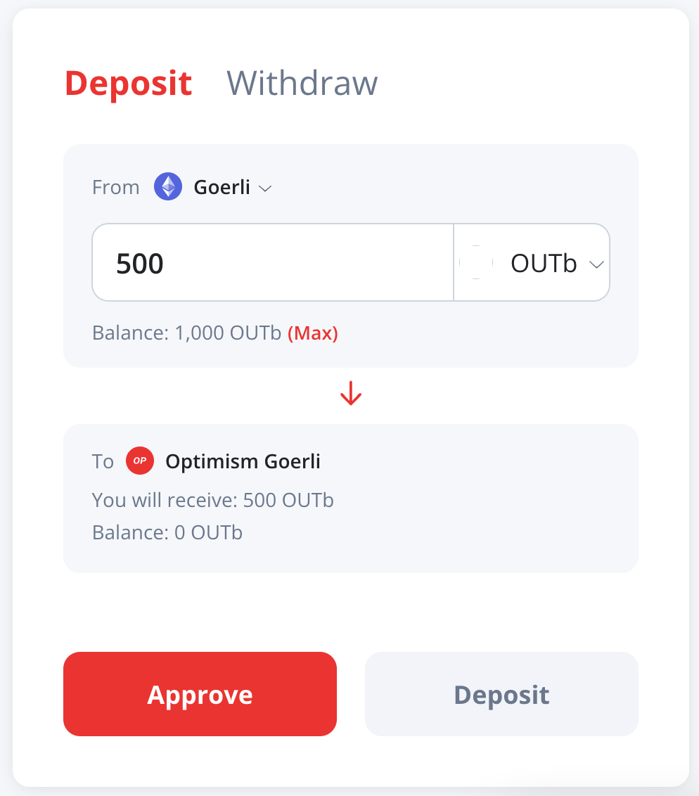

You can connect to Optimism Goerli (or the deprecated Optimism Kovan), our test network, [using these endpoints](../useful-tools/networks.md).
To obtain ETH and tokens (both ERC-20 and NFT), [see here](../useful-tools/faucets.md).

This page shows some additional testing utilities that you might find useful.

## ERC-20 tokens

We have several ERC-20 testing token contracts.
This token is an implementation of ERC-20, with the addition of `faucet`, a function that mints for the caller 1000 tokens to facilitate testing.

### Goerli ERC-20 testing contracts

| Address | Symbol | Decimals | 
| - | - | -: | 
| [`0x32307adfFE088e383AFAa721b06436aDaBA47DBE`](https://blockscout.com/optimism/goerli/address/0x32307adfFE088e383AFAa721b06436aDaBA47DBE) | OUT-1 | 18 |
| [`0xb378ed8647d67b5db6fd41817fd7a0949627d87a`](https://blockscout.com/optimism/goerli/address/0xb378eD8647D67b5dB6fD41817fd7a0949627D87a/) | OUT-2 | 18 |
| [`0x4e6597062c7dc988fbcfe77293d833bad770c19b`](https://blockscout.com/optimism/goerli/address/0x4E6597062c7DC988FBcFE77293D833bAD770C19b) | OUT-3 | 18 |

### Kovan ERC-20 testing contracts

| Address | Symbol | Decimals | 
| - | - | -: | 
| [`0xC905388A3F73d796494b4D8D164844e166B0bA48`](https://kovan-optimistic.etherscan.io/address/0xC905388A3F73d796494b4D8D164844e166B0bA48) | OUT-1 | 0 | 
| [`0xA058b82EAB4966B1D9A10Fe0aC224FC34a69751F`](https://kovan-optimistic.etherscan.io/address/0xA058b82EAB4966B1D9A10Fe0aC224FC34a69751F) | OUT-2 | 0 | 
| [`0xA6dB0d5e8069f4027055Dbe165956218B64BA5C0`](https://kovan-optimistic.etherscan.io/address/0xa6db0d5e8069f4027055dbe165956218b64ba5c0) | OUT-3 | 0 | 
| [`0x5F6572727a825D1B8e1DFa9810d52101ed6d522a`](https://kovan-optimistic.etherscan.io/address/0x5F6572727a825D1B8e1DFa9810d52101ed6d522a) | OUT-4 | 0 | 
| [`0x5a1081FcaF5886845D5FE49fe0DE583EA15C4df3`](https://kovan-optimistic.etherscan.io/address/0x5a1081FcaF5886845D5FE49fe0DE583EA15C4df3) | OUT-5 | 0 
| [`0x010445A1bec4BD8e35e8c08Fbf46c05B4CD00100`](https://kovan-optimistic.etherscan.io/address/0x010445A1bec4BD8e35e8c08Fbf46c05B4CD00100) | Out-x.3 | 3 | 

## The bridge

The `OUTb` token is supported by the bridge. 

1. Call `faucet` on [Goerli `0x32B3b2281717dA83463414af4E8CfB1970E56287`](https://goerli.etherscan.io/address/0x32b3b2281717da83463414af4e8cfb1970e56287#readContract) to obtain tokens.

1. Go to the [Optimism Bridge](https://app.optimism.io/bridge) and select to deposit **OUTb** from **Goerli**.

  

1. The address on Optimism Goerli is `0x3e7eF8f50246f725885102E8238CBba33F276747`.
   Add it to your wallet to see your balance.

1. You can also use the same [Optimism Bridge](https://app.optimism.io/bridge) to withdraw **OUTb** from **Optimism Goerli**.

If you are still using Optimism Kovan, you can bridge between [this token on Kovan](https://kovan.etherscan.io/address/0x3A4a0F1FC238bb0C694A5E7535069c02622Ac5DF#readContract) and [this token on Optimistic Kovan](https://kovan-optimistic.etherscan.io/address/0xdFc18Aa448CD0cD50D2C90Ba74D59Ee001F1d3d6#readContract). 
They both have three decimal points. 
While `faucet` only gives you a single token, you can move token fractions.

## ERC-721 tokens

We have an ERC-721 token on Optimism Goerli at address [`0x38abA480f2bA7A17bC01EE5E1AD64fCedd93EfE7`](https://blockscout.com/optimism/goerli/address/0x38abA480f2bA7A17bC01EE5E1AD64fCedd93EfE7).
It is the OpenZeppelin ERC-721 token contract with the addition of `faucet`.
Just call the `faucet` function to get as many NFT tokens as you need.

## Uniswap pools

### Goerli uniswap pools

Not supported yet.

### Kovan uniswap pools

We have four pools between the tokens above:

| Token 1 | Token 2 | Contract |
| ------- | ------- | -------- |
| OUT-1   | OUT-2   | [`0x96395abcd24badf7745bfe0f37c398b5a6072ed5`](https://kovan-optimistic.etherscan.io/address/0x96395abcd24badf7745bfe0f37c398b5a6072ed5#tokentxns)
| OUT-2   | OUT-3   | [`0x19c83d25a9ca57bc6e4121f6394c82c72bb5a474`](https://kovan-optimistic.etherscan.io/address/0x19c83d25a9ca57bc6e4121f6394c82c72bb5a474)
| OUT-3   | OUT-4   | [`0x8d43f75527072b22047433a65065dd948d289ada`](https://kovan-optimistic.etherscan.io/address/0x8d43f75527072b22047433a65065dd948d289ada#tokentxns)
| OUT-4   | OUT-5   | [`0xda11e21eca45840b253d02b7868f82f458740dd3`](https://kovan-optimistic.etherscan.io/address/0xda11e21eca45840b253d02b7868f82f458740dd3#tokentxns) |

