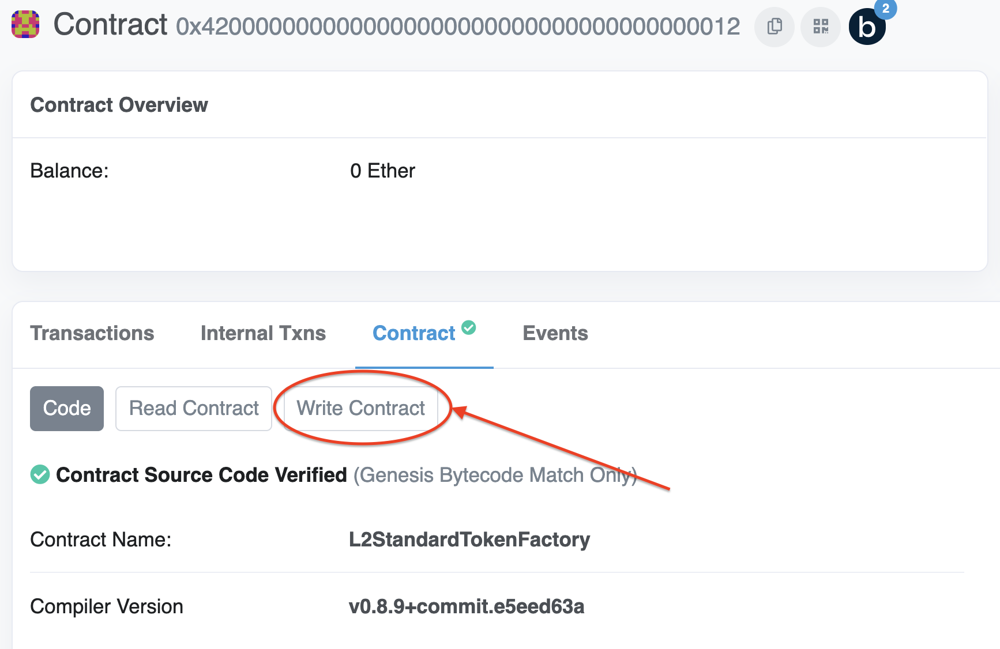
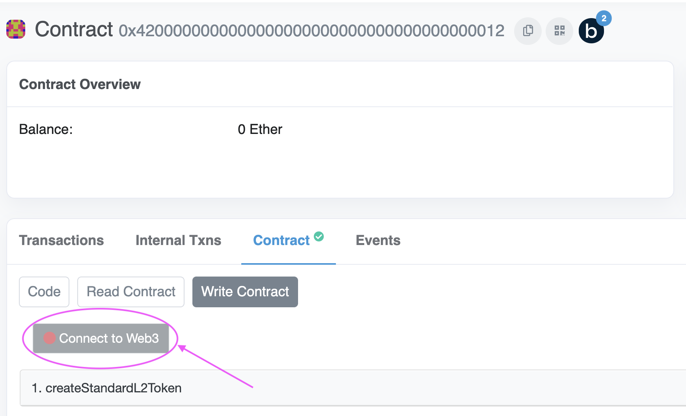
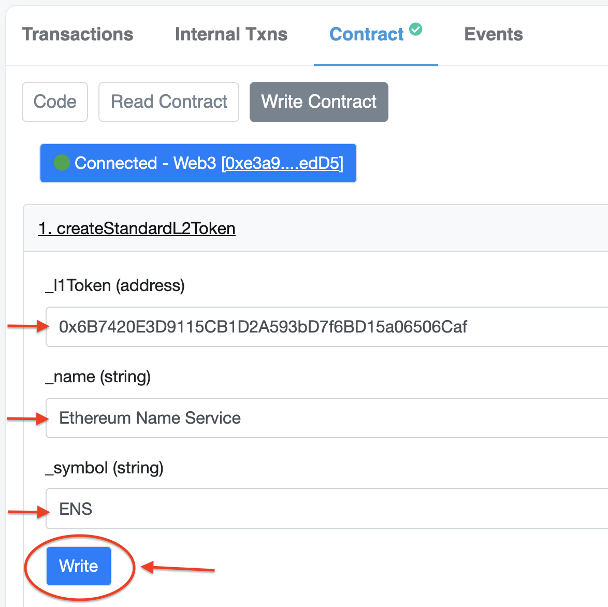
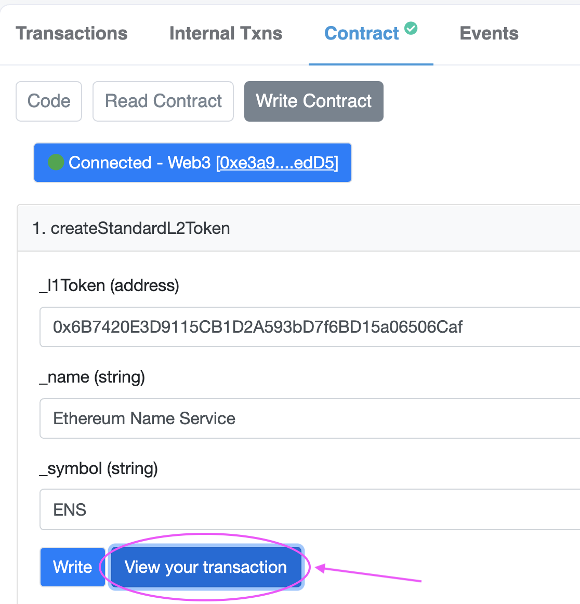
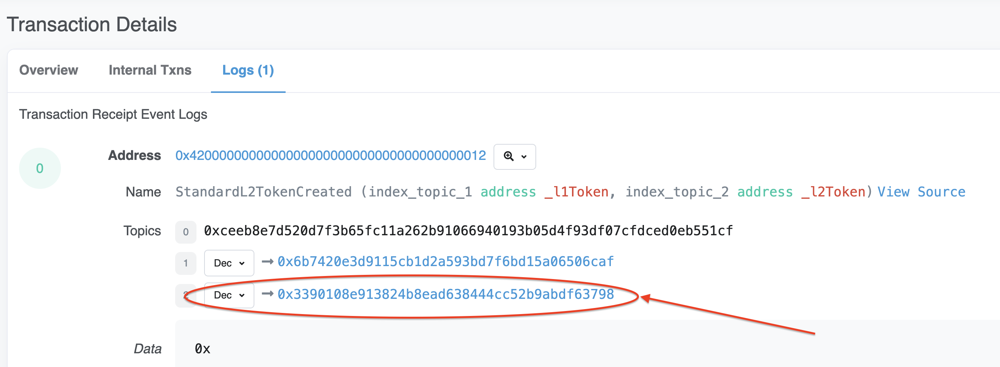

# {{ $frontmatter.title }}

For an ERC20 to work with the Standard Bridge it needs to implement the [`IL2StandardERC20`](https://github.com/ethereum-optimism/optimism/blob/master/packages/contracts/contracts/standards/IL2StandardERC20.sol) interface. Optimism provides a standard implementation of that interface as the [`L2StandardERC20`](https://github.com/ethereum-optimism/optimism/blob/master/packages/contracts/contracts/standards/L2StandardERC20.sol). This contract is a standard ERC20 based on the `@openzeppelin/contracts` `ERC20` implementation with added `ERC165` functionality and `mint` / `burn` logic that the Standard Bridge relies on.

We'll demonstrate the process for deploying an instance of a sample token on Optimism Kovan testnet using [Etherscan](https://kovan-optimistic.etherscan.io/). The same process is applicable to Optimism Mainnet.

::: tip
If the `L2StandardERC20` implementation does not satisfy your requirements, you can deploy an alternative implementation as long as it's compliant with the `IL2StandardERC20` interface. See the detailed tutorial on deploying a custom token at [https://github.com/ethereum-optimism/optimism-tutorial/tree/main/standard-bridge-custom-token](https://github.com/ethereum-optimism/optimism-tutorial/tree/main/standard-bridge-custom-token)
:::

## Requirements

Just like with Ethereum, you'll need a wallet to use to interact with Optimism.
Here we'll be using the [MetaMask](https://metamask.io/) Chrome extension to interact with the Optimism Kovan testnet.
You can probably use other wallets and/or extensions, but this guide will include screenshots of MetaMask.
We recommend using MetaMask to simplify the process of following along.

## Connecting to Optimism

MetaMask requires you to manually connect to new Ethereum-based networks before you can interact with them.
You can find more information about the connection process [on the Optimism Help Center](https://help.optimism.io/hc/en-us/articles/4411903123483-Connecting-your-wallet-to-Optimism).

For now, simply [head to this link](https://chainid.link/?network=optimism-kovan) and click "Connect".
Accept the popup that shows up in MetaMask and you'll be connected to the Optimism Kovan testnet.

## Getting some testnet ETH

Like on Ethereum, transaction fees on Optimism are paid in ETH.
You'll need some ETH on the Optimism Kovan testnet to deploy a contract.
The [Paradigm Multifaucet](https://faucet.paradigm.xyz/) is a quick and easy way to get ETH on a whole bunch of testnets, including the Optimism Kovan testnet.
You'll also be sent some other tokens and assets that you can use to play around even more once you're done with this guide.

## Deploying your token

We have a dedicated Factory predeploy at address `0x4200000000000000000000000000000000000012` for creating `L2StandardERC20` instances. (Note that predeploys are at the same address accross all networks so use the same address for Mainnet).

1. Navigate to the `L2StandardTokenFactory` in Etherscan:

[https://kovan-optimistic.etherscan.io/address/0x4200000000000000000000000000000000000012](https://kovan-optimistic.etherscan.io/address/0x4200000000000000000000000000000000000012)

2. In the "Contract" tab switch to "Write Contract".

3. Select "Connect to Web3" to connect to Metamask on Optimism Kovan.

4. Select `createStandardL2Token` method and complete the required data for token properties:
- `_l1Token` address of the token on L1
- `_name` and `_symbol` are the string properties of the L1 token from the address above. There are rare instances where these need to be different from L1, please contact us if that's the case to validate whether we can support this.

In this example we are using the ENS kovan token from [https://kovan.etherscan.io/address/0x6B7420E3D9115CB1D2A593bD7f6BD15a06506Caf](https://kovan.etherscan.io/address/0x6B7420E3D9115CB1D2A593bD7f6BD15a06506Caf) and creating an Optimism `L2StandardERC20` token instance this can be bridged to.

5. Select "Write" and confirm the transaction in MetaMask.
6. Select "View your transaction".

7. Etherscan opens the transaction.
For example for us this is [https://kovan-optimistic.etherscan.io/tx/0x0f71c0c2af9308260f7d5d89782064c28d32b52ea2b5c8fdaff8922185dde79a](https://kovan-optimistic.etherscan.io/tx/0x0f71c0c2af9308260f7d5d89782064c28d32b52ea2b5c8fdaff8922185dde79a)

8. Switch to the "Logs" tab in Etherscan, you should see `StandardL2TokenCreated` event indicating your token was successfully created. The last address in the Event Topics list is the newly created token address on L2.

9. Go to the newly created address, which should be auto-verified in Etherscan, to validate the token properties.

[https://kovan-optimistic.etherscan.io/address/0x3390108e913824b8ead638444cc52b9abdf63798#code](https://kovan-optimistic.etherscan.io/address/0x3390108e913824b8ead638444cc52b9abdf63798#code)

::: tip
To list your token on the [Optimism token list](http://localhost:8080/docs/developers/bridge/standard-bridge/#the-optimism-token-list), you must make a pull request against the [Optimism token list repository](https://github.com/ethereum-optimism/ethereum-optimism.github.io#adding-a-token-to-the-list).
:::