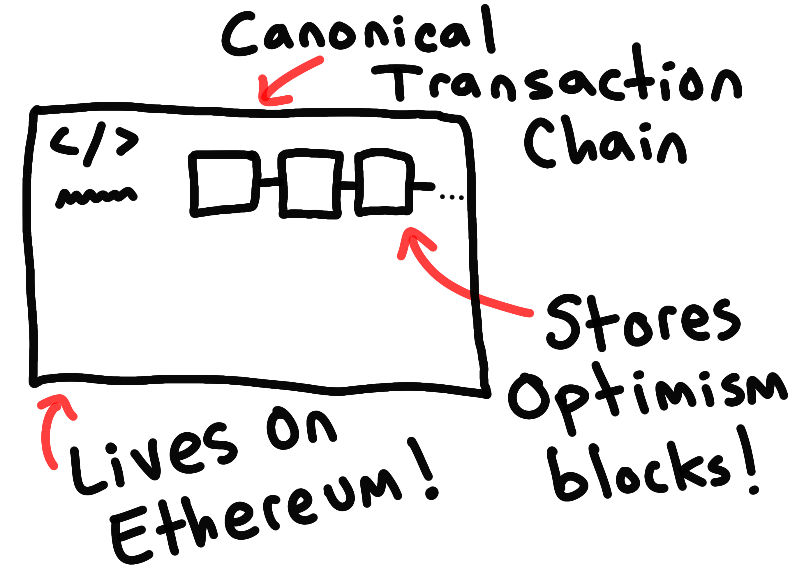

# {{ $frontmatter.title }}

## Introduction

Hello!
By the time you've finished reading this page you should have a foundational understanding of how Optimism makes Ethereum transactions cheaper and faster, the approach that Optimism is taking to scaling both Ethereum and Ethereum's values, and why Optimism is the best place to build your next Ethereum-native app.

We've tried to make this guide as comprehensive as possible while still keeping the content accessible to most readers.
Some content on this page is geared towards readers with a technical background but should still be legible to those with a basic understanding of how blockchains work.
Generally speaking, we err on the side of simplicity and approachability.
Readers interested in a low-level look into Optimism under the hood should refer to the [Protocol](../protocol/) section of this website.

Without further ado, let's find out *How Optimism Works*!

## Design philosophy

Optimism is built according to a strong design philosophy that stands on four main pillars: simplicity, pragmatism, sustainability, and, of course, optimism.
It's important to understand these pillars as they heavily influence the design of Optimism as a whole.

### Simplicity

Optimism is designed to be as simple as possible for the featureset it provides.
Ideally, Optimism should be composed of the minimum number of moving parts required for a secure, scalable, and flexible L2 system.
This simplicity gives Optimism's design a number of significant advantages over other more complex L2 constructions.

Simplicity reduces engineering overhead, which in turn means we can spend our time working on new features instead of re-creating existing ones.
Optimism prefers to use existing battle-tested Ethereum code and infrastructure where possible.
The most visible example of this philosophy in practice is the choice to use Geth as Optimism's client software.

When dealing with critical infrastructure, simplicity is also security.
Every line of code we write is an opportunity to introduce unintentional bugs.
A simple protocol means there's less code to write and, as a result, less surface area for potential mistakes.
A clean and minimal codebase is also more accessible to external contributors and auditors.
All of this serves to maximize the security and correctness of the Optimism protocol.

Simplicity is also important for the long-term vision of Optimism.
By limiting the amount of code that we write on top of Ethereum tooling, we're able to spend most of our time working directly with existing codebases.
Engineering effort that goes into Optimism can also directly benefit Ethereum, and vice versa.
This will only become more pronounced as the Optimism protocol solidifies and existing resources can be redirected towards core Ethereum infrastructure.

### Pragmatism

For all its idealism, the design process behind Optimism is ultimately driven by pragmatism.
The core Optimism team has real-world constraints, the projects that build on Optimism have real-world needs, and the users that engage with Optimism have real-world problems.
Optimism's design philosophy prioritizes user and developer needs over theoretical perfection.
Sometimes the best solution isn't the prettiest one.

Optimism is also developed with the understanding that any core team will have limited areas of expertise.
Optimism is developed iteratively and strives to continously pull feedback from users.
Many core Optimism features today (like EVM equivalence) were only made possible by this iterative approach to protocol development.

### Sustainability

Optimism is in it for the long haul.
Application developers need assurance that the platform they're building on will remain not only operational but competitive over long periods of time.
Optimism's design process is built around the idea of long-term sustainability and not taking shortcuts to scalability.
At the end of the day, a scalable system means nothing without the ecosystem that sustains it.

Sustainability actively influences Optimism's protocol design in ways that go hand-in-hand with our philosophy of simplicity.
The more complex a codebase, the more difficult it is for people outside of the core development team to actively contribute.
By keeping our codebase simple we're able to build a bigger community of contributors who can help maintain the protocol long-term.

### Optimism

Of course, none of this would be possible without a sense of optimism.
Our optimism about the Ethereum vision keeps this project moving forward.
We believe in an optimistic future for Ethereum, a future where we get to redesign our relationships to the institutions that coordinate our lives.

Although Optimism looks like a standalone blockchain, it's ultimately designed as an extension to Ethereum.
We keep this in mind whenever we're creating new features or trying to simplify existing ones.
Optimism is as close to Ethereum as possible not only for pragmatic reasons, but because Optimism exists so that Ethereum can succeed.
We hope that you can see the influence of this philosophy when looking at Optimism's design.

## System overview

We've covered most of the "why" behind Optimism.
Now it's time to explain the big idea that makes Optimism possible: the Optimistic Rollup.
We'll go through a brief explainer of *how* Optimistic Rollups work at a high level.
Then we'll explain *why* Optimism is built as an Optimistic Rollup and why we believe it's the best option for a system that addresses all of our design goals.

### Optimistic Rollups TL;DR

Optimism is an "Optimistic Rollup," which is basically just a fancy way of describing a blockchain that piggy-backs off of the security of another "parent" blockchain.
Specifically, Optimistic Rollups take advantage of the consensus mechanism (like PoW or PoS) of their parent chain instead of providing their own.
In Optimism's case this parent blockchain is Ethereum.

### Block storage

Optimism blocks are published by sending a transaction to a special smart contract on Ethereum called the [`CanonicalTransactionChain`](https://etherscan.io/address/0x5E4e65926BA27467555EB562121fac00D24E9dD2) (or CTC for short).
When this contract is triggered, a block is added to an immutable list of blocks held within the smart contract's storage.
This list of blocks forms the Optimism blockchain.
As long as blocks can't be easily reordered on Ethereum, blocks also can't be easily reordered on Optimism.
It's through this relationship that Optimism derives its security from Ethereum.

### Block production

Users can have their transactions added to the chain in one of two ways: by sending the transaction to a block producer (also called a "Sequencer") or by submitting their transactions directly to the `CanonicalTransactionChain`.

Block producers combine lots of transactions together and publish them all at once as a batch.
This significantly reduces overall transaction fees by spreading fixed costs over all of the transactions in a given batch.
Block producers also apply some basic compression techniques to minimize the amount of data published to Ethereum.
Only one block producer is active at any given time.
For the moment, [Optimism PBC](https://www.optimism.io/) runs the only block producer.
Refer to the below section about [Sequencer decentralization](#sequencer-decentralization) for more information.

Alternatively, users can skip block producers entirely and submit their transactions directly to the `CanonicalTransactionChain`.
This is typically more expensive but has the advantage of being resistant to censorship by block producers.

(diagram)

### Block execution

Optimism, like Ethereum, is a network of nodes.
Ethereum nodes download blocks from Ethereum's p2p network.
Optimism nodes instead download blocks directly from the `CanonicalTransactionChain` contract.
These blocks are then executed deterministically, just like any other blockchain.

(image)

Optimism nodes are made up of two primary components, the Ethereum data indexer and the Optimism client software.
The Ethereum data indexer, also called the ["data transport layer"](https://github.com/ethereum-optimism/optimism/tree/develop/packages/data-transport-layer) (or DTL), pieces together the Optimism blockchain from blocks published to the `CanonicalTransactionChain` contract.

(image)

Once a block is indexed, the Optimism client software will pull this block in and execute it.
Optimism's client software is an *almost* completely vanilla version of [Geth](https://github.com/ethereum/go-ethereum), which means Optimism is close to identical to Ethereum under the hood.
We refer to this architecture as ["EVM Equivalence"](https://medium.com/ethereum-optimism/introducing-evm-equivalence-5c2021deb306).

(insert node diagram)

### Deposits

Since users can create blocks on Optimism by triggering the `CanonicalTransactionChain` on Ethereum, it's very easy to send data from Ethereum to Optimism.
User-created blocks can include transactions that will appear to originate from the address that generated the block.
Contracts on Ethereum can use this feature to, for example, deposit some assets from Ethereum into Optimism.

(diagram)

### Withdrawals

The process of sending data from Optimism back to Ethereum is somewhat more involved.
In this direction, we need to be able to make provable statements about the state of Optimism to contracts sitting on Ethereum.

Making provable statements about the state of Optimism requires a [cryptographic commitment](https://en.wikipedia.org/wiki/Commitment_scheme) in the form of the root of the Optimism's [state trie](https://medium.com/@eiki1212/ethereum-state-trie-architecture-explained-a30237009d4e).
Optimism's state is updated after each block, so this commitment will also change after every block.
Commitments are regularly published to a smart contract on Ethereum called the [`StateCommitmentChain`](https://etherscan.io/address/0xBe5dAb4A2e9cd0F27300dB4aB94BeE3A233AEB19).

(diagram)

Users can use these commitments to generate [Merkle tree proofs](https://en.wikipedia.org/wiki/Merkle_tree) about the state of Optimism to be validated by applications on Ethereum.
These proofs can be used to prove that some `ContractA` on Optimism is trying to send a message to a `ContractB` on Ethereum.
With a little fancy footwork, we can use this basic building block to support the withdrawal of assets from Optimism back onto Ethereum.

(diagram)

### Fault proofs

Withdrawals from Optimism back to Ethereum require the regular publication of [cryptographic commitments](https://en.wikipedia.org/wiki/Commitment_scheme) to Optimism's state (we call these "state roots").
We have to be able to guarantee that these state roots do actually represent the state of Optimism.
A "bad" state root could be used to lie about the state of Optimism and, as a result, potentially incorrectly withdraw funds from the system.

In a zero-knowledge (ZK) Rollup system, each commitment comes with a cryptographic proof that the commitment represents the true state of the L2 system.
This zero-knowledge proof is checked at the time of publication and prevents users from being able to submit bad state roots.
In an Optimistic Rollup, commitments are published *without* any proof of validity.
Instead, commitments are considered pending for some period of time during which they can be invalidated by a special challenge process called the "fault proof" process.

(diagram)

Optimism users can challenge published state roots at any time during their "challenge window" (currently set to 7 days).
This triggers a multi-round process in which the challenger and the original publisher walk down a Merkle tree of the execution trace of the block that generated the resulting state root.
Eventually the two parties find the first execution step where both parties agree on the input but disagree on the output.
This single execution step is executed on Ethereum and the winner of the challenge is determined.

(diagram)

This process is guaranteed to always correctly determine whether or not the published state root is valid.
Bad state roots will always be invalidated as long as at least one user is willing to perform this challenge process.
Under the assumption that at least one such user exists, we can be certain that any state root that has passed its 7 day waiting period without being invalidated by a challenge must be valid.
Once we can be sure that a state root is valid, users can begin to use that state root to create Merkle proofs about the current state of Optimism.

## Roadmap

### Next gen fault proofs

On November 11th, 2021, the Optimism protocol went through its biggest upgrade to date.
The primary focus of this update was [EVM Equivalence](https://medium.com/ethereum-optimism/introducing-evm-equivalence-5c2021deb306), a new design for Optimism's client software that brought it close to 1:1 parity with Ethereum's Geth.
As part of this upgrade, the Optimism fault proof mechanism had to be redesigned from the ground up.

For a number of pragmatic reasons, we made the decision to launch the EVM Equivalence upgrade before the new fault proof mechanism was fully productionized.
The EVM Equivalence upgrade significantly reduced development and support overhead required to get new projects onboarded to the Optimism network.
By launching early, we were able to speed up the timeline of the new fault proof and ultimately bring a better experience to users and developers, faster.

This means that users of the Optimism network currently need to trust the Sequencer node (run by Optimism PBC) to publish valid state roots to Ethereum.
We're making fast progress on the upgrade fault proof mechanism and we expect to productionize our work within the first few months of 2022.
You can keep up with our progress on the [Cannon repository](https://github.com/ethereum-optimism/cannon/).

### Sequencer decentralization

Optimism PBC currently runs the only Optimism Sequencer node.
We're working hard to completely decentralize the Sequencer selection process so that anyone can participate in the network as a block producer.
Getting to full Sequencer decentralization is a challenging process that requires careful consideration.
In particular, we need to manage the impact of [Miner Extractable Value](https://ethereum.org/en/developers/docs/mev/) that Sequencer nodes have access to.

TODO: expand this section

<!-- ## Why Optimistic Rollups?

Before any code was written, Optimism was just a goal: *make Ethereum mainstream*.

We just needed to figure out exactly how to turn that lofty goal into a reality.
Constructing a new L1 system was out of the question.
Optimism was designed to scale Ethereum, not create a new chain that competes with it.
This left only two serious options: Optimistic Rollups or ZK Rollups.

### Simple

ZK Rollups are extremely cool.
They're also extremely complicated.
The most advanced ZK Rollups are built on top of fields of mathematics still being established at this very moment.
In the pursuit of simplicity and sustainability, Optimistic Rollups really can't be beat.
Perhaps most the most critical advantage is that an Optimistic Rollup can be audited without a PhD.

### Flexible

Optimistic Rollups are also more flexible than their ZK counterparts.
For Optimistic Rollups, EVM compatibility is the expectation rather than a theoretical future outcome.
Existing Ethereum applications can easily be ported to most Optimistic Rollups, a requirement that we felt absolutely necessary for a system designed to scale *Ethereum*.

### Mature
Furthermore, we know from experience that an initial protocol release is just the beginning.
Optimistic Rollup infrastructure is far more mature than the equivalent ZK Rollup infrastructure.
This is mostly a result of the minimal additional code required to transform an Ethereum node into an Optimistic Rollup node.
The relative simplicity of building and maintaining Optimistic Rollups will only serve to widen this maturity gap as time goes on.

At the end of the day, we feel that there are a number of clear advantages to the Optimistic Rollup design for the particular needs and goals of Optimism.
We hope you'll find these advantages to be just as clear once you start using Optimism! -->

<!-- ## System overview

Now that we've covered the philosophy behind Optimism, let's take a look at how it currently works at a high level.

### Fault proofs

Since Ethereum doesn't execute the L2 transactions, transaction results published to Ethereum could be incorrect.
This doesn't impact the validity of the chain itself, just what smart contracts on Ethereum think the state of Optimism is.
The worst case scenario here would be that a contract for example allows a user to withdraw funds when the user didn't actuaLly have the right to withdraw funds.
Optimism is designed to prevent this with cryptoeconomic security.

(insert diagram)

In the Optimism system, users publish results for a given block.
Then other users can challenge that result and say they think the result is wrong.
There's always only one correct answer, and it's an answer that any honest node knows.
So if there's something wrong with the result, all honest nodes will immediately know and be able to challenge the block.
One honest node then needs to start the challenge, which begins a back-and-forth process between the challenger and the publisher to determine who was correct.
The process is designed so that it will always find the correct party programmatically.

We have a one-honest node assumption for security on Optimism, that is to say that there only needs to be one node willing to participate in the security process for the system to be secure.
Because of the way the security system is set up, this one node can keep the system secure by doing the challenge process and they get paid for the cost of the challenge, so it's mostly costless.
The party with the correct answer (which will be the honest node) will always win, so you can see why you only need that one party.
The process is relatively cheap and you only need one of them, and the one party can do this sustainably.

- Transaction results
  (NOTE: Currently trusted)
  - Transaction results are published to Ethereum, with one result per transaction currently
  - Transactions can be published by any node that puts up a bond
  - Transaction results are unchecked, they could be correct or they could be bogus (this is "optimistic")
  - Transaction results can be challenged by any other party
  - Can be detected immediately by any honest node because we have 
  - This kicks off a challenge process
- Challenge process TL;DR
  (NOTE: Currently disabled until further notice)
  - Multi-round process a lot like TrueBit
  - We compile Geth down into MIPS and turn the transaction execution into a series of states
  - We go over each state and find the first place where users agree on the input but disagree on the output
  - Then we execute that one step and figure out who's correct
  - If the result is challenged, then we delete that result and all results that were published after it
  - this does NOT mean that transactions are reverted, transactions are never reverted, it's just that a bad result may be removed.
    - Important to drive home

### Deposits and withdrawals

## Start building on Optimism
- Where to learn more?
  - Contact form if you want to deploy and you want assistance in getting there
  - Docs, help center, discord, github
  - Or just bring your existing Etheruem expertise
  - To Optimism! -->

<!-- ## Design goals

Before we explore the inner workings of Optimism, it's important to understand the goals that the Optimism system sets out to achieve.
These goals deeply impact the way in which Optimism is built and define how Optimism tackles new problems.
You'll see the effects of these goals in various places throughout the Optimism protocol.
By familiarizing yourself with these goals, you'll have a more intuitive understanding of exactly *why* Optimism is built the way that it is.

### Make Ethereum mainstream

Everything about the Optimism project comes down to one core goal: to make Ethereum mainstream.

We believe that Ethereum (and its ecosystem) has the potential to revolutionize the relationship that the average person has with the institutions that govern their lives.
Ethereum is the only platform with the reach and vision to make this potential future a reality.
We could talk for ages about why we love Ethereum.
At the end of the day, Optimism is built by Ethereans, for Ethereans.
We want the Ethereum vision to succeed.
And, of course, for Ethereum to succeed it has to break into the mainstream.

This commitment to Ethereum and its future has concrete and visible effects on the way Optimism is designed.
Almost every decision that Optimism makes is informed by the way that decision can help the future of Ethereum.
For example, as you'll see later in this page, Optimism is built almost entirely as a minimal wrapper around existing Ethereum code and infrastructure.
This design decision deliberately ties Optimism to Ethereum's roadmap and means concretely that Optimism's engineers can shift towards working on core Ethereum infrastructure once the protocol is fully stable.

### Cut transaction costs

For Ethereum to break into the mainstream it has to become significantly more accessible to the average person.
The most obvious barrier to this accessibility is Ethereum's sky-high transaction fees.
It's exceedingly clear that Ethereum is simply too expensive for most people to use on a daily basis.
It's Optimism's goal to reduce Ethereum's transaction fees without compromising on the security properties that make Ethereum so attractive in the first place.

Optimism is the currently least expensive general-purpose L2 system on average and we intend to keep it that way.
It accomplishes this with various techniques that minimize the most expensive part of any Layer 2 system, the publication of transaction data to Ethereum.
However, there's always room to keep reducing costs on multiple fronts.
The impact that a design decision can have on end-user cost always has to be considered when creating new features for Optimism.

### Improve user experience

Accessibility isn't just about cheaper transactions, it's also about creating a great user experience.
Unfortunately, web2 apps usually outperform web3 apps on this front as a side-effect of centralization.
Optimism has already made significant improvements to the status quo of web3 user experience and each feature we add is carefully designed to always improve the user experience that we have in the face of our constraints.

For example, Optimism was the first L2 system to introduce instant "Sequencer confirmations", a technique where transactions sent on L2 can have strong guarantees about finality in a very short period of time.
As a result, apps deployed natively to Optimism can finally start to compete with the user experience of existing web2 apps.

### Improve developer experience

Alongside an improved user experience comes an improved developer experience.
At the end of the day we need to make it as easy and as safe as possible to build applications for Optimism.

Optimism also pioneered EVM equivalence, a Layer 2 design pattern where the client software is an almost completely vanilla version of an existing Ethereum node.
This means more than just API-level compatibility.
Tools that expect the underlying blockchain to work a certain way or tools that are designed to hook directly into an Ethereum node will "just work", no fiddling required.

All this sounds fancy, but it ultimately just means that Optimism is the easiest L2 to deploy to by a longshot.
We think you'll have a lot of fun working on Optimism.
And because of Optimism's tight compatibility with Ethereum, you're never locked into the ecosystem.
You can always take your code and deploy it to other Ethereum-based chains with little effort.

We never think we're finished, we always have more work to do.
We also believe in compatibility with other L2s and actively work to integrate the design patters that they use.
In the spirit of pragmatism and collaboration, we try to maintain compatiblity with other L2s to minimize lockin as much as possible, we think blockchain apps should be portable.

### Security through simplicity

Optimism is designed to be as simple as possible at its core.
It's aimed to be composed of the minimum number of pieces required to make a secure L2 system possible.
This simplicity and minimalism is important for a number of significant reasons to Optimism.
First, a minimal protocol will come with the least amount of overhead.
We've designed our protocol to have the smallest possible diff from existing software.
This way we don't need an entire team of people to maintain a highly custom codebase.

Simplicity also means that we're writing fewer lines of code, which means there's less room to make mistakes.
Simplicity is security.
Particularly when it comes to complex things like a Layer 2 rollup system, it should be as simple as possible so there's little room for error and so that it's as easy as possible for outside people to audit the codebase.
If a codebase can't be easily audited, it can't be trusted.

Finally, simplicity is also important for our vision.
By limiting the amount of code that we write on top of existing Ethereum tooling, we're able to position ourselves to dedicate most of the Optimism engineering effort to improving that existing tooling.
Since it will mostly be the same codebase, it will literally be a direct improvement to Optimism to be working on code like Geth.
Once the core Optimism code is done, there won't be a lot else for the Optimism team to work on!

### Build for the long-term

- Building a project is a serious endeavour. We're not here to leave. We're here to create an ecosystem that'll be around in 20 years. We're more serious about it than anyone else.
- Building a long-term ecosystem is about building sustainably. We spend a lot of time building software, but we also spend a lot of time thinking about how we can create a blockchain ecosystem where projects are supported during every stage of the development process.
- We're not in it to create an entirely separate ecosystem. You're not leaving the Ethereum ecosystem. Everything we do goes back into the Ethereum ecosystem.
- Building with the Ethereum codebase wasn't just a practical decision, it was a philosophical one. We want to work on Ethereum, we want to scale Ethereum. Optimism is jsut a part of scaling Etheruem.

- Why Optimism?
  - First reiterate the previous points of cost and security, of the general-purpose rollups our tech is far ahead and we've got an excellent team pushing the protocol and client software even further. "You can expect to save a sigificant amount of money"
  - We're thinking about the future of blockchains in a way that nobody else is. We want to create a sustainable ecosystem where you'll get rewarded for your contribution to the system. Retroactive public goods funding is a part of this, with Optimism you can expect to get top notch support in getting your application running, funded by protocol revenue. Optimism helps you win, it's not just another platform for you to deploy to. -->
