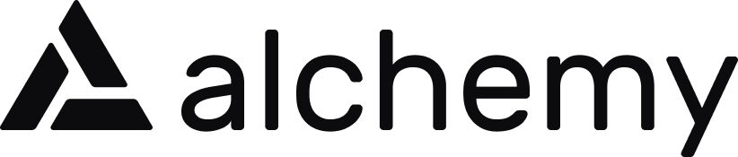
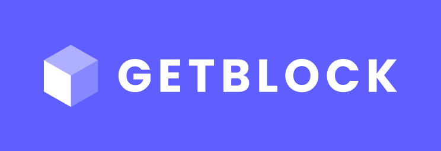
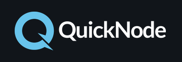
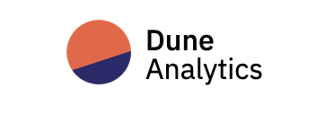
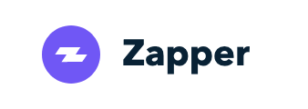

# {{ $frontmatter.title }}

<!-- TODO: add a section for remix once we have a tutorial for using the remix plugin -->

---

## Infura

### Services

- [Get access to Optimistic Ethereum nodes](https://infura.io/docs/ethereum#section/Network-Add-Ons/Optimistic-Ethereum)

### Support

| Mainnet Support | Kovan Testnet Support |
| --------------- | --------------------- |
| ☑               | ☑                     |

---

## Alchemy

### Services

- [Get access to Optimistic Ethereum nodes](https://www.alchemy.com/layer2/optimism)

### Support

| Mainnet Support | Kovan Testnet Support |
| --------------- | --------------------- |
| ☑               | Soon™                 |

---

## GetBlock

### Services

- [Get access to Optimistic Ethereum nodes](https://getblock.io/en/nodes/optimism/)

### Support

| Mainnet Support | Kovan Testnet Support |
| --------------- | --------------------- |
| ☑               | Soon™                     |

---

## QuickNode

### Services

- [Get access to Optimistic Ethereum nodes](https://www.quicknode.com/chains/optimism)

### Support

| Mainnet Support | Kovan Testnet Support |
| --------------- | --------------------- |
| ☑               | ☑                     |

---

## Etherscan

### Services
- [Explore the Optimistic Ethereum mainnet](https://optimistic.etherscan.io/)
- [Explore the Optimistic Kovan testnet](https://kovan-optimistic.etherscan.io/)
- [Relay withdrawals to L1](https://optimistic.etherscan.io/messagerelayer)
- [Verify contracts](https://optimistic.etherscan.io/contractsVerified)

### Support

| Mainnet Support | Kovan Testnet Support |
| --------------- | --------------------- |
| ☑               | ☑                     |

---

## The Graph

### Services

- [Index and query data on Optimistic Ethereum](https://thegraph.com/blog/graph-optimistic-ethereum)

### Support

| Mainnet Support | Kovan Testnet Support |
| --------------- | --------------------- |
| ☑               | Soon™                 |

---

## Dune Analytics

### Services

- [Explore activity on the Optimistic Ethereum network](https://duneanalytics.com/Marcov/Optimism-Ethereum)
- [Create your own Optimistic Ethereum dashboards](https://docs.duneanalytics.com/#queries)

### Support

| Mainnet Support | Kovan Testnet Support |
| --------------- | --------------------- |
| ☑               | Soon™                 |

---

## Tenderly

### Services

- [Monitor your Optimistic smart contracts](https://dashboard.tenderly.co/explorer)

### Support

| Mainnet Support | Kovan Testnet Support |
| --------------- | --------------------- |
| ☑               | ☑                     |

---

## Zapper

### Services

- [View your Ethereum and Optimistic Ethereum assets in one place](https://zapper.fi/dashboard)

### Support

| Mainnet Support | Kovan Testnet Support |
| --------------- | --------------------- |
| Soon™           | Soon™                 |

---

## Zerion

### Services

- [Invest in Optimistic DeFi from one place](https://app.zerion.io/0x5b3ce67ebc795fe7e709815bc49d4300898e1b7b/overview)

### Support

| Mainnet Support | Kovan Testnet Support |
| --------------- | --------------------- |
| Soon™           | Soon™                 |

---

<!-- links go here -->

[infura]: https://infura.io/docs/ethereum#section/Network-Add-Ons/Optimistic-Ethereum
[alchemy]: https://www.alchemy.com/layer2/optimism
[quicknode]: https://www.quicknode.com/chains/optimism
[etherscan]: https://optimistic.etherscan.io/
[the-graph]: https://thegraph.com/blog/graph-optimistic-ethereum
[dune-analytics]: https://duneanalytics.com/Marcov/Optimism-Ethereum
[zapper]: https://zapper.fi/
[tenderly]: https://tenderly.co/
[zerion]: https://zerion.io/
