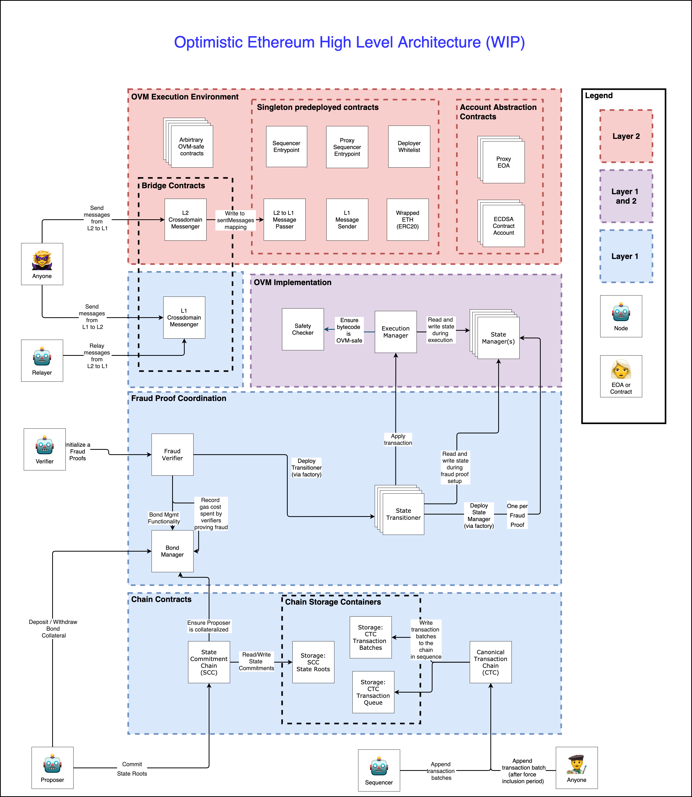

# Understanding the Optimistic Ethereum Protocol

## Handy Temp WIP info:

> [GH Epic](https://github.com/ethereum-optimism/roadmap/issues/455)

> Good sample doc sites:
> - [uniswap docs](https://uniswap.org/docs/v2/protocol-overview/how-uniswap-works/)
> - [0x docs](https://0x.org/docs/core-concepts#networked-liquidity)

**remove all content above this line before publishing**

------

## Introduction

<!-- - Welcome!  Give context -- "how to read these docs" -->

Optimistic Ethereum (often referred to in this document as simply OE) is a layer 2 scaling protocol for Ethereum. We've designed it to be the easiest way for developers to scale up their smart contract systems, while also minimizing overhead required for migration. 

### Design Philosophy 

We've designed our protocol with the following principles in mind:

- Developer Experience: ...
- Compatibility with Layer 1 Ethereum: ...
- 

### Key Concepts

_// John: Putting this here for now, we may or may not need this section, but I like how 
0x uses it_.

### System Overview

The smart contracts in the Optimistic Ethereum (OE) protocol can be separated into a few key components. We will discuss each component in more detail below. 

- **Chain:** Contracts on layer-1, which hold the ordering of layer-2 transactions, and commitments to the associated layer-2 state roots.
- **Fraud Proving:** Contracts on layer-1 which implement the process for proving a fraudulent state transition.
- **Execution:** Contracts which implement the Optimistic Virtual Machine. 
- **Bridge:** Contracts which facilitate message passing between layer-1 and layer-2. 
- **Predeploys:** 
- **Accounts:** Redeployable contracts layer-2 contracts which can represent a user and provide a form of 'account abstraction'. 

  - Contracts Reference Sheet (aka glossary)
  - Deployed contracts (with addresses ie. [aave example][aave])

## Chain (John todo)
    - Delineation between CTC and SCC, 
    - **high priority**: explain once and for all that fraud proofs roll back state roots, but NOT transactions
    - Diagram of "the chains" and what is stored on chain -- ideally illustrates the "roll up" mechanism whereby only roots of batches are SSTOREd
    - Sequencing -- what are the properties, what are the implications
    - Ring buffer?? (lean deprioritize)
    - 

## Execution (John todo)
    - Example execution trace through the OVM starting from `run`
    - State Management L1/L2 differences
    - Explicit list of opcodes that are replaced

## Bridge
    - Low-level tools (ovmL1TXORIGIN, state committment access)

## Fraud Proving ([use gakonst doc][gak])
    - Fraud proving flow

## Precompiles

## OVM Accounts -- TODO: figure out how much of this needs to go into "integration" section
    - explanation of createEOA/nonce opcodes which offer backwards compatibility
    - Transaction formats (ethSign vs RLP)
        - somewhere this should say it's upgradeable
    - Fees (Is this where fee discussion should go? Or with RPC docs?)

[gak]: https://docs.google.com/document/d/1GeoPBezX-CT9dGgwFHCW6kCjmcUQH9oARBLbgLooOBc/edit#heading=h.whebpifa90c9

[vyper]: https://vyper.readthedocs.io/en/v0.1.0-beta.6/#principles-and-goals
[aave]: https://docs.aave.com/developers/deployed-contracts
