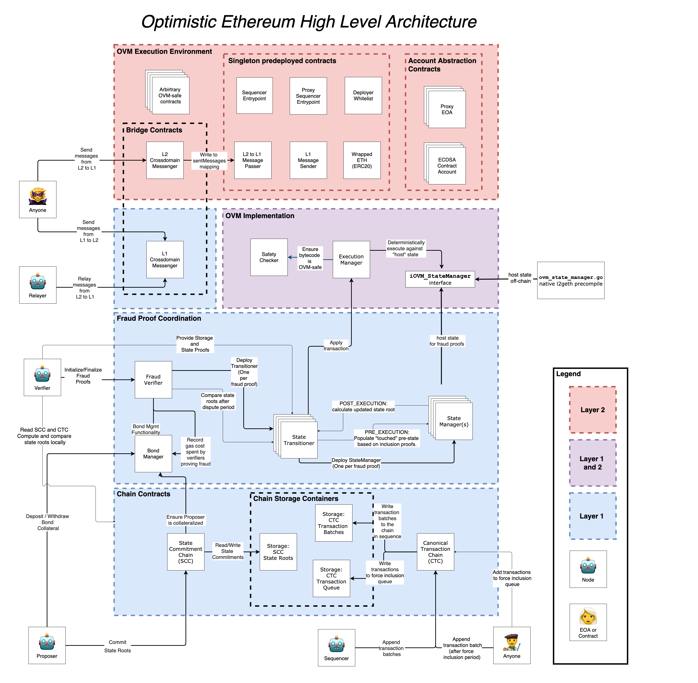

# {{ $frontmatter.title }}

<!-- This comment string does not appear in the rendered html, so it can be used for making notes.
The following is a list of useful references that can be used in writing this doc:

- [ToB audit brief](https://docs.google.com/document/d/1SA8-5f73I9G8wDDfwCGLojhY0fmK-0kM2B5-YVqv2Co/edit#)
- [OZ audit brief](https://docs.google.com/document/d/1obZqFlyVLX93HnN6Hpibah4NHa4bZ3QcoZgRQm96UU0/edit#heading=h.ene4josc1vb4)
- [OVM post on Medium](https://medium.com/plasma-group/ethereum-smart-contracts-in-l2-optimistic-rollup-2c1cef2ec537)
- [gakonst post](https://research.paradigm.xyz/optimism)

These are some great documentation sites for inspiration:

- [uniswap docs](https://uniswap.org/docs/v2/protocol-overview/how-uniswap-works/)
- [0x docs](https://0x.org/docs/core-concepts#networked-liquidity)

[gak]: https://docs.google.com/document/d/1GeoPBezX-CT9dGgwFHCW6kCjmcUQH9oARBLbgLooOBc/edit#heading=h.whebpifa90c9
[vyper]: https://vyper.readthedocs.io/en/v0.1.0-beta.6/#principles-and-goals
[aave]: https://docs.aave.com/developers/deployed-contracts

**remove all content above this line before publishing**
-->

::: tip Work in Progress™
_Our documentation is a rapidly improving work in progress. If you have questions or feel like something is missing feel free to ask in our [Discord server](https://discord.optimism.io) where we (and our awesome community) are actively responding, or [open an issue](https://github.com/ethereum-optimism/community-hub/issues) in the GitHub repo for this site._
:::

## Introduction

<!-- - Welcome!  Give context -- "how to read these docs" -->

Optimistic Ethereum (OE) is a Layer 2 scaling protocol for Ethereum applications.
I.e., it makes transactions cheap. Real cheap.
We aim to make transacting on Ethereum affordable and
accessible to anyone.

This document is intended for anyone looking for a deeper understanding of how the protocol works
'under the hood'.
If you just want to skip straight to integrating your smart contract application with
OE, check out the [Developer Docs](../developers/integration.md).

Optimistic Ethereum is meant to look, feel and behave like Ethereum but cheaper and faster.
For developers building on our OE, we aim to make the transition as seamless as possible.
With very few exceptions,
existing Solidity smart contracts can run on L2 exactly how they run on L1.
Similarly, off-chain code (ie. UIs and wallets), should be able to interact with L2 contract with little more than an updated RPC endpoint.

<!-- ### Design Philosophy

// [ref](https://docs.google.com/presentation/d/1_hMomfXES3jhpPxKhV-4tydPwjJ6CUYU49eylDFY1ek/edit?ts=6021777a#slide=id.ga4c51e44d5_1_207)

We've designed our protocol with the following principles in mind:

- Pragmatism:
  - We aren't seeking to reinvent the wheel, or to develop the a...
- Collaboration:
  - Dev in the open
  - lean heavily into ETH1.x
- Iteration:
  - Learn from Community
  - Work with Community

- Developer Experience:
- Compatibility with Layer 1 Ethereum: ... -->

<!-- ## Overview of the Optimistic Ethereum Roll Up

Fraud proofs:

Sandboxing/containerization

The core of OE is the Optimistic Virtual Machine (OVM), which uses a containerization model enabling smart contract execution to
run on Layer

occur natively during a dispute on L1, but in such a way that the execution has non-interference with any external L1 state.  Verifying that this holds true is our main goal with this audit--effectively, proving that the execution sandbox we have created cannot be escaped.
yar -->
<!--
### Similarities and differences between Ethereum and Optimistic Ethereum

### OVM vs. EVM

The OVM

#### No native token

Ethereum has Ether, and every Ethereum account has a balance (possibly zero) in Ether. Conversely OE has a built-in ERC20 compatible Wrapped Ether (WETH) token. EVM  -->

<!--
### Key Concepts

_// John: Putting this here for now, we may or may not need this section, but I like how 0x uses it_.

- Batches
- Queue
- Layer 1 and Layer 2: What do we mean by L1 and L2? Is there better terminology for this? Can we say EVM and OVM instead?
- Sequencer
- Sandboxing
 -->

## System Overview

The smart contracts in the Optimistic Ethereum (OE) protocol can be separated into a few key components. We will discuss each component in more detail below.

- **[Chain:](#chain-contracts)** Contracts on layer-1, which hold the ordering of layer-2 transactions, and commitments to the associated layer-2 state roots.
- **[Transaction result challenges:](#transaction-challenge-contracts)** Contracts on layer-1 which implement the process for challenging a transaction result.
- **[Execution:](#execution-contracts)** Contracts which implement the Optimistic Virtual Machine.
- **[Bridge:](#bridge-contracts)** Contracts which facilitate message passing between layer-1 and layer-2.
- **[Predeploys:](#predeployed-contracts)** A set of essential contracts which are deployed and available in the genesis state of the system. These contracts are similar to Ethereum's precompiles, however they are written in Solidity, and can be found at addresses prefixed with 0x42.
- **[Accounts:](#account-contracts)** Redeployable contracts layer-2 contracts which can represent a user and provide a form of 'account abstraction'.

<!-- Using html instead of markdown so we can put a caption on the image. -->
<figure>
  
  <figcaption style="text-align: center; font-size: 12px;">Diagram created with <a href="https://www.diagrams.net/">draw.io</a>.  Editable source <a href="https://docs.google.com/document/d/1OObmIhuVyh5GEekqT4dd3bzO58ejSQb_rlnrBmxcNN0/edit#">here</a>.</figcaption>
</figure>

<!--
 - Contracts Reference Sheet (aka glossary)
  - Deployed contracts (with addresses ie. [aave example][aave])
-->

## Chain Contracts

The Chain is composed of a set of contracts running on the Ethereum mainnet. These contracts store ordered
lists of:

1. An _ordered_ list of all transactions applied to the L2 state.
2. The proposed state root which would results from the application of each transaction.
3. Transactions sent from L1 to L2, which are pending inclusion in the ordered list.

<!--
**Planned section outline**
- Delineation between CTC and SCC,
- **high priority**: explain once and for all that challenges roll back state roots, but NOT transactions
- Diagram of "the chains" and what is stored on chain -- ideally illustrates the "roll up" mechanism whereby only roots of batches are SSTOREd
- Sequencing -- what are the properties, what are the implications
- Ring buffer?? (lean deprioritize)
-->

The chain is composed of the following concrete contracts:
<!-- [concrete contracts][stackex]: -->

### [`OVM_CanonicalTransactionChain`](https://github.com/ethereum-optimism/optimism/blob/develop/packages/contracts/contracts/optimistic-ethereum/OVM/chain/OVM_CanonicalTransactionChain.sol) (CTC)

The Canonical Transaction Chain (CTC) contract is an append-only log of transactions which must be applied to the OVM state. It defines the ordering of transactions by writing them to the `CTC:batches` instance of the Chain Storage Container. The CTC also allows any account to `enqueue()` an L2 transaction, which the Sequencer must  eventually append to the rollup state.

### [`OVM_StateCommitmentChain`](https://github.com/ethereum-optimism/optimism/blob/develop/packages/contracts/contracts/optimistic-ethereum/OVM/chain/OVM_StateCommitmentChain.sol) (SCC)

The State Commitment Chain (SCC) contract contains a list of proposed state roots which Proposers assert to be a result of each transaction in the Canonical Transaction Chain (CTC). Elements here have a 1:1 correspondence with transactions in the CTC, and should be the unique state root calculated off-chain by applying the canonical transactions one by one.

### [`OVM_ChainStorageContainer`](https://github.com/ethereum-optimism/optimism/blob/develop/packages/contracts/contracts/optimistic-ethereum/OVM/chain/OVM_ChainStorageContainer.sol)

Provides reusable storage in the form of a "Ring Buffer" data structure, which will overwrite storage slots that are no longer needed. There are three Chain Storage Containers deployed, two are controlled by the CTC, one by the SCC.

<!-- [stackex]: TODO - create a stackexchange Q and A, to make this term real. -->

## Transaction Challenge Contracts

In the previous section, we mentioned that the Chain includes a list of the _proposed_ state roots
resulting from each transaction. Here we explain a bit more about how these proposals happen, and how
we come to trust them.

In brief: If a proposed state root is not the correct result of executing a transaction, then a Verifier (which is anyone running an OE 'full node') can initiate a transaction result challenge. If the transaction result is successfully proven to be incorrect, the Verifier will receive a reward taken from funds which a Sequencer must put up as a bond.

The challenge system is composed of the following concrete contracts:

### [`OVM_FraudVerifier`](https://github.com/ethereum-optimism/optimism/blob/develop/packages/contracts/contracts/optimistic-ethereum/OVM/verification/OVM_FraudVerifier.sol)
The Fraud Verifier contract coordinates the entire challenge verification process. If the challenge is successful it prunes any state batches from State Commitment Chain which were published after and including the state root in question.

### [`OVM_BondManager`](https://github.com/ethereum-optimism/optimism/blob/develop/packages/contracts/contracts/optimistic-ethereum/OVM/verification/OVM_BondManager.sol)
The Bond Manager contract handles deposits in the form of an ERC20 token from bonded Proposers. It also handles the accounting of gas costs spent by a Verifier during the course of a challenge. In the event of a successful challenge, the faulty Proposer's bond is slashed, and the Verifier's gas costs are refunded.

### [`OVM_StateTransitioner`](https://github.com/ethereum-optimism/optimism/blob/develop/packages/contracts/contracts/optimistic-ethereum/OVM/verification/OVM_StateTransitioner.sol)
The State Transitioner coordinates the execution of a state transition during the evaluation of a challenge. It feeds verified input to the Execution Manager's run(), and controls a State Manager (which is uniquely created for each challenge). Once a challenge has been initialized, this contract is provided with the pre-state root and verifies that the OVM storage slots committed to the State Manager are contained in that state. This contract controls the State Manager and Execution Manager, and uses them to calculate the post-state root by applying the transaction. The Fraud Verifier can then check the correctness of a result by comparing the calculated post-state root with the proposed post-state root.

### [`OVM_StateTransitionerFactory`](https://github.com/ethereum-optimism/optimism/blob/develop/packages/contracts/contracts/optimistic-ethereum/OVM/verification/OVM_StateTransitionerFactory.sol)
Used by the Fraud verifier to create a unique State Transitioner for each challenge.
<!-- - (TODO: are factories even worth including?) -->

## Execution Contracts

<!-- John TODO:
**Planned section outline**
- Example execution trace through the OVM starting from `run`
- State Management L1/L2 differences
- Explicit list of opcodes that are replaced -->

The Execution contracts implement the Optimistic Virtual Machine, or OVM. Importantly, these contracts
must execute in the same deterministic manner, whether a transaction is run on Layer 2, or Layer 1 (during a challenge).

### [`OVM_ExecutionManager`](https://github.com/ethereum-optimism/optimism/blob/develop/packages/contracts/contracts/optimistic-ethereum/OVM/execution/OVM_ExecutionManager.sol)
The Execution Manager (EM) is the core of our OVM implementation, and provides a sandboxed environment allowing us to execute OVM transactions deterministically on either Layer 1 or Layer 2. The EM's run() function is the first function called during the execution of any transaction on L2. For each context-dependent EVM operation the EM has a function which implements a corresponding OVM operation, which will read state from the State Manager contract. The EM relies on the Safety Checker to verify that code deployed to Layer 2 does not contain any context-dependent operations.

### [`OVM_SafetyChecker`](https://github.com/ethereum-optimism/optimism/blob/develop/packages/contracts/contracts/optimistic-ethereum/OVM/execution/OVM_SafetyChecker.sol)
The Safety Checker verifies that contracts deployed on L2 do not contain any "unsafe" operations. An operation is considered unsafe if it would access state variables which are specific to the environment (ie. L1 or L2) in which it is executed, as this could be used to "escape the sandbox" of the OVM, resulting in non-deterministic challenges. That is, an attacker would be able to challenge an honestly applied transaction. Note that a "safe" contract requires opcodes to appear in a particular pattern; omission of "unsafe" opcodes is necessary, but not sufficient.

The following opcodes are disallowed:

- `ADDRESS`
- `BALANCE`
- `ORIGIN`
- `EXTCODESIZE`
- `EXTCODECOPY`
- `EXTCODEHASH`
- `BLOCKHASH`
- `COINBASE`
- `TIMESTAMP`
- `NUMBER`
- `DIFFICULTY`
- `GASLIMIT`
- `GASPRICE`
- `CREATE`
- `CREATE2`
- `CALLCODE`
- `DELEGATECALL`
- `STATICCALL`
- `SELFDESTRUCT`
- `SELFBALANCE`
- `SSTORE`
- `SLOAD`
- `CHAINID`
- `CALLER`*
- `CALL`*
- `REVERT`*

\* The `CALLER`, `CALL`, and `REVERT` opcodes are also disallowed, except in the special case that they appear as part of one of the following strings of bytecode:

1. `CALLER PUSH1 0x00 SWAP1 GAS CALL PC PUSH1 0x0E ADD JUMPI RETURNDATASIZE PUSH1 0x00 DUP1 RETURNDATACOPY RETURNDATASIZE PUSH1 0x00 REVERT JUMPDEST RETURNDATASIZE PUSH1 0x01 EQ ISZERO PC PUSH1 0x0a ADD JUMPI PUSH1 0x01 PUSH1 0x00 RETURN JUMPDEST`
2. `CALLER POP PUSH1 0x00 PUSH1 0x04 GAS CALL`

Opcodes which are not yet assigned in the EVM are also disallowed.

### [`OVM_StateManager`](https://github.com/ethereum-optimism/optimism/blob/develop/packages/contracts/contracts/optimistic-ethereum/OVM/execution/OVM_StateManager.sol)
The State Manager contract holds all storage values for contracts in the OVM. It can only be written to by the Execution Manager and State Transitioner. It runs on L1 during the setup and execution of a challenge. The same logic runs on L2, but has been implemented as a precompile in the L2 go-ethereum client.

### [`OVM_StateManagerFactory`](https://github.com/ethereum-optimism/optimism/blob/develop/packages/contracts/contracts/optimistic-ethereum/OVM/execution/OVM_StateManagerFactory.sol)
The State Manager Factory is called by a State Transitioner's init code, to create a new State Manager for use in the challenge process.

## Bridge Contracts

The Bridge contracts implement the functionality required to pass messages between layer 1 and layer 2.

<!--
**Planned section outline**
- Low-level tools (ovmL1TXORIGIN, state committment access)

### Key concepts
- **Relaying** refers to executing a message sent from the other domain, ie. "this message was relayed
-->

The Bridge is composed of the following concrete contracts:

### [`OVM_L1CrossDomainMessenger`](https://github.com/ethereum-optimism/optimism/blob/develop/packages/contracts/contracts/optimistic-ethereum/OVM/bridge/messaging/OVM_L1CrossDomainMessenger.sol)
The L1 Cross Domain Messenger (L1xDM) contract sends messages from L1 to L2, and relays messages from L2 onto L1. In the event that a message sent from L1 to L2 is rejected for exceeding the L2 epoch gas limit, it can be resubmitted via this contract's replay function.

### [`OVM_L2CrossDomainMessenger`](https://github.com/ethereum-optimism/optimism/blob/develop/packages/contracts/contracts/optimistic-ethereum/OVM/bridge/messaging/OVM_L2CrossDomainMessenger.sol)
The L2 Cross Domain Messenger (L2xDM) contract sends messages from L2 to L1, and is the entry point for L2 messages sent via the L1 Cross Domain Messenger.

<!--
JM scribbles:
Proving fraud against a crossDomain message with a false account for **l1TxOrigin**:

- All L1 to L2 messages must be passed via `enqueue` in the CTC. This records `msg.sender` in the enqueued tx hash.
- Recall that each transitioner has a specific txHash, and state root.
- During a fraud proof, the verifier must provide the transaction data to `applyTransaction()`, and the transitioner just checks that the hashes match. -->

## Predeployed Contracts

"Predeploys" are a set of essential L2 contracts which are deployed and available in the genesis state of the system. These contracts are similar to Ethereum's precompiles, however they are written in Solidity, and can be found in the OVM at addresses prefixed with 0x42.

Looking up predeploys is available in the Solidity library [`Lib_PredeployAddresses`](https://github.com/ethereum-optimism/optimism/blob/master/packages/contracts/contracts/optimistic-ethereum/libraries/constants/Lib_PredeployAddresses.sol) as well as in the `@eth-optimism/contracts` package as `predeploys` export.

The following concrete contracts are predeployed:

### [`OVM_DeployerWhitelist`](https://github.com/ethereum-optimism/optimism/blob/develop/packages/contracts/contracts/optimistic-ethereum/OVM/predeploys/OVM_DeployerWhitelist.sol)
The Deployer Whitelist is a temporary predeploy used to provide additional safety during the initial phases of our mainnet roll out. It is owned by the Optimism team, and defines accounts which are allowed to deploy contracts on Layer 2. The Execution Manager will only allow an ovmCREATE or ovmCREATE2 operation to proceed if the deployer's address whitelisted.

### [`OVM_ETH`](https://github.com/ethereum-optimism/optimism/blob/develop/packages/contracts/contracts/optimistic-ethereum/OVM/predeploys/OVM_ETH.sol)
The ETH predeploy provides an ERC20 interface for ETH deposited to Layer 2. Note that unlike on Layer 1, Layer 2 accounts do not have a balance field.

### [`OVM_L1MessageSender`](https://github.com/ethereum-optimism/optimism/blob/develop/packages/contracts/contracts/optimistic-ethereum/OVM/predeploys/OVM_L1MessageSender.sol)
The L1MessageSender is a predeployed contract running on L2.
During the execution of cross domain transaction from L1 to L2, it returns the address of the L1 account (either an EOA or contract) which sent the message to L2 via the Canonical Transaction Chain's `enqueue()` function.
This contract exclusively serves as a getter for the `ovmL1TXORIGIN` operation.
This is necessary because there is no corresponding EVM opcode which the optimistic solidity compiler could replace with a call to the ExecutionManager's `ovmL1TXORIGIN()` function.
That is, if a contract on L2 wants to know which L1 address initiated a call on L2, the way to do it is by calling `OVM_L1MessageSender.ovmL1TXORIGIN()`.

### [`OVM_L2ToL1MessagePasser`](https://github.com/ethereum-optimism/optimism/blob/develop/packages/contracts/contracts/optimistic-ethereum/OVM/predeploys/OVM_L2ToL1MessagePasser.sol)
The L2 to L1 Message Passer is a utility contract which facilitate an L1 proof of the  of a message on L2. The L1 Cross Domain Messenger performs this proof in its _verifyStorageProof function, which verifies the existence of the transaction hash in this  contract's `sentMessages` mapping.

### [`OVM_SequencerEntrypoint`](https://github.com/ethereum-optimism/optimism/blob/develop/packages/contracts/contracts/optimistic-ethereum/OVM/predeploys/OVM_SequencerEntrypoint.sol)
The Sequencer Entrypoint is a predeploy which, despite its name, can in fact be called by  any account. It accepts a more efficient compressed calldata format, which it decompresses and  encodes to the standard EIP155 transaction format. This contract is the implementation referenced by the Proxy Sequencer Entrypoint, thus enabling the Optimism team to upgrade the decompression of calldata from the Sequencer.

### [`OVM_L2StandardBridge`](https://github.com/ethereum-optimism/optimism/blob/master/packages/contracts/contracts/optimistic-ethereum/OVM/bridge/tokens/OVM_L2StandardBridge.sol)
The L2 part of the Standard Bridge. Responsible for finalising deposits from L1 and initiating withdrawals from L2 of ETH and compliant ERC20s.
See [Standard Bridge](../developers/bridging.md#the-standardtm-bridge) for details.

## Account Contracts

OVM Account contracts are redeployable contracts layer-2 contracts which can represent a user and provide a form of 'account abstraction'.

<!--
**Planned section outline**
- **TODO:** figure out how much of this needs to go into "integration" section
- explanation of createEOA/nonce opcodes which offer backwards compatibility
- Transaction formats (ethSign vs RLP)
- somewhere this should say it's upgradeable
- Fees (Is this where fee discussion should go? Or with RPC docs?)
 -->

### [`OVM_ProxyEOA`](https://github.com/ethereum-optimism/optimism/blob/develop/packages/contracts/contracts/optimistic-ethereum/OVM/accounts/OVM_ProxyEOA.sol)
The Proxy EOA contract uses a delegate call to execute the logic in an implementation contract. In combination with the logic implemented in the ECDSA Contract Account, this enables a form of upgradable  'account abstraction' on layer 2.

### [`OVM_ECDSAContractAccount`](https://github.com/ethereum-optimism/optimism/blob/develop/packages/contracts/contracts/optimistic-ethereum/OVM/accounts/OVM_ECDSAContractAccount.sol)
The ECDSA Contract Account contract can be used as the implementation for a ProxyEOA deployed by the ovmCREATEEOA operation. It enables backwards compatibility with Ethereum's Layer 1, by  providing eth_sign and EIP155 formatted transaction encodings.
