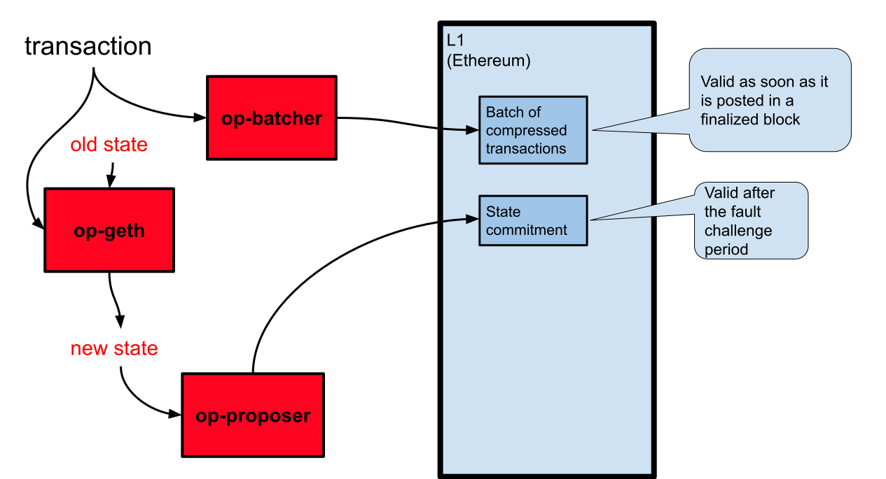

## Introduction

The process for a rollup transaction has two requirements.

- The transaction needs to be written to L1 (Ethereum).
  This is typically performed by `op-batcher`, but any user can send an L1 transaction to submit an L2 transaction, in which case `op-batcher` is bypassed.

- The transaction needs to be executed to modify the state (by `op-geth`).
  Afterwards, `op-proposer` writes a [commitment](https://en.wikipedia.org/wiki/Commitment_scheme) to the post-transaction state to L1.
  Note that `op-proposer` does not need to write a commitment after each transaction to L1, it is OK to commit to the state after a block of transactions.




## Writing the transaction to L1

[`op-batcher`](https://github.com/ethereum-optimism/optimism/tree/233ede59d16cb01bdd8e7ff662a153a4c3178bdd/op-batcher) has two main jobs:

- Compress transactions into batches.
- Post those batches to L1 to ensure availability and integrity.

### Compression

The batcher aggregates [sequencer batches](https://github.com/ethereum-optimism/optimism/blob/233ede59d16cb01bdd8e7ff662a153a4c3178bdd/specs/glossary.md#sequencer-batch) into [channels](https://github.com/ethereum-optimism/optimism/blob/233ede59d16cb01bdd8e7ff662a153a4c3178bdd/specs/glossary.md#channel).
This allows for more data per compression frame, and therefore a better compression ratio.
You can read more about this process [in the specs](https://github.com/ethereum-optimism/optimism/blob/233ede59d16cb01bdd8e7ff662a153a4c3178bdd/specs/derivation.md#batch-submission).

When a channel is full or times out it is compressed and written.

The maximum time that a channel can be open, from the first transaction to the last, is specified in units of L1 block time (so a value of 5 means 5*12=60 seconds).
You can specify it either as an environment variable (`OP_BATCHER_MAX_CHANNEL_DURATION`) or a command line parameters (`--max-channel-duration`).
Alternatively, you can set it to zero (the default) to avoid posting smaller, less cost efficient, transactions.

A channel is full when the anticipated compressed size is the target L1 transaction size. 
This is controlled by two parameters:

1. The target L1 transaction size, which you can specify in bytes on the command line (`--target-l1-tx-size-bytes`) or as an environment variable (`OP_BATCHER_TARGET_L1_TX_SIZE_BYTES`)

1. The expected compression ratio, which you can specify as a decimal value, again either on the command line (`--approx-compr-ratio`) or as an environment variable (`OP_BATCHER_APPROX_COMPR_RATIO`).

You can see the code that implements this process in [`channel_manager.go`](https://github.com/ethereum-optimism/optimism/blob/233ede59d16cb01bdd8e7ff662a153a4c3178bdd/op-batcher/batcher/channel_manager.go) and [`channel_builder.go`](https://github.com/ethereum-optimism/optimism/blob/233ede59d16cb01bdd8e7ff662a153a4c3178bdd/op-batcher/batcher/channel_builder.go).


### Posting to L1

When a channel is full it is posted, either as a single transaction or as multiple transactions (depending on data size) to L1. 

Processed L2 transactions exist in one of three states:

- **unsafe** transactions are already processed, but not written to L1 yet.
  A batcher fault might cause these transactions to be dropped.

- **safe** transactions are already processed and written to L1.
  However, they might be dropped due to a reorganization at the L1 level.

- **finalized** transactions are written to L1 in an L1 block that is old enough to be [finalized](https://www.alchemy.com/overviews/ethereum-commitment-levels).

::: tip When are transactions irrevocable?

Once a transaction is finalized, you can rely that it has "happened".
While the state after the transaction is subject to fault challenges, the transaction itself is fix and immutable.

:::

You can see the code that builds the channels to be written to L1 in [`channel_out.go`](https://github.com/ethereum-optimism/optimism/blob/233ede59d16cb01bdd8e7ff662a153a4c3178bdd/op-node/rollup/derive/channel_out.go) and [`channel_builder.go`](https://github.com/ethereum-optimism/optimism/blob/233ede59d16cb01bdd8e7ff662a153a4c3178bdd/op-node/rollup/derive/channel_out.go).
The transactions themselves are sent in [`op-batcher`'s main loop](https://github.com/ethereum-optimism/optimism/blob/915036aaa7eba7ee2ce290be90f78bb35df8d066/op-batcher/batcher/driver.go#L284-L299), which calls [`publishStateToL1`](https://github.com/ethereum-optimism/optimism/blob/915036aaa7eba7ee2ce290be90f78bb35df8d066/op-batcher/batcher/driver.go#L303-L344)


#### Determining the status of a transaction

This is the procedure to see a transaction's status.
The directions here are for [Foundry](https://book.getfoundry.sh/), but the concept is the same regardless of the method you use.


1. Get the number of the L2 block in which the transaction is recorded.

   ```sh
   export ETH_RPC_URL=<URL to Optimism network>
   cast tx <transaction hash> blockNumber
   ```

1. Get the number of the latest finalized block.
   If the result is greater than the block number of the transaction, or equal, the transaction is finalized.

   ```sh
   cast block finalized --field number
   ```

1. Get the number of the latest safe block.
   If the result is greater than the block number of the transaction, or equal, the transaction is safe.

   ```sh
   cast block safe --field number
   ```

1. If the transaction isn't finalized or safe, it's unsafe. 
   

## State processing

State processing can be divided into two steps:

1. Applying the transaction to the old state to produce the new state, which is performed by [`op-geth`](https://github.com/ethereum-optimism/op-geth).

1. Proposing the new [Merkle root](https://en.wikipedia.org/wiki/Merkle_tree) of the state.
   Merkle roots are used because the actual state is long and would cost too much to write to L1.
   This step is performed by `op-proposer`.

### State changes

The state is stored and modified by [`op-geth`](https://github.com/ethereum-optimism/op-geth).
It is a [slightly modified](https://op-geth.optimism.io/) version of the standard [geth](https://geth.ethereum.org/).


### State root proposals

The state root proposals are posted by [`op-proposer`](https://github.com/ethereum-optimism/optimism/tree/233ede59d16cb01bdd8e7ff662a153a4c3178bdd/op-proposer) to [`L2OutputOracle`](https://github.com/ethereum-optimism/optimism/blob/233ede59d16cb01bdd8e7ff662a153a4c3178bdd/packages/contracts-bedrock/contracts/L1/L2OutputOracle.sol) on L1. 

Output proposals are *not* immediately valid. 
They can only be considered authoritative once the fault challenge period (7 days on the production network, less on test networks) has passed.
