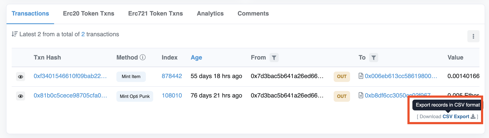
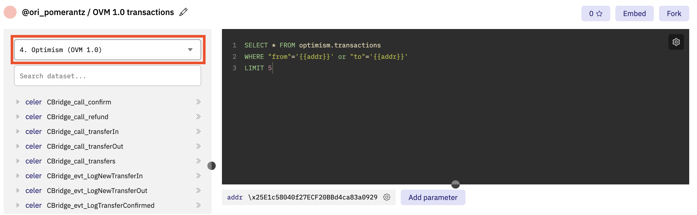

## Etherscan

We have Etherscan explorers for the [Optimism mainnet](https://optimistic.etherscan.io) and the [Optimism Kovan testnet](https://kovan-optimistic.etherscan.io).
Etherscan has lots of tools to help you debug transactions.

Optimistic Etherscan has all the tools you expect from Etherscan, such as:
- [Detailed transaction information](https://optimistic.etherscan.io/tx/0x292423266d6da24126dc4e0e81890c22a67295cc8b1a987e71ad84748511452f)
- [List of events emitted by a transaction](https://optimistic.etherscan.io/tx/0x292423266d6da24126dc4e0e81890c22a67295cc8b1a987e71ad84748511452f#eventlog)
- [Contract source code and verification](https://optimistic.etherscan.io/address/0x420000000000000000000000000000000000000F#code)
- And everything else you might find on Etherscan!

It's also got some Optimism-specific features:
- [A list of L1-to-L2 transactions](https://optimistic.etherscan.io/txsEnqueued)
- [A list of L2-to-L1 transactions](https://optimistic.etherscan.io/txsExit)
- [A tool for finalizing L2-to-L1 transactions](https://optimistic.etherscan.io/messagerelayer)
- And more! Just check it out and click around to find all of the available features.

Etherscan currently provides the most advanced block explorers for all Optimism Ethereum networks.

### Access to pre-regenesis history

The Etherscan user interface only shows information since our final regenesis on November 11th, 2021. 
To retrieve older transactions, run the query as you would normally, and then use the **CSV Export** tool.



#### Dune (in case you need fields missing from the CSV)

[Dune.xyz](https://dune.xyz) is an analytics platform for blockchain information.
If the Etherscan CSV file does not contain the information you need, you can use Dune's stored history:


1. Log on to a Dune Analytics account (their free tier is sufficient).

1. Select the data source **4. Optimism (OVM 1.0)**.

   

1. Run a query similar to [this one](https://dune.xyz/queries/354886?addr=%5Cx25E1c58040f27ECF20BBd4ca83a09290326896B3) 

   ```sql
   SELECT * FROM optimism.transactions 
      WHERE "from"='{{addr}}' or "to"='{{addr}}' 
      LIMIT 5
   ```

   ::: v-pre

   Parameter values, such as `{{addr}}`, allows the user to choose a value without editing the query itself. 
   Note that in Dune you write addresses as **\x &lt; hex address &gt;** rather than <strong> 0x &lt; hex address &gt; </strong> .

### Even older history

Both of these methods only work for transaction that happened on June 23rd, 2021 or later. If you need anything older, please contact us.

