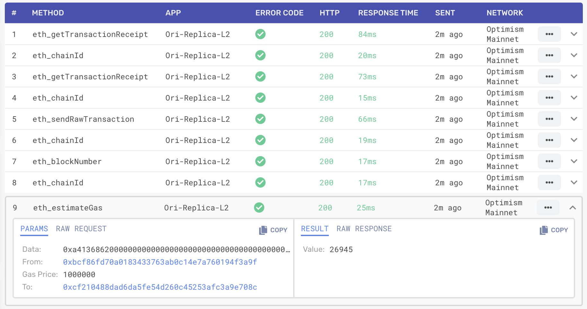

::: tip Developer Tip
We recommend using [Alchemy](https://www.alchemy.com/optimism) for its scalablity, reliability, and data accuracy. 
:::

::: warning
Some API calls, such as the those in the [personal namespace](https://geth.ethereum.org/docs/rpc/ns-personal) make no sense in a shared environment.
Such RPCs are either totally unsupported, or will return nonsensical values.
:::

## Optimism (mainnet)

| Parameter | Value |
| --------- | ----- |
| Network Name | **`Optimism`** |
| Description | **`Mainnet`** |
| Chain ID | **`10`** |
| Explorer | **[https://optimistic.etherscan.io](https://optimistic.etherscan.io)** |
| HTTP Endpoint1 | We recommend [Alchemy](https://docs.alchemy.com/reference/optimism-api-quickstart/?a=818c11a8da). Optimism also provides this endpoint: **`https://mainnet.optimism.io`.** _But it is not for production systems and is rate limited._   |
| WebSocket Endpoint2 | **`wss://ws-mainnet.optimism.io`** 
| L1 Contract Addresses | [link](https://github.com/ethereum-optimism/optimism/tree/develop/packages/contracts/deployments/mainnet#layer-1-contracts) |
| L2 Contract Addresses | [link](https://github.com/ethereum-optimism/optimism/tree/develop/packages/contracts/deployments/mainnet#layer-2-contracts) |
| chainid.link | [https://chainid.link/?network=optimism](https://chainid.link/?network=optimism)

(1) Some API calls, such as those in the [personal namespace](https://geth.ethereum.org/docs/rpc/ns-personal) make no sense in a shared environment.
Such RPCs are either not supported, or will return nonsensical values.

(2) The WebSocket endpoint is only supported for the two operations that cannot be provided on an HTTP endpoint: `eth_subscribe` and `eth_unsubscribe`. 
If you need a general purpose WebSocket endpoint, get one from a service provider._

### API Options:

1. Get free access to Optimism through [Alchemy](https://www.alchemy.com/optimism)

2. For small scale tests, you can use our public API:
- HTTP endpoint: [https://mainnet.optimism.io](https://mainnet.optimism.io) (note, this is for testing. For production, use Alchemy) 
- WebSocket endpoint (limited usage, see footnote below the table): [wss://ws-mainnet.optimism.io](wss://ws-mainnet.optimism.io)

You can run a large application for free using [Alchemy](https://www.alchemy.com/optimism). We’ve done extensive diligence and Alchemy is our recommendation due to reliability, scalability, and data correctness. They're the default API provider and developer platform for top projects like OpenSea and Facebook. 

## Optimism Goerli

::: tip Purpose
This is our test network.
:::

| Parameter | Value |
| --------- | ----- |
| Network Name | **`Optimism Goerli`** |
| Description | **`Testnet (public)`** |
| Chain ID | **`420`** |
| Explorer | **[https://goerli-optimism.etherscan.io/](https://goerli-optimism.etherscan.io/)** |
| HTTP Endpoint | **`https://goerli.optimism.io`** |
| WebSocket Endpoint | **`wss://ws-goerli.optimism.io`** |
| L1 Contract Addresses | [link](https://github.com/ethereum-optimism/optimism/tree/develop/packages/contracts/deployments/goerli#layer-1-contracts) |
| L2 Contract Addresses | [link](https://github.com/ethereum-optimism/optimism/tree/develop/packages/contracts/deployments/goerli#layer-2-contracts) |
| chainid.link | [https://chainid.link/?network=optimism-goerli](https://chainid.link/?network=optimism-goerli)

### API Options

1. Get free access to Optimism through [Alchemy](https://www.alchemy.com/optimism)

2. For small scale tests, you can use our public API:
- HTTP endpoint: [https://goerli.optimism.io](https://goerli.optimism.io) (note, this is for testing. For production, use Alchemy) 
- WebSocket endpoint (limited usage, see footnote below the table): [wss://ws-goerli.optimism.io](wss://ws-goerli.optimism.io)

You can run a large application for free using [Alchemy](https://www.alchemy.com/optimism). We’ve done extensive diligence and Alchemy is our recommendation due to reliability, scalability, and data correctness. They're the default API provider and developer platform for top projects like OpenSea and Facebook. 

### Test ETH

[The Optimism Faucet](https://optimismfaucet.xyz/) now provides Optimism Goerli ETH.
Alternatively, if you already have Goerli ETH, you can [bridge it](https://app.optimism.io/bridge).

## Connecting to Optimism

There are four strategies to connect to an Optimism network (mainnet or testnet).

1. **Public endpoint**. These are endpoints open to anybody who wants to use them.
   Because they are a shared resource, these endpoints have rate limits that make them unusable for a production application.
   They are supposed to be for initial exploration and development, and for use by wallets.

   These public endpoints are available:

   | Provider | Network | Endpoint |
   | - | - | - |
   | Optimism | Mainnet | https://mainnet.optimism.io |
   | Bware Labs | Mainnet | https://optimism-mainnet.public.blastapi.io ([see docs](https://blastapi.io/public-api/optimism)) |
   | Optimism | Testnet | https://goerli.optimism.io |

1. **Free tier endpoints**. [Alchemy](https://www.alchemy.com/optimism?a=818c11a8da), as well as a number of [other providers](./providers.md), provide a free tier in their endpoint service.
   There are several reasons to use this free tier service instead of a public endpoints: 

   - Some providers give you [additional API functions](https://www.alchemy.com/enhanced-apis/?a=818c11a8da) which are not available from public endpoints.

   - While a free tier endpoint is still going to be rate limited, the limit is typically a lot higher than on a public endpoint.

   - Provider endpoints give you detailed logging, including logs of read-only requests that are not available on public utilities such as [Etherscan](https://etherscan.io/) and [Tenderly](https://tenderly.co/).

     In the screen capture below you see a log from [Alchemy](https://www.alchemy.com/optimism?a=818c11a8da) with an `eth_getEstimate` request, which does not get propagated to the entire blockchain.

    

1. **Paid endpoints**. [Alchemy](https://www.alchemy.com/optimism?a=818c11a8da) and the [other providers](./providers.md), also provide a paid tier.
   While the free tier is usually sufficient for development, once the dapp is popular it is likely to require more requests than the free tier allows.

1. **Run your own node**. If your dapp needs to support a lot of requests, it might be cheaper to [run your own node](../developers/build/run-a-node.md).
   You will still need an upstream endpoint to synchronize from, and because our own infrastructure runs on Alchemy that would probably be the fastest provider.