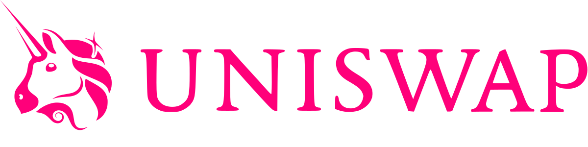
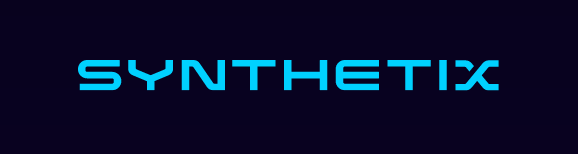
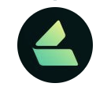
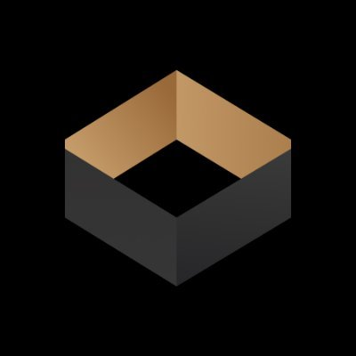

# {{ $frontmatter.title }}

--- 

|  |  |  |  |  |
| - | - | - | - | - |

|  |  |  |  |  |
| - | - | - | - | - | - |

|  |  | 
| - | - |

[See our list of supported wallets here](/docs/users/wallets.html)

---

## [Optimism ](https://gateway.optimism.io/)

The Optimism Gateway allows you to transfer assets between L1 and Optimistic Ethereum.

* [Documentation](/docs/users/gateway.html)

---

## [1inch ](https://help.1inch.io/en/articles/5468238-optimism-how-to-use-1inch-on-optimistic-ethereum)

1inch's aggregation protocol, which allows you to choose the best decentralized exchange for your
transaction, is available on Optimistic Ethereum.

---

## [Celer ](https://cbridge.celer.network/#/)

You can use Celer's bridge to transfer assets between Optimism and other Ethereum
networks (L1, other rollovers, and side chains).

---

## [Chainlink ](https://chain.link/)

Chainlink's decentralized oracle network provides reliable, tamper-proof inputs and outputs for complex smart contracts on any blockchain.

---

## [DeBank ](https://debank.com/)

Debank is a multi-chain portfolio tracker.

---

## [Dune Analytics ](https://duneanalytics.com/Marcov/Optimism-Ethereum)

Dune Analytics allows you to explore activity on the Optimistic Ethereum network and also 
[create your own Optimistic Ethereum dashboards](https://docs.duneanalytics.com/#queries).

---

## [Hop.Exchange ](https://app.hop.exchange/send?sourceNetwork=ethereum&destNetwork=optimism)

Hop allows you to quickly bridge assets between L1 and various L2 solutions.

---

## [Kwenta ](https://kwenta.io/)

Kwenta allows you to trade real world assets and derivatives on-chain.

* [Everything you need to know about using Kwenta on L2](https://blog.kwenta.io/everything-you-need-to-know-about-using-kwenta-on-l2/)

---

## [Lyra ](https://www.lyra.finance/)

Lyra is an automated market maker (AMM) for [option 
trading](https://www.lyra.finance/files/whitepaper.pdf). 

* [Onboarding Guide](https://blog.lyra.finance/onboarding-guide/)

---

## [OG Gnosis Multisig](https://ogg.scopelift.co/)

We have a copy of the OG Gnosis Multisig running on Optimistic Ethereum, in case you need to
create a multisig.

---

## [Synthetix ](https://staking.synthetix.io/)

Synthetix is a system designed to let users hold and trade synthetic assets whose value can be tied to
[real-world assets](https://docs.synthetix.io/tokens/list).
This makes it possible to invest in and trade assets without actually having to hold the underlying assets.

* [Optimistic Ethereum on L2 is now integrated into Staking!](https://blog.synthetix.io/oe-integrated-into-staking/)
* [Synth Exchanges are Live on L2!](https://blog.synthetix.io/synth-exchanges-are-live-on-l2/)
* [Synthetix Staking dApp (live on L2)](https://staking.synthetix.io/)

---

## [Uniswap ](https://uniswap.org/)

The Uniswap protocol is a peer-to-peer system designed for exchanging [ERC20 Tokens](https://ethereum.org/en/developers/docs/standards/tokens/erc-20/) on EVM-compatible blockchains.
The protocol is implemented as a set of persistent, non-upgradable smart contracts; designed to prioritize censorship resistance, security, self-custody, and to function without any trusted intermediaries who may selectively restrict access.

* [Learn how to use Uniswap on faster & cheaper Layer 2 networks](https://help.uniswap.org/en/collections/3033942-layer-2)
* [Uniswap (live on L2)](https://app.uniswap.org/#/swap)

