# {{ $frontmatter.title }}

## Why use Optimistic Ethereum?

The Optimistic Ethereum network lets you send transactions, similar to Ethereum, but
with two important advantages:

* **Near-instant transaction finality.** You know almost immediately if your transaction took place
  or not.
* **Much lower transaction fees.** Typically between a 1% and 10% of the cost on L1.
  [For the current gas price and a few sample transactions' costs,
  see here](https://public-grafana.optimism.io/d/9hkhMxn7z/public-dashboard?orgId=1&refresh=5m).
* **Decentralization.** All transactions are posted to L1 Ethereum, inheriting the strong security guarantees of Ethereum

## Depositing assets

Before you can use assets (Ether, ERC-20 tokens, etc) on Optimistic Ethereum you need to deposit
them from Mainnet Ethereum using [a bridge](https://www.optimism.io/apps/dapps). For depositing ETH, you can use [our own gateway](https://gateway.optimism.io/).

1. If you do not have any ETH, purchase some through a centralized exchange, such as 
   [Coinbase](https://www.coinbase.com/signup), [Gemini](https://exchange.gemini.com/register), 
   or [Binance](https://accounts.binance.com/en/register).
1. Set up a wallet, for example [Metamask](https://metamask.io/), and withdraw the ETH from the centralized
   exchange to your wallet.   
1. [Browse to the gateway](https://gateway.optimism.io/).
1. Click **CONNECT**, select your wallet type, and approve the connection in the 
   wallet itself if asked.
1. Make sure the form is correct:

   * **Deposit** is selected
    
     

     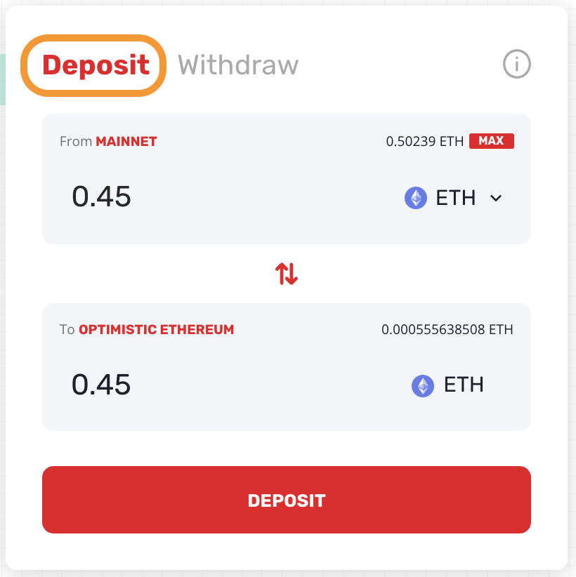
     

   * From **MAINNET**

     

     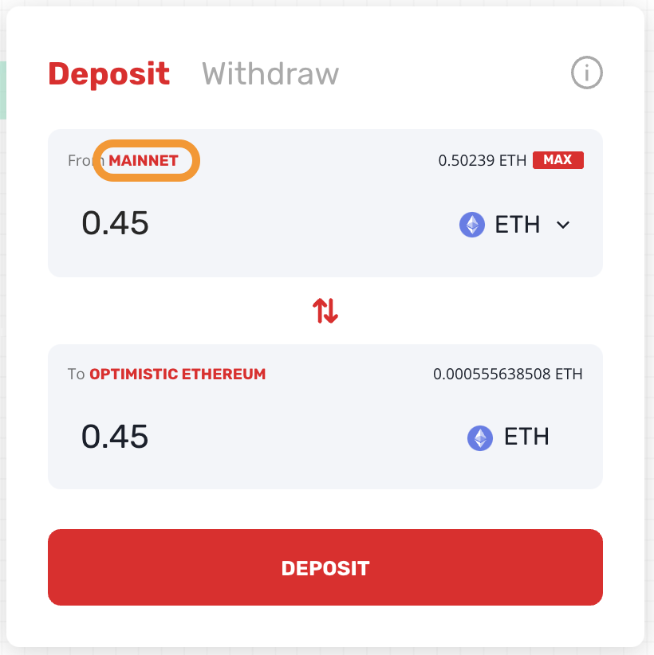
     

   * The asset is **ETH**.
   
     

     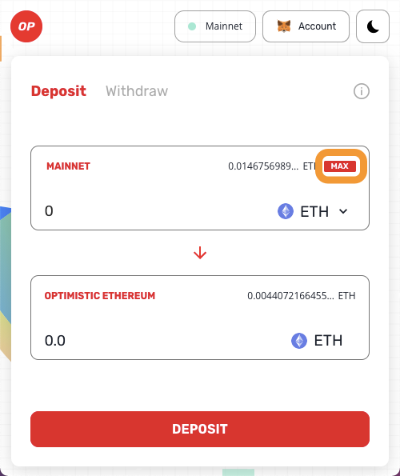
     

   * The amount is possible. Click **MAX** to see the maximum amount 
     you can deposit (after accounting for transaction costs), and 
     if relevant enter a lower amount.

     

     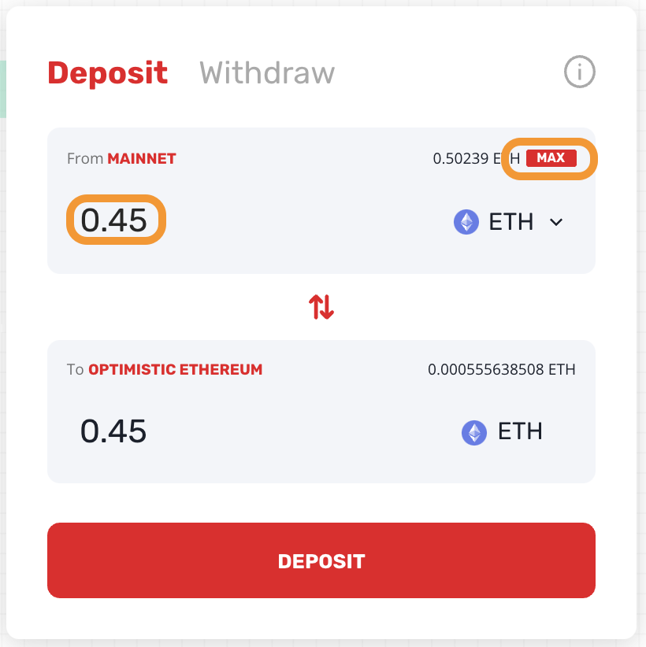
     

1. Click **DEPOSIT**.
1. Click **DEPOSIT** again to confirm.
1. Confirm the transaction in the wallet, wait until the transaction is confirmed and the ETH
   deposited to Optimistic Ethereum.
1. [Browse here](https://chainid.link/?network=optimism) and click
   **connect** to add the Optimistic Ethereum network to your wallet. 
   You will need to approve this addition in your wallet. The network
   notification in MetaMask is shown below, other wallets are likely
   to be similar

      

      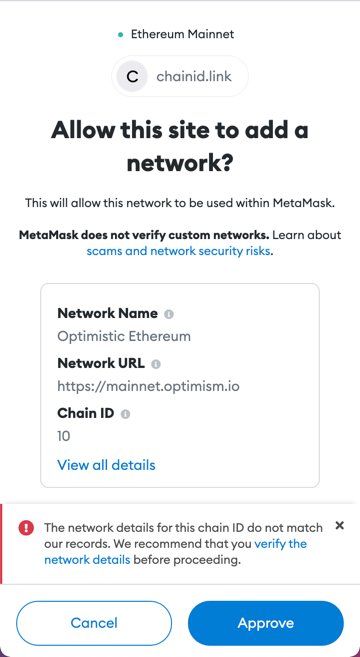
      
   

## Applications

Optimistic Ethereum supports [a large and growing list of 
applications](https://www.optimism.io/apps/all). To tell your wallet to
change to Optimistic Ethereum click **Withdraw** in the gateway and confirm the network
switch in the wallet.

### Uniswap 

Uniswap lets you swap between assets. It is currently the most commonly used
Open Ethereum application, so here are step by step directions to let you
see that applications are used the same way they are on mainnet.

1. Browse to the [Uniswap application](https://app.uniswap.org/#/swap).
1. Click **Connect to a wallet** and confirm in the wallet. If necessary, switch the
   network in the wallet to **Optimism**.
1. Select:

   A. The token you give
      
      

      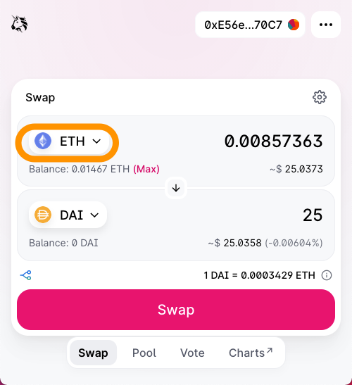 
      

   
   B. The token you get back

      

      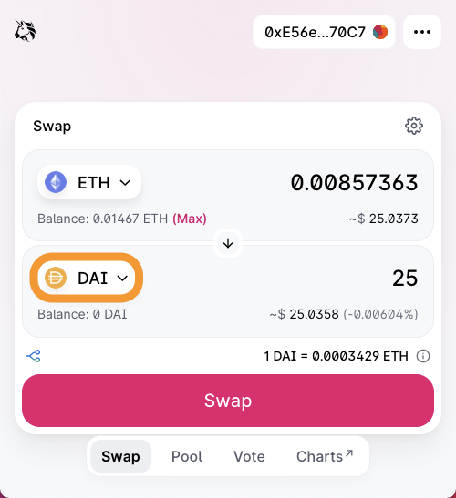
      

   C. Type an amount (of either token)

      

      
      

1. Click **Swap**.
1. Click **Confirm Swap**.
1. Confirm the transaction in the wallet.
1. After the transaction is executed, browse to [Etherscan for Optimistic 
   Ethereum](https://optimistic.etherscan.io/) and enter your address. Confirm
   you now have the correct amount of the new token.   

   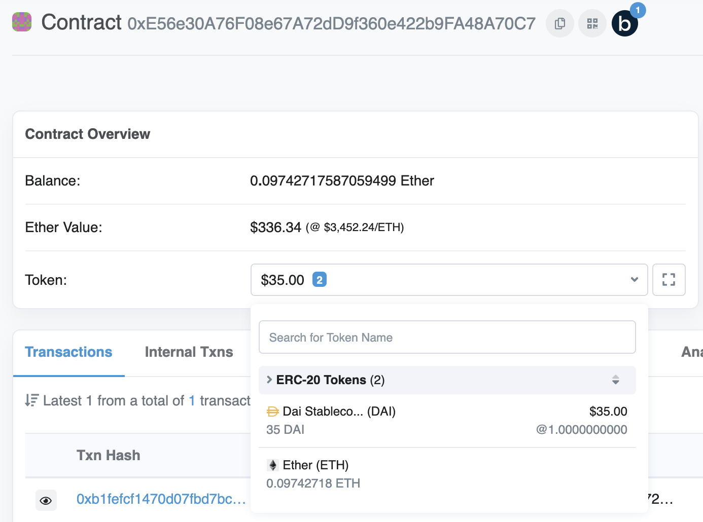   

## Withdrawing assets

The Optimism gateway takes seven days to withdraw back to mainnet, because it needs to support
verification challenges. So if the asset type is supported on the other bridges (either
[Hop](https://app.hop.exchange/send?sourceNetwork=optimism&destNetwork=mainnet&token=USDC) or
[cBridge](https://cbridge.celer.network/#/)) it is faster, and often cheaper, to use them. In 
this tutorial we use Hop.

1. Browse to [Hop.Exchange](https://app.hop.exchange/send?sourceNetwork=optimism&destNetwork=mainnet&token=USDC).
1. Select:
   
   A. Asset type

      

      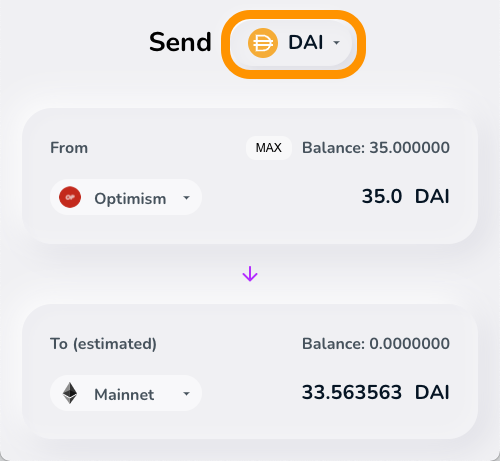
      

   B. Source network (if you are withdrawing, this is **Optimism**)

      

      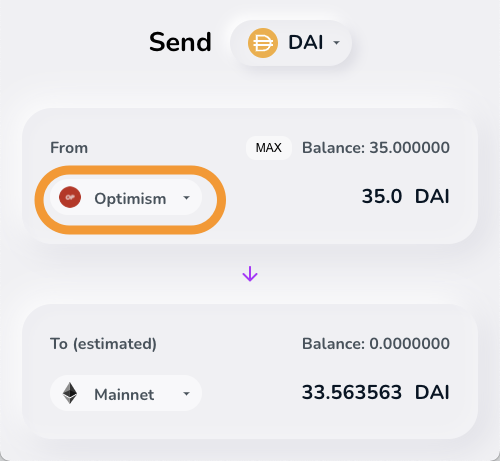
      
   

   C. Amount to withdraw (or **MAX**)

      

      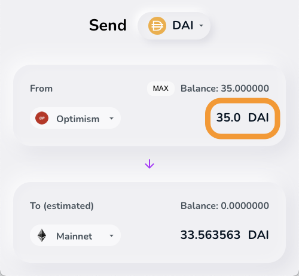
      

   D. Destination network

      

      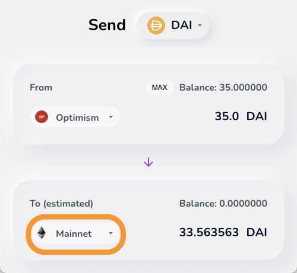
      

      
1. Scroll down to accept the transaction fee and click **Approve**.
1. Clear **Approve all** to limit Hop's spending allowance to the amount you with to withdraw and 
   then click **Approve** again to confirm.
1. Confirm the transaction in the wallet.
1. Click **Send**, allow the network switch in the wallet, click **Send** again, and approve the
   transaction in the wallet.
1. After a few minutes you'll get the asset back in L1 (minus transfer charges).    
