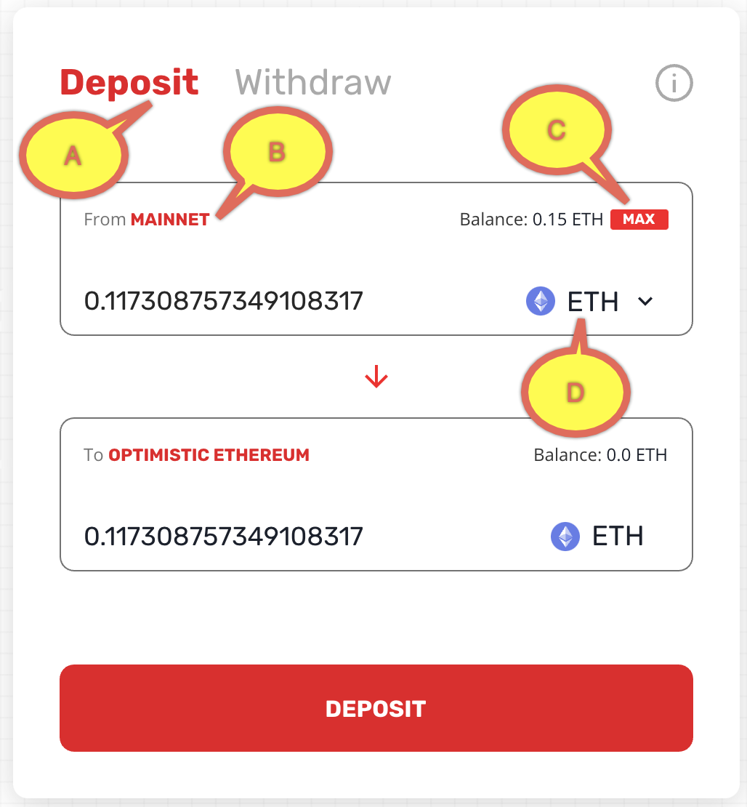
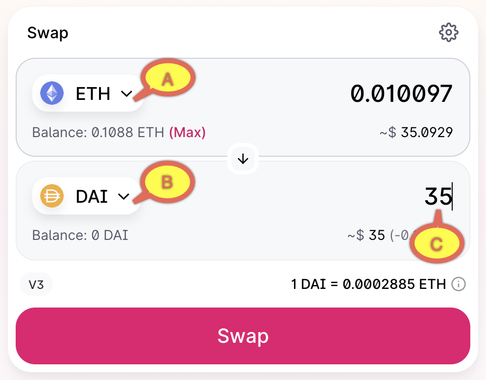
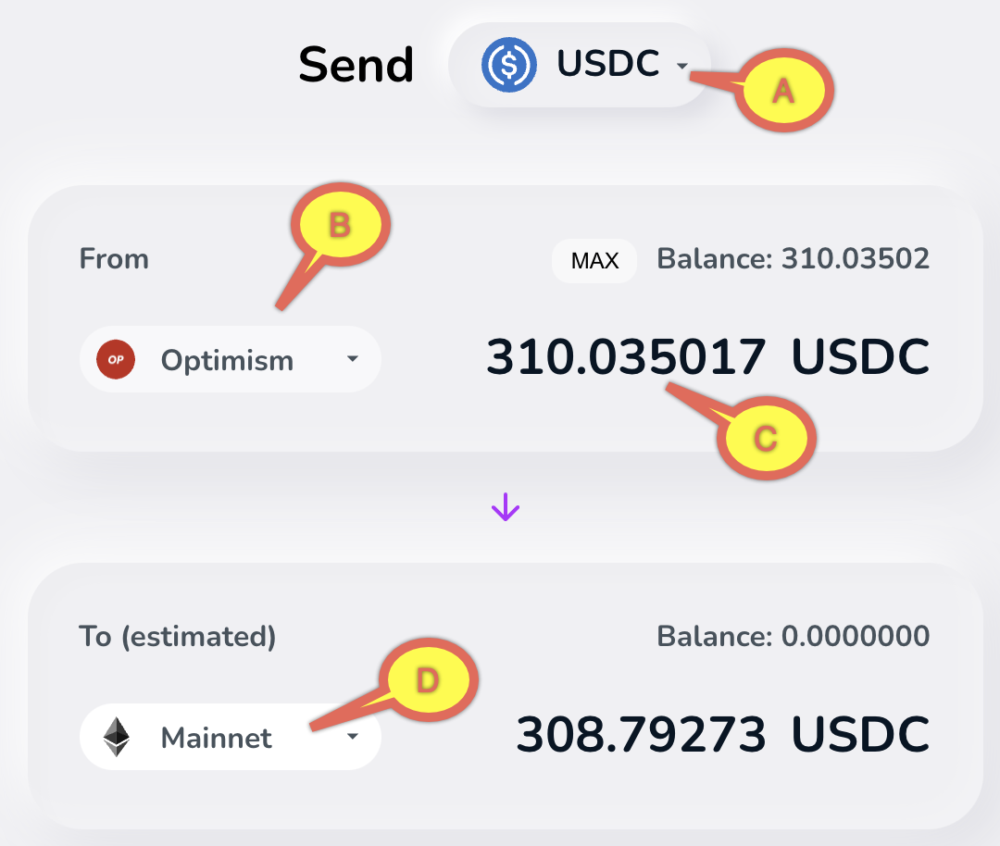

# {{ $frontmatter.title }}

## Why use Optimistic Ethereum?

The Optimistic Ethereum scaling solution lets you run transactions, similar to Ethereum, but
with two important advantages:

* Near-instant transaction finality. You know almost immediately if your transaction took place
  or not.
* Much lower transaction fees. L1 gas cost only affects the cost to write the transaction to L1
  for security purposes, which is **a lot less** than the cost of running the transaction on L1. 
  When Optimistic Ethereum is not congested, the gas price is 0.001 Gwei. [For the current gas price,
  see here](https://public-grafana.optimism.io/d/9hkhMxn7z/public-dashboard?orgId=1&refresh=5m).

## Depositing assets

Before you can use assets (Ether, ERC-20 tokens, etc) on Optimistic Ethereum you need to deposit
them using [a bridge](/docs/users/apps.html#gateways-and-bridges). For depositing ETH, the best
mechanism is [our own gateway](https://gateway.optimism.io/).

1. Log on to your wallet.
1. [Browse to the gateway](https://gateway.optimism.io/).
1. Click **CONNECT**, select your wallet type, and approve the connection in the 
   wallet itself if asked.
1. Make sure the form is correct:

   A. **Deposit** is selected

   B. From **MAINNET**

   C. The amount is possible. Click **MAX** to see the maximum amount you can
      deposit (after accounting for transaction costs), and if relevant enter
      a lower amount.

   D. The asset is **ETH**.
   
   

1. Click **DEPOSIT**.
1. Click **DEPOSIT** again to confirm.
1. Confirm the transaction in the wallet, wait until the transaction is confirmed and the ETH
   deposited to Optimistic Ethereum.

## Applications

Optimistic Ethereum supports [a large and growing list of 
applications](https://community.optimism.io/docs/users/apps.html). To tell your wallet to
change to Optimistic Ethereum click **Withdraw** in the gateway and confirm the network
switch in the wallet.

### Uniswap 

Uniswap lets you swap between assets. It is currently the most commonly used
Open Ethereum application, so here are step by step directions to let you
see that applications are used the same way they are on mainnet.

1. Browse to the [Uniswap application](https://app.uniswap.org/#/swap).
1. Click **Connect to a wallet** and confirm in the wallet. If necessary, switch the
   network in the wallet to **Optimism**.
1. Select:

   A. The token you give

   B. The token you get back

   C. Type an amount (of either token)

   

1. Click **Swap**.
1. Click **Confirm Swap**.
1. Confirm the transaction in the wallet.
1. After the transaction is executed, browse to [Etherscan for Optimistic 
   Ethereum](https://optimistic.etherscan.io/) and enter your address. Confirm
   you now have the correct amount of the new token.   

      

## Withdrawing assets

The Optimism gateway takes seven days to withdraw back to mainnet, because it needs to support
verification challenges. So if the asset type is supported on the other bridges (either
[Hop](https://app.hop.exchange/send?sourceNetwork=optimism&destNetwork=mainnet&token=USDC) or
[cBridge](https://cbridge.celer.network/#/)) it is faster, and often cheaper, to use them. In 
this tutorial we use Hop.

1. Browse to [Hop.Exchange](https://app.hop.exchange/send?sourceNetwork=optimism&destNetwork=mainnet&token=USDC).
1. Select:
   
   A. Asset type

   B. Source network (if you are withdrawing, this is **Optimism**)

   C. Amount to withdraw (or **MAX**)

   D. Destination network

   

1. Scroll down to accept the transaction fee and click **Approve**.
1. Clear **Approve all** to limit Hop's spending allowance to the amount you with to withdraw and 
   then click **Approve** again to confirm.
1. Confirm the transaction in the wallet.
1. Click **Send**, allow the network switch in the wallet, click **Send** again, and approve the
   transaction in the wallet.
1. After a few minutes you'll get the asset back in L1 (minus transfer charges).    
