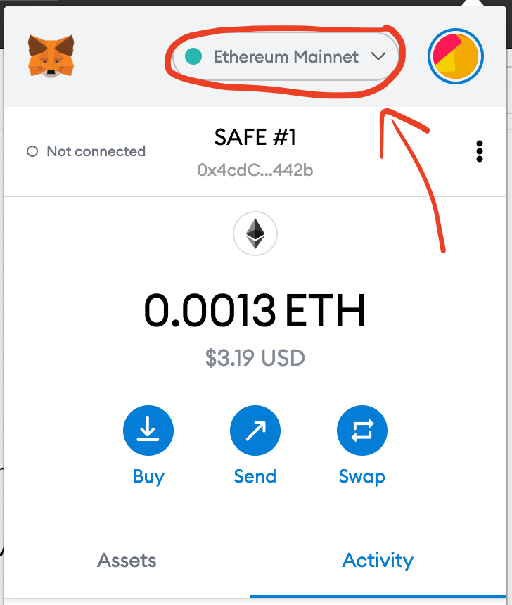
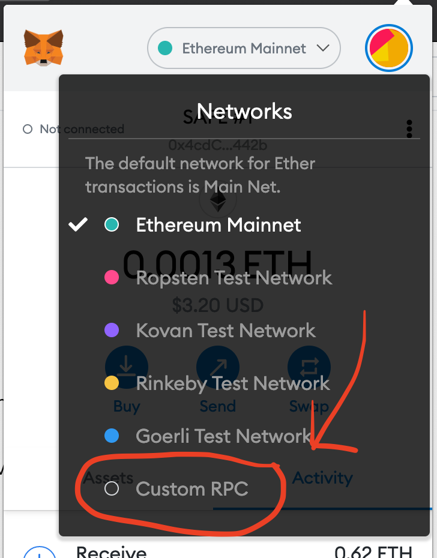
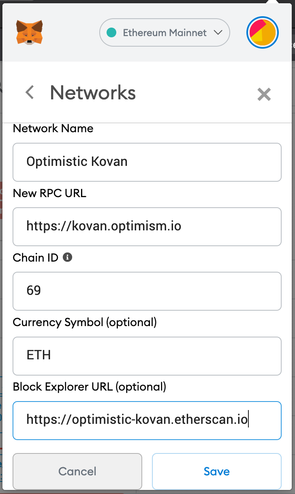

# {{ $frontmatter.title }}

## Connecting with chainid.link

There are a few easy to ways connect to Optimism via MetaMask.
The easiest way is to use `chainid.link`:

* [Click here to connect to Optimism](https://chainid.link?network=optimism)
* [Click here to connect to Optimism Kovan](https://chainid.link?network=optimism-kovan)

## Connecting manually

Alternatively, it's pretty easy to manually add a network to MetaMask.
First, take a look at our [Networks and Connection Details](../infra/networks) page and figure out which network you'd like to connect to.
Then, follow these three easy steps:

1. Open the MetaMask browser extension and click on the network name at the top of the pane:

2. Next, click the `Custom RPC` button at the bottom of the network list:

3. Now you'll be prompted to input your connection details. Make sure to refer to the [Networks and Connection Details](../infra/networks) page and input the details for your desired network:

Once you hit `save`, you'll be automatically connected to the network.
You're ready to play with Optimism! 

::: tip Having issues connecting?
Make sure you've correctly inputted all of your network details.
In particular, make sure the chain ID you entered is correct.
MetaMask likes to complain if your chain ID is invalid.
:::
